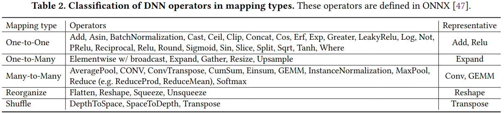
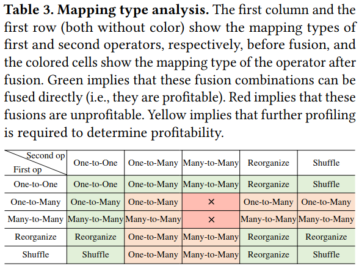
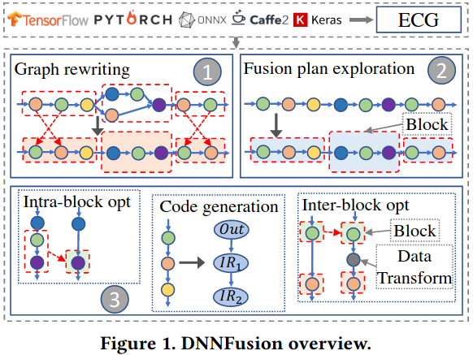
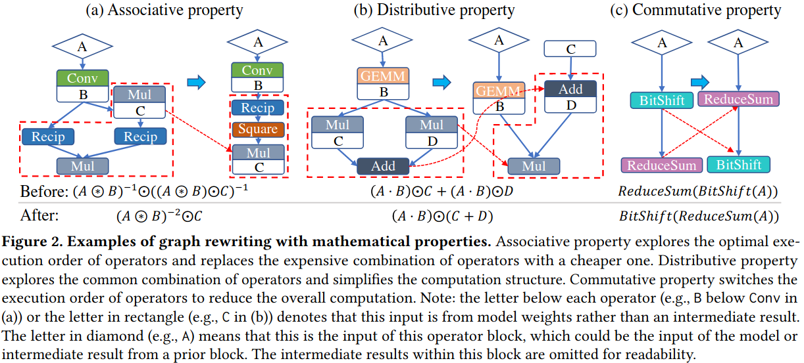
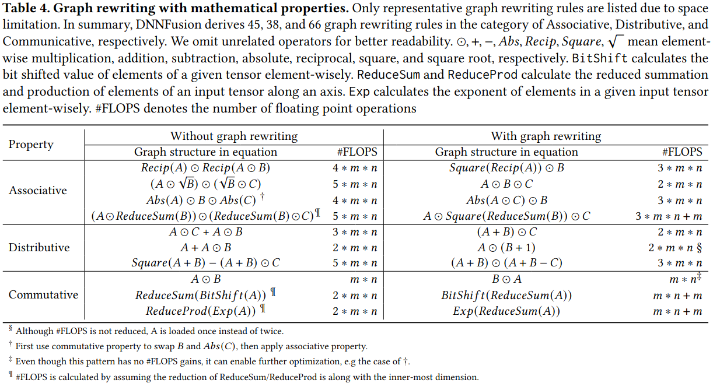
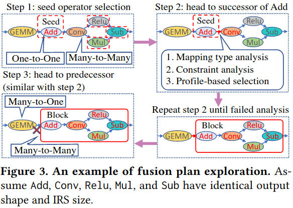
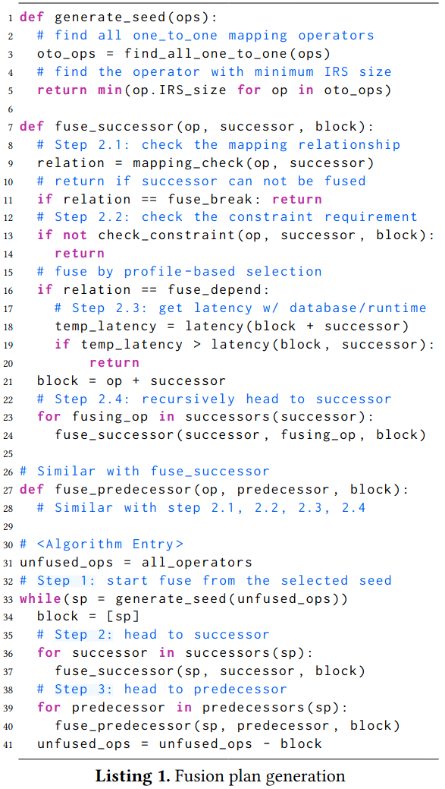
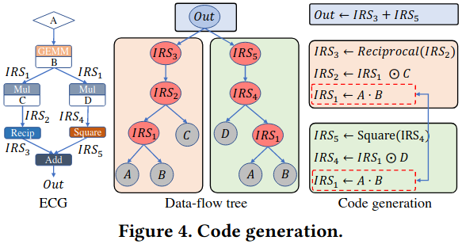

### Motivation
- models with more layers usually generate more intermediate results, thus increasing the memory/cache pressure
- deep models usually have an insufficient amount of computations in each layer, thus degrading the processor's utilization, particularly for GPUs

### Classification of DNN Operators and Fusion Opportunity Analysis

***DNN Operators Classification***

***Fusion Opportunity Analysis***

### DNNFusion's Design

***Mathematical-Property-Based Graph Rewriting***

***Light-Weight Profile-Driven Fusion Plan Exploration*** 
- overall idea 
(1) DNNFusion selects the starting operators from our ECG to restrict the search space  
(2) starting with these seed operators, DNNFusion explores fusion opportunities along the seed opeator's successors and predecessors, respectively  
(3) DNNFusion creates fusion plans based on an approach that combines machine-independent mapping type analysis and a profiling result database  

- Fusion Plan Generation Algorithm  
(1) Fusion seed operator selection  
(2) Propagated exploration along seed's successors  
(3) Propagated exploration along seed's predecessors  

***Fusion Code Generation and Optimizations*** 

- Fusion Code Generation  
