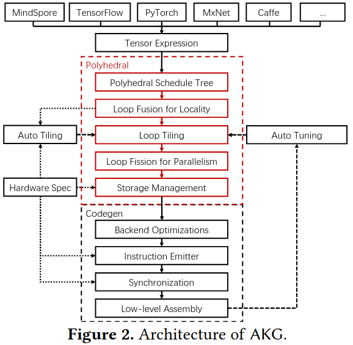
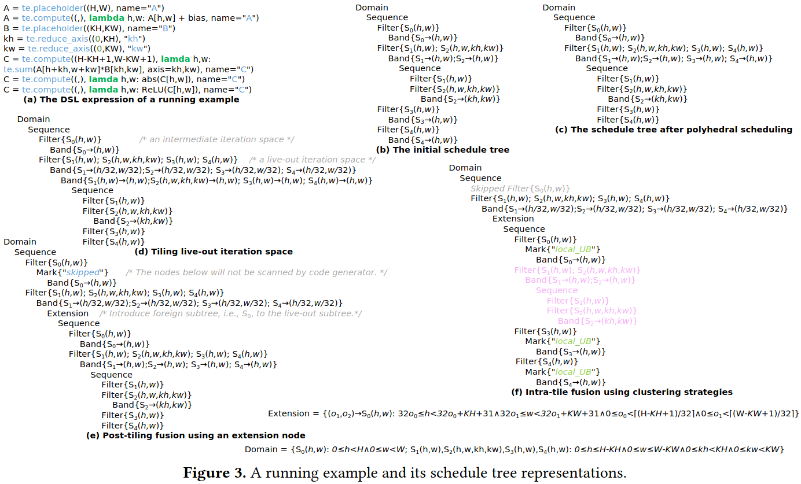
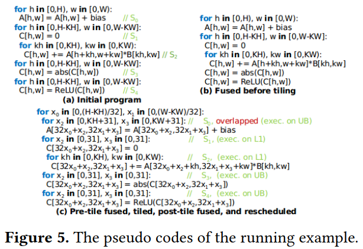
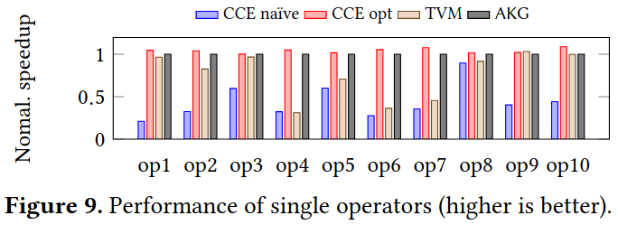
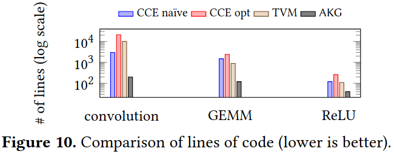
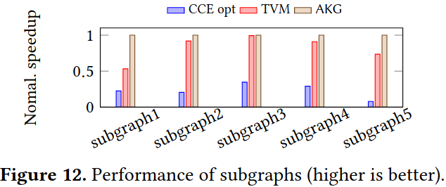
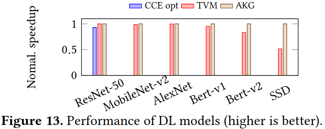

### Challenges
之前设计的深度学习编译器主要目标的硬件平台是CPU、GPU、FPGA，没有考虑NPU，作者在针对这一硬件平台设计相应的编译器，有如下挑战：
1.在各种各样的计算单元的并行和空间/时间局部性的冲突需求
2.高效管理分级内存
3.建模在通用处理器架构没有出现过的优化方案

### Overview of AKG

***Polyhedral Transformations***
- versatile polyhedral scheduling
- tiling(分块形状和分块大小)
- fusion
- storage management
- optimization of convolution
- manual scheduling and debugging

***Code Generation***
- vectorization
- low-level optimization of synchronization
- auto tuning strategies

### Evaluation

### Reference
[AKG: Automatic Kernel Generation for Neural  Processing Units using Polyhedral Transformations](https://01.me/files/AKG/akg-pldi21.pdf)
