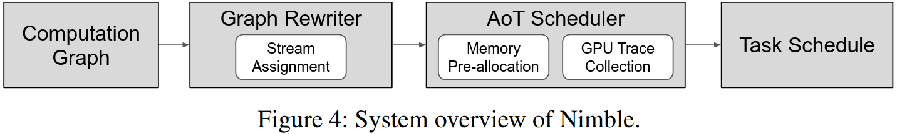
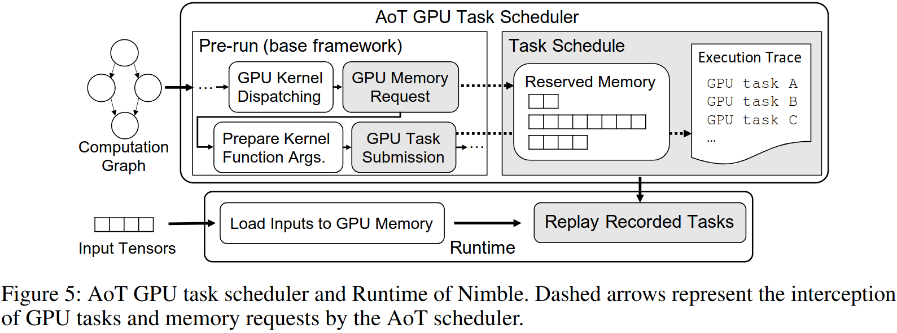
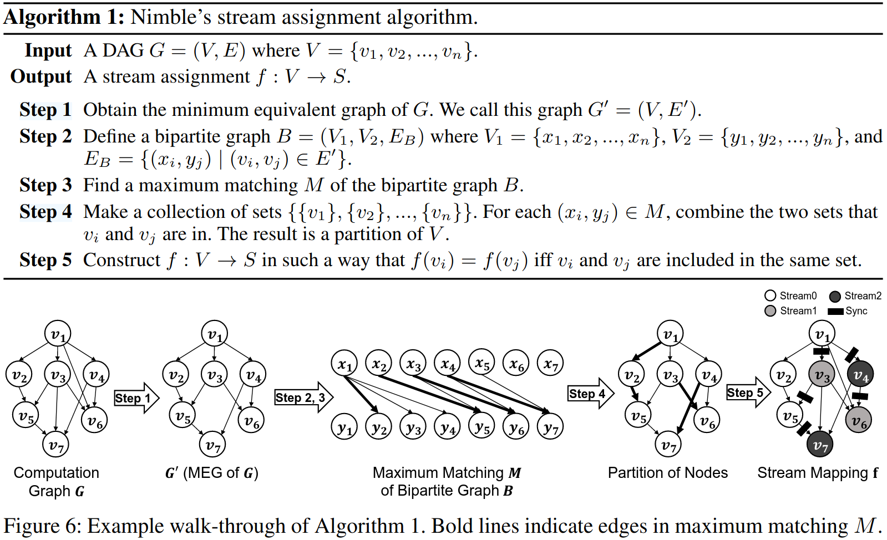
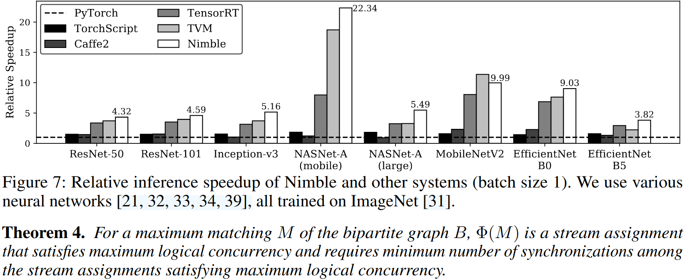
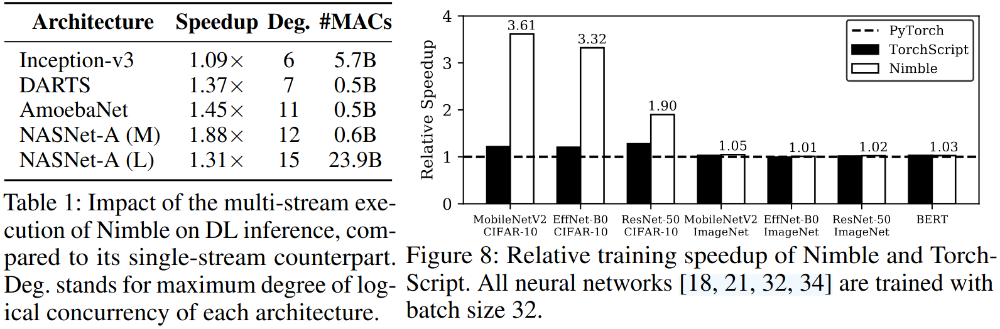

### Motivation
现有的深度学习框架存在极大的调度开销和没有必要顺序执行，作者提出提前调度，来减少在执行的大多数调度开销
1. 高调度开销使GPU变得空闲
2. 非并行GPU任务执行

### System Design

***Ahead-of-time scheduling***

***stream assignment algorithm***
- Stream Synchronization
- Goal of the Algorithm:最大化逻辑并行度、最小化同步数目
- Algorithm Description

### Evaluation

### Reference
[Nimble: Lightweight and Parallel GPU Task Scheduling for Deep Learning](https://proceedings.neurips.cc/paper/2020/file/5f0ad4db43d8723d18169b2e4817a160-Paper.pdf)
