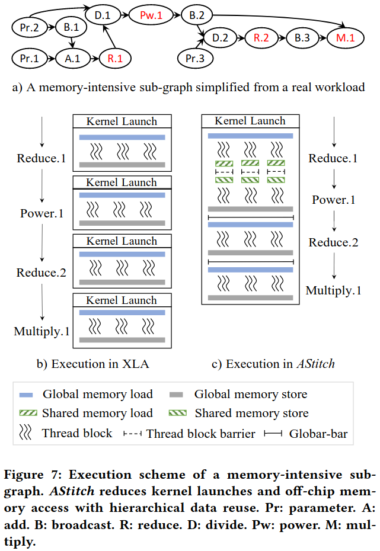
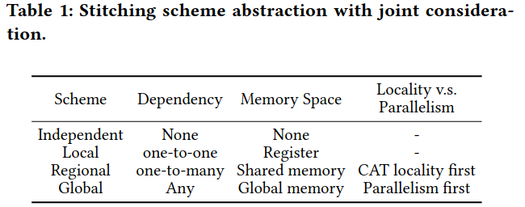
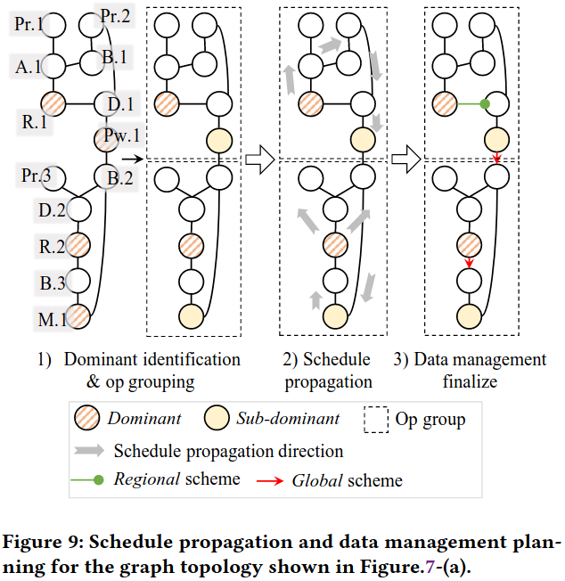
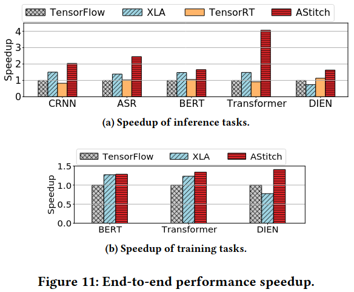
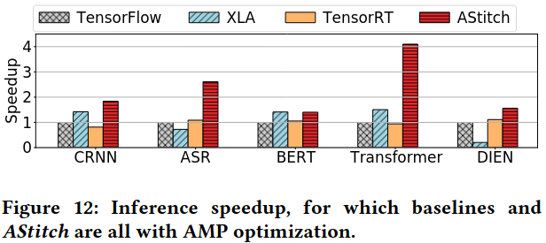
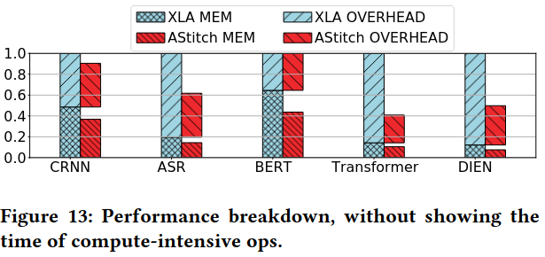
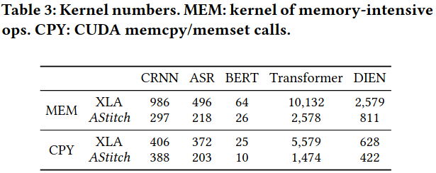

### Motivation
面临的挑战：
(1) complex two-level dependencies combined with just-in-time demand exacerbates training/inference inefficiency---hierarchical data reuse technique; 算子级一对多依赖导致producer被多次重复计算，降低了训练和推理效率，增加了CPU-GPU上下文切换和框架调度开销 <br>
(2) irregular tensor shapes in real-world production workloads often lead to poor parallelism control and servere performance issues in the current ML compilers---an adaptive thread mapping technique 现有编译器生成的线程映射方案要么块太小要么块太少，无法充分利用硬件


### Key Design Methodology




```Operator-Stitching Scheme Abstraction```:



Independent Scheme: 算子之间相互独立
Local Scheme: 相邻算子间是元素级一对一依赖
Regional Scheme: 处理一对多元素级依赖关系，使用GPU共享内存，确保线程块级数据局部性
Global Scheme: 可以处理任意复杂的依赖关系，使用全局内存

```Hierarchical Data Reuse Illustration```

```Adaptive Thread Mapping```：
- Task Packing: *Horizontal packing*(解决small block-size问题，将多个小块打包成一个大的线程块)、*Vertical packing* (减少块数量，满足global barrier要求，将多个线程块的任务打包到一个块中)
- Task Splitting: 解决small block count问题，将一个线程块内的任务拆分到多个块中，使用跨块院子操作实现行规约

### Compiler Design and Optimizations



#### Stitching Scope Identification

- 子图识别: 使用BFS算法自动识别内存密集型子图，将每个子图替换为一个新的算子，称为stitch op
- remote stitching: 将没有数据依赖的stitch ops组合成更大的stitch op

#### Automatic Compiler Optimization Design

***dominant identification and op grouping***: 识别candidate dominant ops、确定final dominant ops(倾向选择reduction作为final dominant)、形成Op groupping

***adaptive thread mapping and schedule propagation***：为每个dominant op生成并行代码、在对应的组内传播线程映射调度、得到所有算子的线程映射调度

***Finalization***: 确定dominant和sub-dominant ops的stitching schemes,这些算子的scheme只能是regional或global；确定Scheme的方法(Passive block-locality checking、Proactive block-locality adaptation)

### Evaluation













### Reference
[AStitch: Enabling a New Multi-dimensional Optimization Space for Memory-Intensive ML Training and Inference on Modern SIMT Architectures](https://jamesthez.github.io/files/astitch-asplos22.pdf)