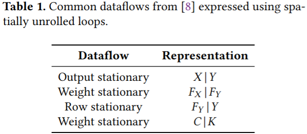
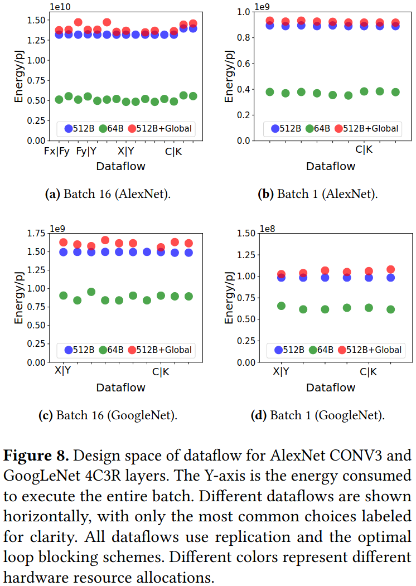
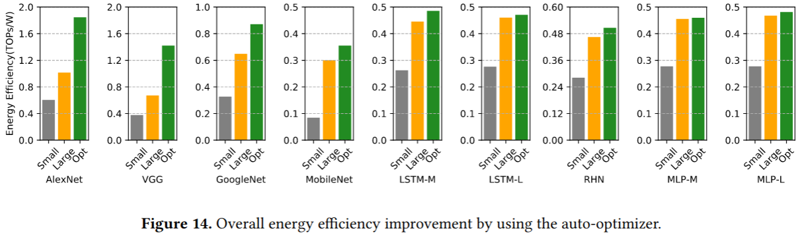

### DNN Accelerator Design Space

#### Design Space Overview
* Dataflow
* Resource Allocation
* Loop Blocking

#### A Formal Dataflow Taxonomy
提出一个基于循环变换的形式化数据流分类方法

***Output stationary***: 每个PE负责计算一个固定的输出像素位置，输入数据需要在PE间移动，而输出数据保持在原地
***Weight stationary***: 每个PE保存卷积核的一个权重值不变，输入和输出数据需要在PE间移动
***Row stationary***: 每个PE处理同一行的计算，适合处理具有行方向局部性的数据
***Weight stationary***: 每个PE保存特定输入通道和输出通道之间的权重

### Results

***Observation 1***: With the same hardware resources, many different dataflows are able to achieve similar and close-to-optimal energy efficiency, as long as proper loop blocking and replication are used

***Observation 2***: The total energy of an efficient system should not be dominated by any individual level in the memory hierarchy

### 贡献
(1) 提出一个系统化的DNN加速器描述方法，将加速器设计空间归纳为3个维度：数据流(如何在PE阵列上映射计算)、资源分配(如何分配计算和存储资源)、循环分块(如何组织数据移动和复用) 
(2) 利用Halide语言来实现加速器设计(发现Halide的调度语言可以表达DNN加速器需要的各种循环变换、扩展Halide编译器，使其能够生成硬件实现) 
(3) 实验发现数据流的选择不是最关键的：只要适当的循环分块，许多不同的数据流都能达到相似的能效；发现内存层级的设计更为重要：合理的存储层级划分可以显著提升能效

### Reference
[Interstellar: Using Halide’s Scheduling Language to Analyze DNN Accelerators](https://arxiv.org/pdf/1809.04070)