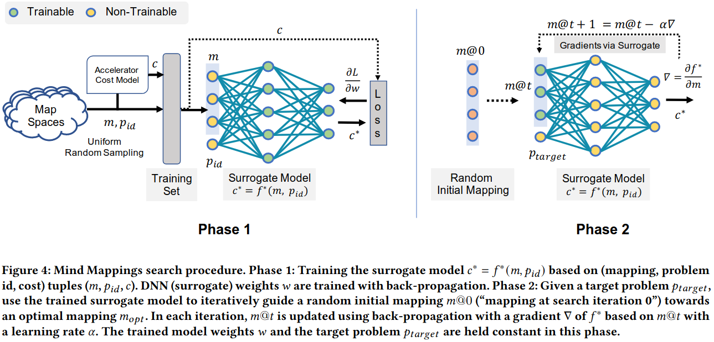

### Background
- algorithm-accelerator mapping space
- mapping space search
- cost function

### Method

#### Phase 1: Approximating the Map Search Space
***Generating the surrogate model training set***:  
which map spaces should be used to populate the training set? 
based on the choice of map spaces, which mappings should we sample to populate the training set 
how to uniquely associate each mapping m with its map space $M_{a, p}$? 
how to calculate cost per mapping? 

***Input Mapping Representation***

***Output Cost Representation***

#### Phase 2: Gradient Search to Find High-Quality Mappings

### Evaluation

post-mind-mappings-iso-iteration.png

post-mind-mappings-iso-time.png

post-mind-mappings-experiments.png