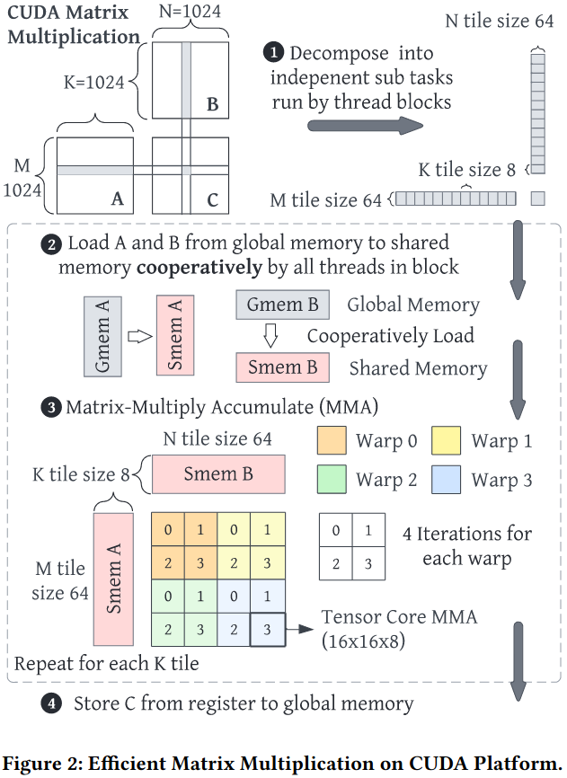
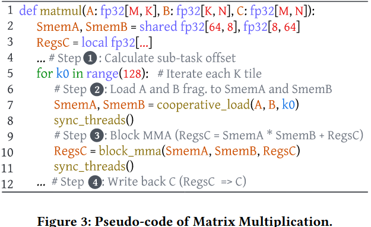
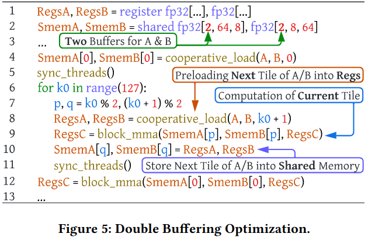
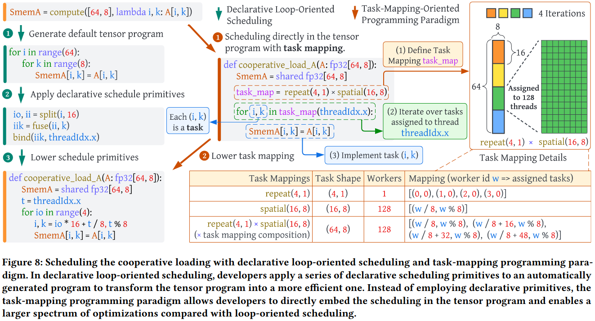
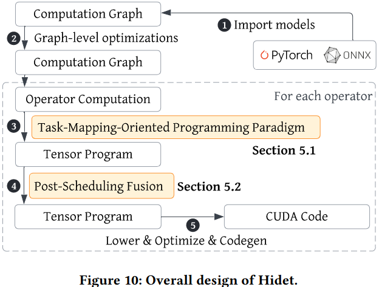
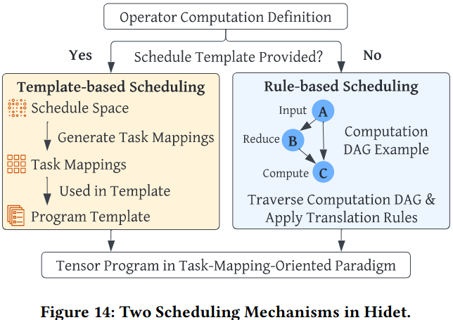
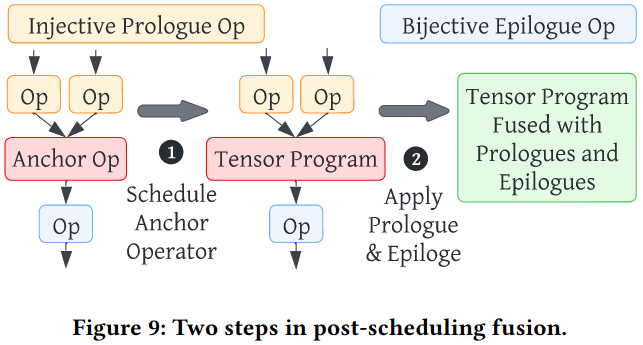
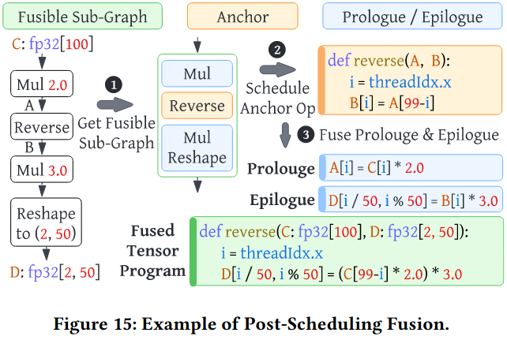
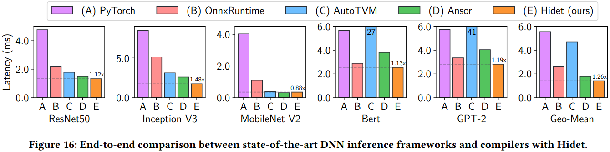
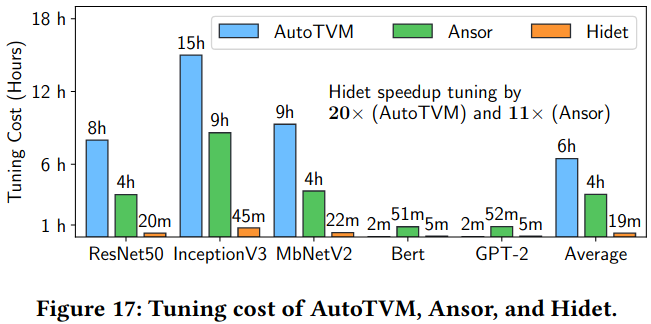

### Motivation

***Limited Optimization Support***: 现有的循环导向的调度原语无法实现double_buffer、thread block swizzle、efficient usage of Tensor Core MMA PTX instruction、multi-stage asynchronous prefetching

上面两张图解决的性能瓶颈是同一线程块中的所有线程可能被同一类型的硬件资源阻塞

***Dedicated Schedule Template for Fusion***

***Long Tuning Time***

### Hidet: System Design

#### Task-Mapping Programming Paradigm
***Task Mappping***
- repeat(d1, ..., dm): 将一个网格任务(d1, ..., dm)映射到单个worker, 一个worker负责执行所有任务
- spatial(d1, ..., dm): 将网格任务(d1, ..., dm)映射到相同数量的worker, 每个worker只处理一个任务

***Task Mapping Composition***

***Scheduling Mechanism***

#### Post-Scheduling Fusion
***step 1***: 只调度锚点算子(anchor operator) 
***step 2***: 自动将周围的算子融合到已调度好的锚点算子程序中 
前序算子: 在锚点算子之前的可融合算子; 要求是injective operator,不能有reduction computation 
后序算子: 在锚点算子之后的可融合算子; 要求是bijective operator,输入张量的每个元素只能贡献到输出张量的一个元素

### Evaluation

### Reference
[Hidet Task-Mapping Programming Paradigm for Deep Learning Tensor Programs](https://dl.acm.org/doi/pdf/10.1145/3575693.3575702)