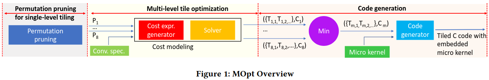

### Motivation
通过内存层次结构移动数据是影响机器学习算法性能的核心瓶颈，循环级别优化能减少数据移动，但是找到最优化的性能配置的搜索空间是巨大的

### Overview

### Analytical Modeling for Single-level Tiling

### Pruning Configurations: Single-level Tiling

### Multi-level Tile-size Optimization

### Microkernel Design for CNN

### Optimizing for Parallelism

### Putting it all Together

### Evaluation

### 论文代码链接
[代码链接](https://github.com/HPCRL/ASPLOS_artifact)

### Reference
[Artifact: Analytical characterization and design space exploration for optimization of CNNs](https://dl.acm.org/doi/pdf/10.1145/3445814.3446759)