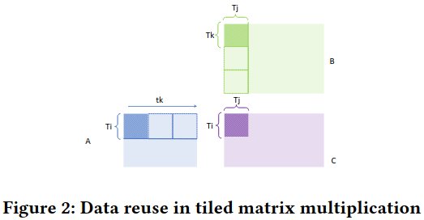

### Motivation
通过内存层次结构移动数据是影响机器学习算法性能的核心瓶颈，循环级别优化能减少数据移动，但是找到最优化的性能配置的搜索空间是巨大的

### Overview

***key ideas for analytical modeling***

最内层循环kt的数据移动：
$DV_{kt} = DV^{A}_{kt} + DV^{B}_{kt} + DV^{C}_{kt} = T_{i}N_{k} + T_{j}N_{k} + 2T_{i}T_{j}$

中间层循环jt:
$DV_{jt, kt} = \frac{N_j}{T_j}DV_{kt} = \frac{N_j}{T_j}T_{i}N_{k} + N_{j}N_{k} + 2T_{i}N_{j}$

最外层循环it:
$DV_{it, jt, kt} = \frac{N_i}{T_i}DV_{jt, kt} = \frac{N_i}{T_i}(\frac{N_i}{T_j}T_{i}N_{k} + N_{j}N_{k} + 2T_{i}N_{j}) = N_{i}N_{j}N_{k}(\frac{1}{T_i} + \frac{1}{T_j} + \frac{2}{N_k})$

### Analytical Modeling for Single-level Tiling

### Pruning Configurations: Single-level Tiling

### Multi-level Tile-size Optimization

### Microkernel Design for CNN

### Optimizing for Parallelism

### Putting it all Together

### Evaluation

### 论文代码链接
[代码链接](https://github.com/HPCRL/ASPLOS_artifact)

### Reference
[Artifact: Analytical characterization and design space exploration for optimization of CNNs](https://dl.acm.org/doi/pdf/10.1145/3445814.3446759)