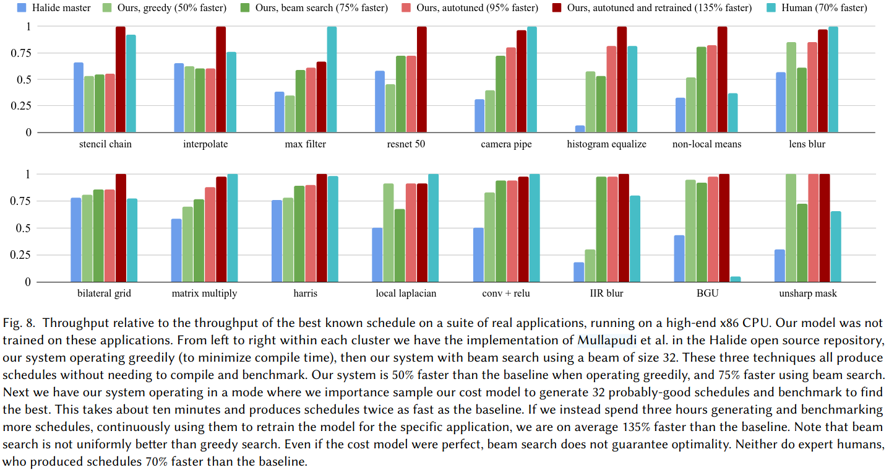

###  Motivation

面临的挑战：
(1) 目前设计只考虑可能调度的一小部分
(2) 使用专用的搜索程序来做关键选择
(3) 使用人工设计的代价模型来探索空间
作者的解决方案
* a new parameterization of the search space
* a more general search algorithm with backtracking and coarse-to-fine refinement
* a new cost model that combines symbolic analysis with machine learning
* a robust methodology which trains the cost model on an infinite population of random programs
* the optional use of sampling and benchmarking to further improve performance given extra time

### Navigating the halide scheduling space
#### Halide 基础概念
* Halide程序由多个stages组成，形成有向无环图(DAG)
* 指定期望的输出区域
* 编译器负责推断需要计算的区域

#### 调度的两个核心选择
***Intra-stage order***: 决定如何计算一个stage内的所有点(包括维度顺序和平铺选择，可以选择并行化、向量化或展开循环)
***Cross-stage granularity***: 决定何时计算每个stage的结果，以及存储多久(选择在不同粒度级别计算和存储，支持完全计算、内联计算或增量计算等策略)

#### 搜索算法
* 使用基于beam search的算法
* 维护k个候选状态进行搜索
* 使用成本模型对候选进行评估和排序
* 采用粗到细的调度细化策略(使用hash函数控制搜索深度、在高层决策上保持多样性、分多次pass逐步细化调度)

### Predicting runtime
#### Featurizing a Schedule
***算法特定特征***：
* 计算单个点所需的操作直方图
* 访问其他stage时的Jacobian矩阵
* 用于分类内存访问类型

***调度相关特征***：
* 事件计数
* 内存占用特征
* 在多个位置分析读写区域的形状
* 使用Halide的边界推断机制进行符号区间分析

#### Cost Model Design
创新点: 不直接预测运行时间
采用混合方法: 手工设计一些非线性项、使用神经网络预测这些项的系数、最终运行时间是它们的点积
网络架构: 两个输入头(调度特征嵌入、算法特征嵌入)、特点(对调度特征进行对数变换、算法特征权重通过sigmoid保持为正)、输出27个系数用于手工设计的项

#### Autotuning
通过采样和基准测试改进: 使用成本模型进行重要性采样、以概率p选择最优预测状态、否则尝试次优状态
进一步优化: 对采样结果进行基准测试、使用测试结果重新训练模型、迭代改进预测准确性

 ### Evaluation

 

 ### Reference
 [Learning to Optimize Halide with Tree Search and Random Programs](https://escholarship.org/content/qt5h71f534/qt5h71f534.pdf)