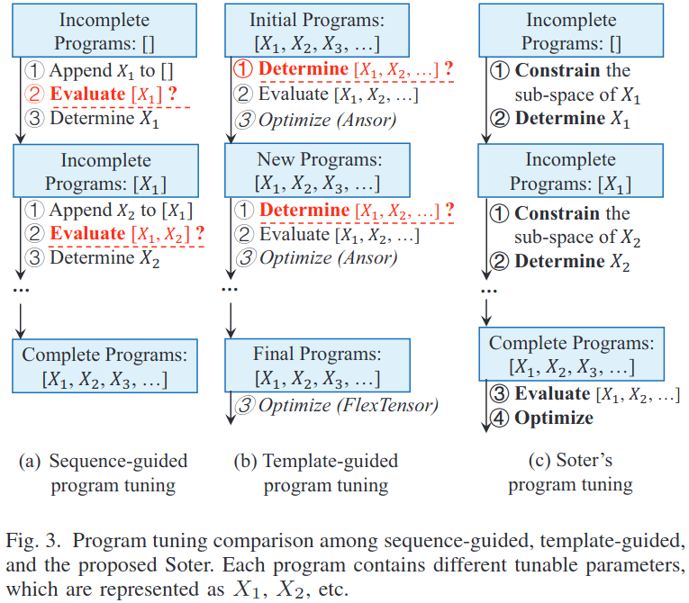
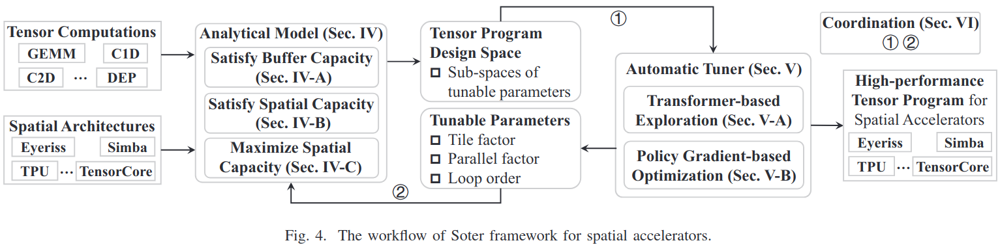

### Introduction
作者的贡献：
(1) The tuner determines tunable parameters through a sequence of decisions
(2) The tuner exploits the Transformer structure due to its robust ability in sequence modeling
(3) Combining Transformer with the policy gradient algorithm, the tuner can select the best exploration direction instead of top-k candidates

### Motivation

***The sequence-guided compilers*** require to evaluate incomplete programs, which is either inaccurate or time-consuming  
***The template-guided compilers*** require to determine all of the tunable parameters simultaneously, which leads to a large number of invalid and inefficient programs

post-soter.png

### The Soter Framework

### Analytical Model
buffer capacity and spatial capacity
$$f(X_t) \leq C_t, f(X_p) \leq C_p$$

maximize spatial capacity
$$f(X_t, X_p) \geq C_p$$

***A. Satisfy Buffer Capacity: $f(X_t) \leq C_t$***

***B. Satisfy Spatial Capacity: $f(X_p) \leq C_p$***

***C. Maximize Spatial Capacity: $F(X_t, X_p) \geq C_p$***

### Automatic Program Tuner

