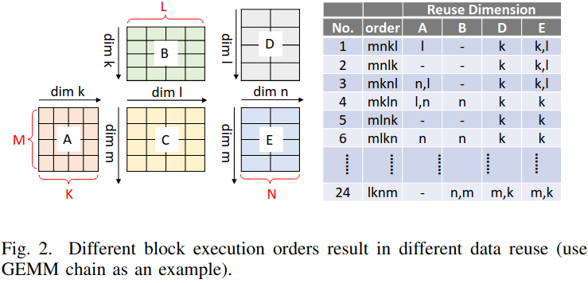
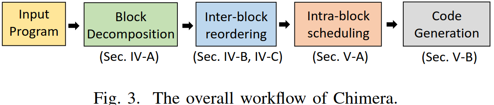
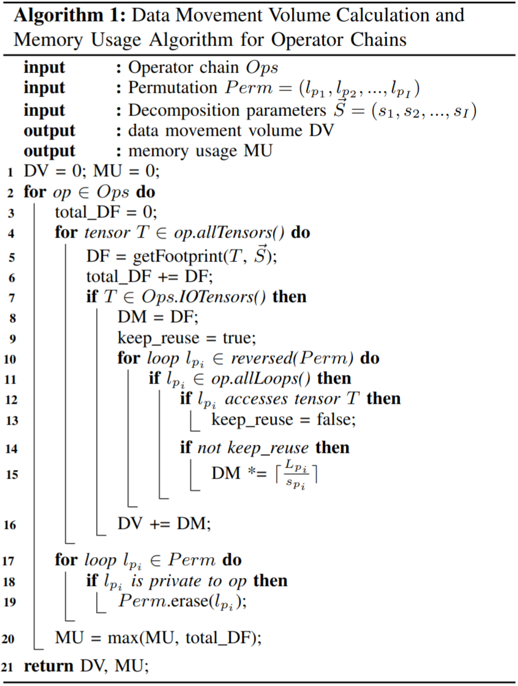
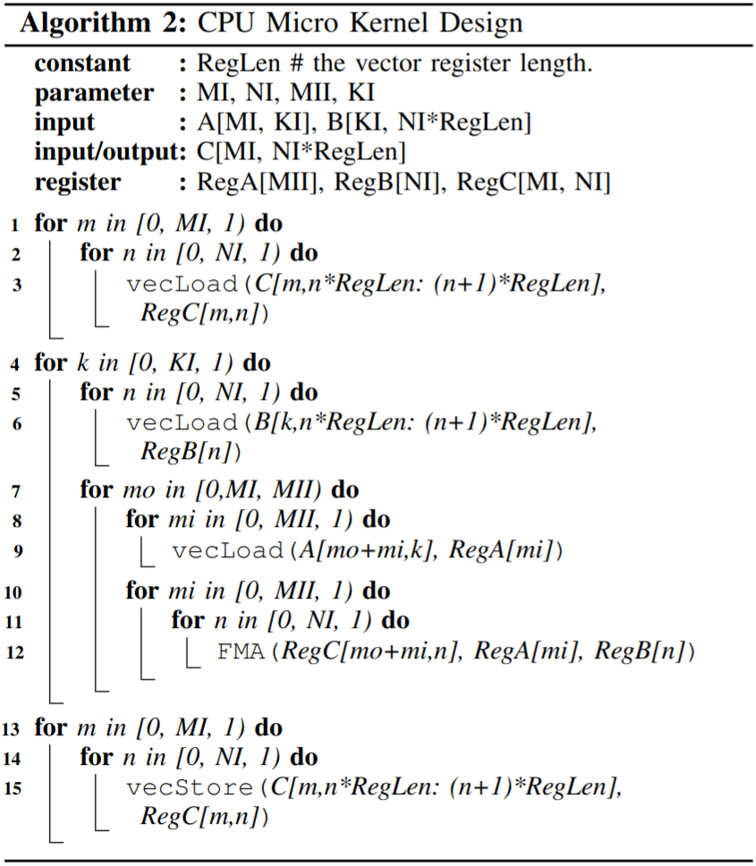
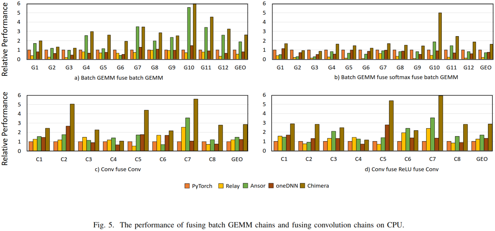
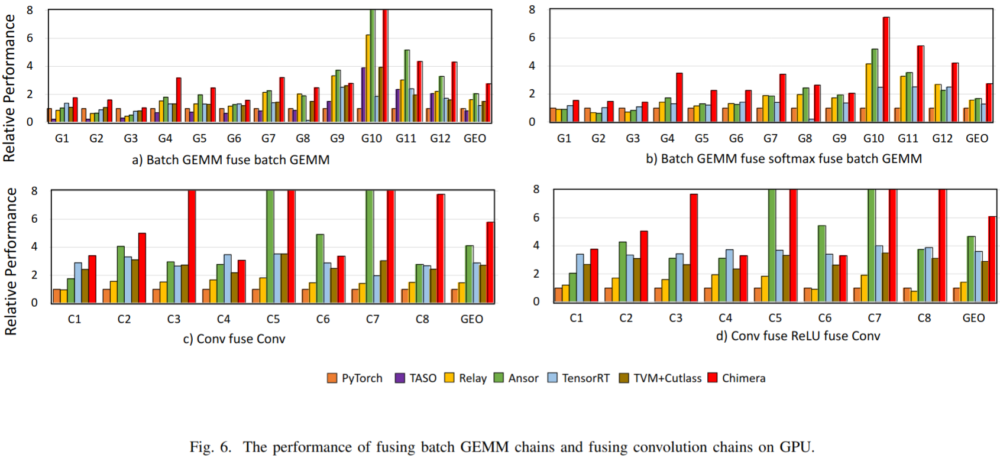
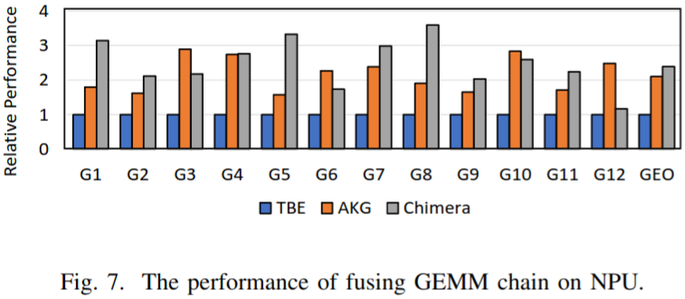
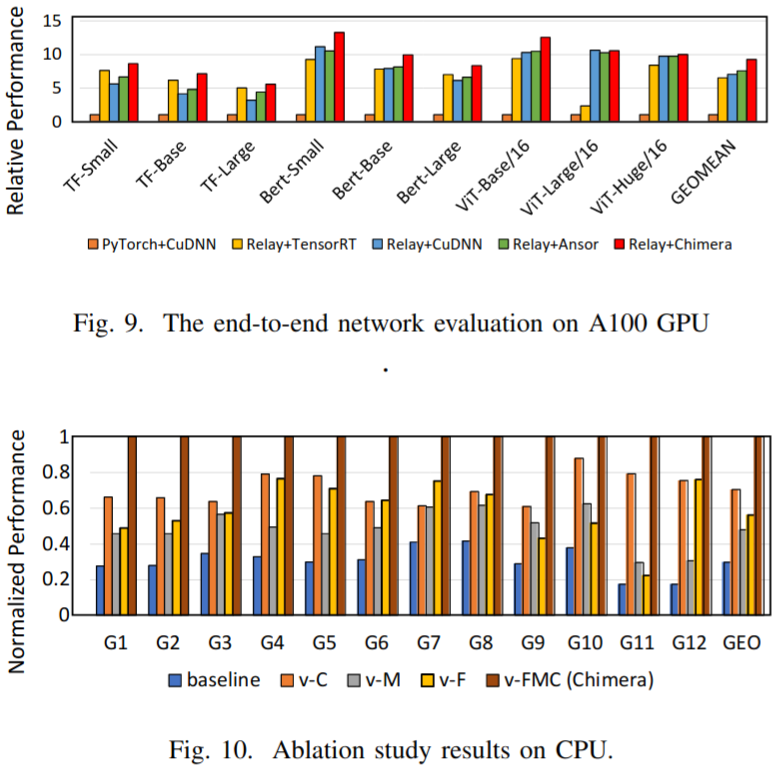
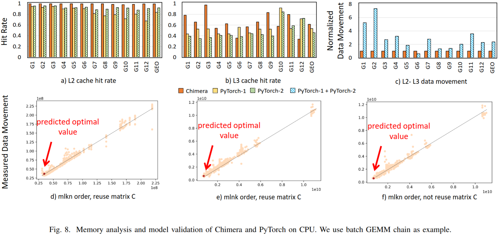

### Motivation
场景：现在计算速度得到很大的提高，导致现在有很多计算密集型算子受限于内存带宽，因此需要对内存受限的算子进行优化
挑战：1.在计算密集型算子的执行顺序生成高效融合核十分困难，因为计算密集型的算子的执行顺序有严格的数据依赖 2.利用硬件特征优化每个块的计算十分困难

### Overview of Chimera

***Inter-block Optimization***
- 通过块排序减少数据移动(observation:1.有些循环不会导致数据移动 2.只要一个循环会导致数据移动，其周围所有外部循环都会导致数据移动 3.生产者算子的循环不会导致消费者算子的数据移动)

***Intra-block Optimization***

### Evaluation

### Reference
[Chimera An Analytical Optimizing Framework for  Effective Compute-intensive Operators Fusion](https://drive.google.com/file/d/1JuFSFxP-UM_XVAU9SS2FVkPDnsWtl0La/view)