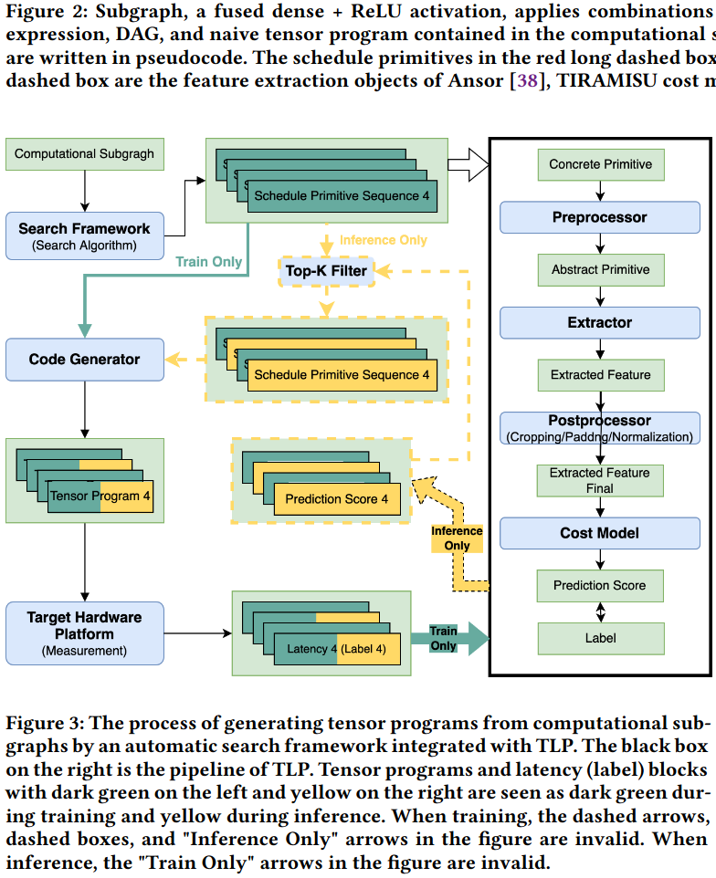
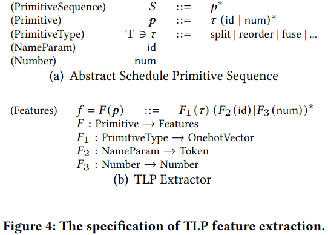
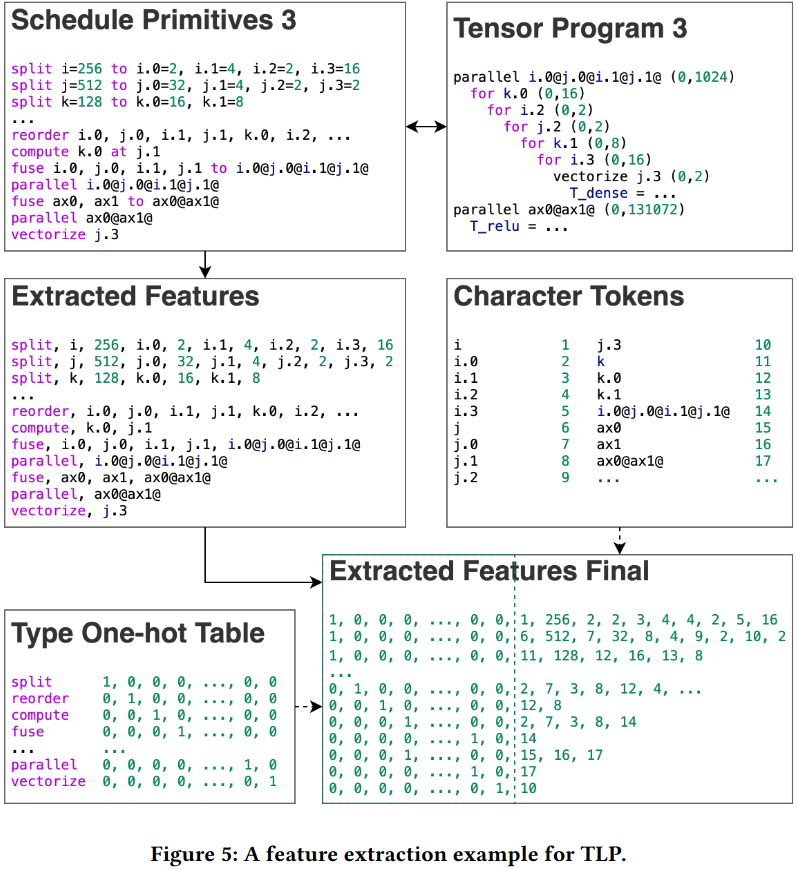
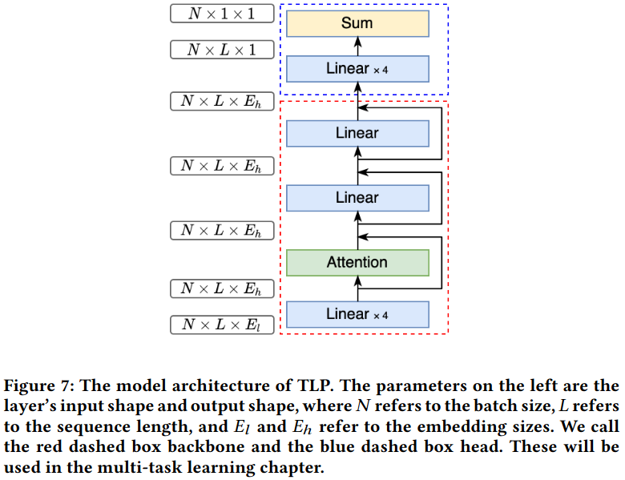
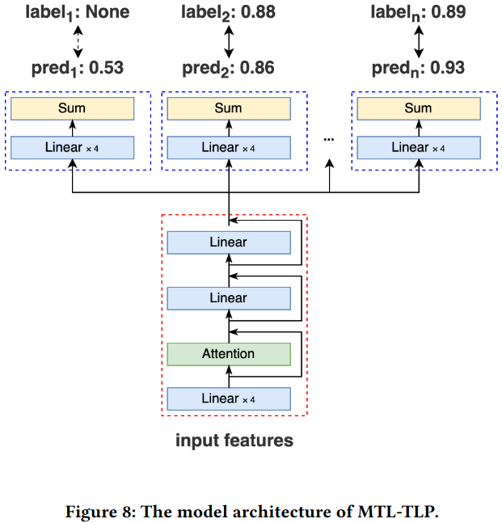
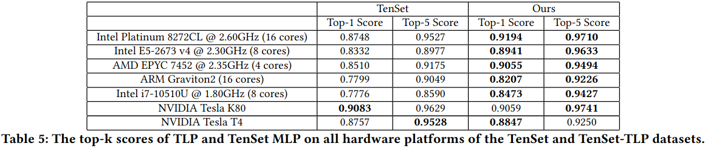
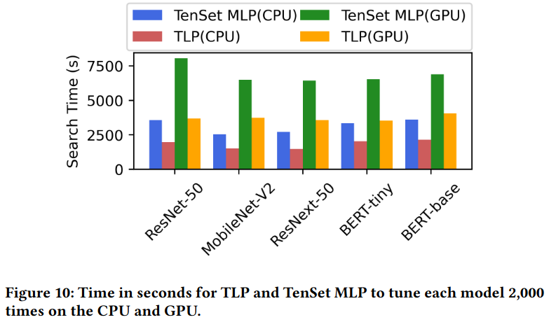
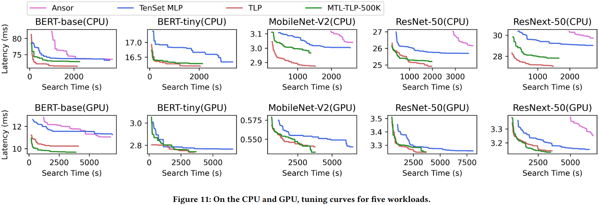
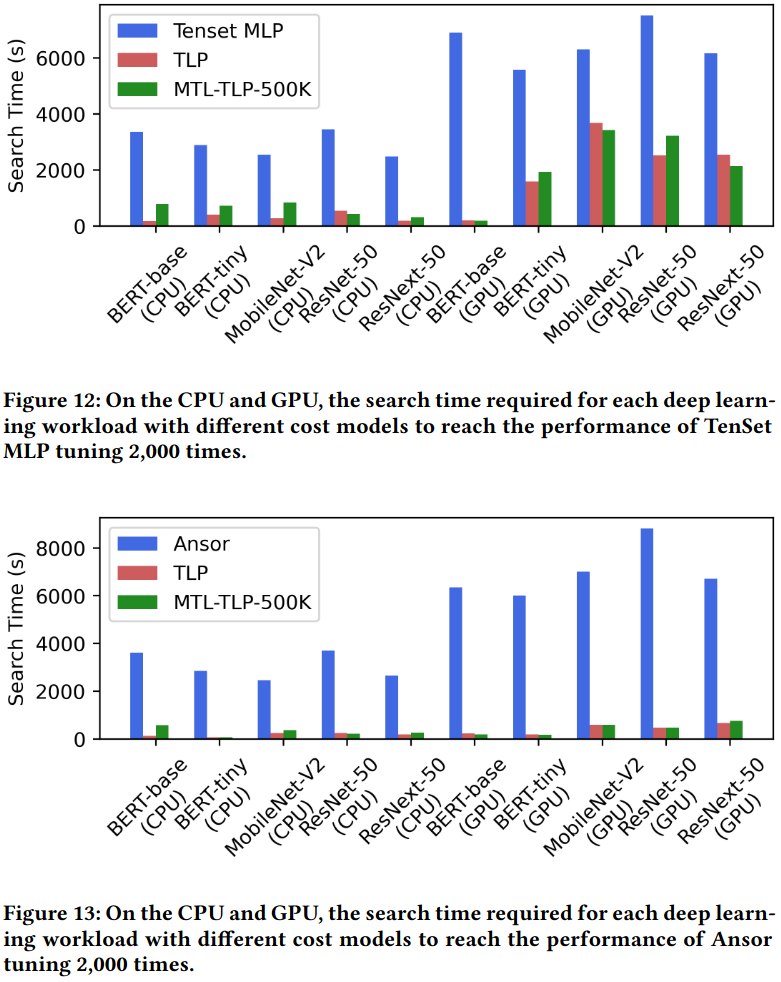

### Motivation
测试张量程序耗时的原因：1.测试流水线由多步组成包括编译、加载、执行 2.保证测试准确性需要多次测试 3.测量任务通常会垄断计算资源
不从张量源程序提取特征的原因：1.张量程序的源代码是带有嵌套循环的树形结构数据、抽象语法树的信息很难提取 2.在源代码中有太多不相关的字符token
作者选择从调度原语提取特征

### System Overview

***TLP***
- feature extraction of tlp
原语类型、数字参数、特征参数

- tlp feature extraction on tenset dataset 
feature size = sequence length x embedding size
- feasiblity analysis of tlp feature extraction
- model architecture

***MTL-TLP***
- corss-hardware unavailability
- mtl-tlp

- feasibility analysis of mtl-tlp

### Evaluation
***TLP with dataset-based metrics***  
loss function & backbone basic module: self-attention + lambda rank loss  
feature size cropping: sequence length 25 + embedding size 22  
model architecture details: shallow linear layers upsample the embedding size from 22 to 256 and 512 + self-attention module sets 8 heads + one layer of the self-attention module + two residual blocks

***MTL-TLP with Dataset metrics***  
setting up two or three tasks, with non-target platform tasks using all data from the same instruction set architecture hardware platform and the target platform task using at least 500K data

***Search-based metrics***  

### Reference
[TLP: A Deep Learning-based Cost Model for Tensor Program Tuning](https://arxiv.org/pdf/2211.03578)
