### Motivation
Existing Methods: a two-layered scheduling approach(an inter-operator DFD layer scheduler、an intra-operator scheduler) 
***Limitions***: 
(1) Hardware-managed intra-operator scheduling leads to low GPU utilization

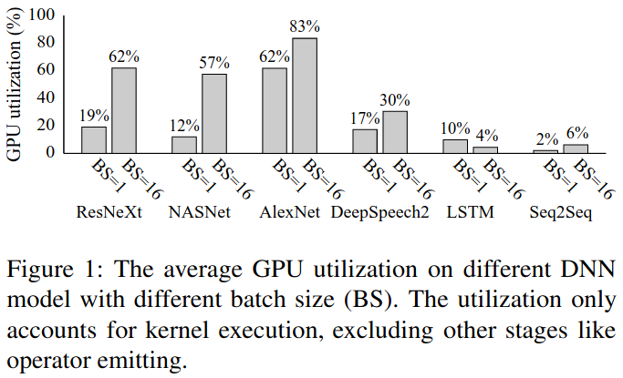

(2) High inter-operator scheduling overheads

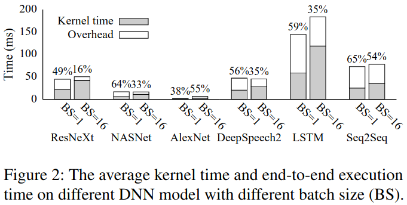

(3) Interplay between inter- and intra-operator scheduling

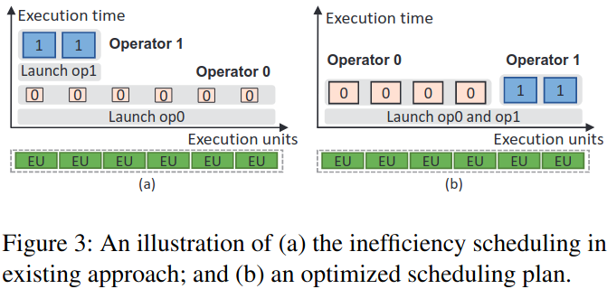

### Rammer's Design

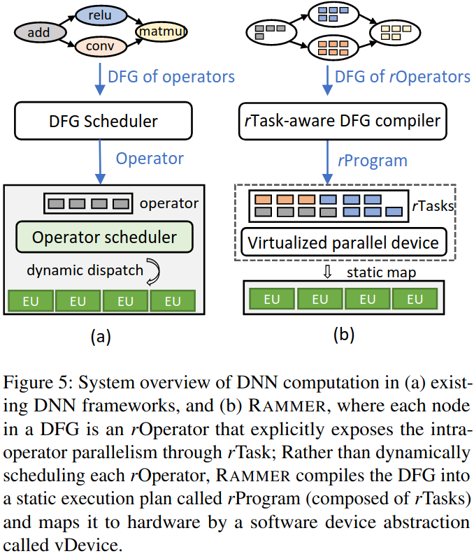

***rOperator***

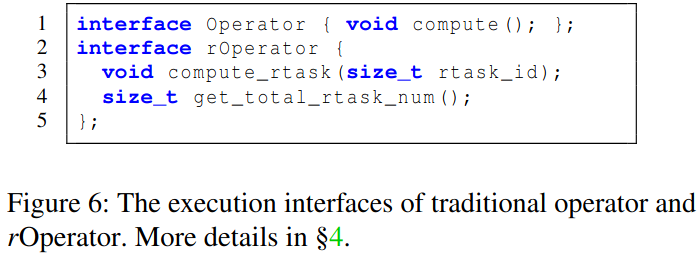

***Virtualized Parallel Device***

***rTask-aware DFG Compiler***:
(1) Scheduling interfaces
(2) Compile-time profiling
(3) Scheduling policy

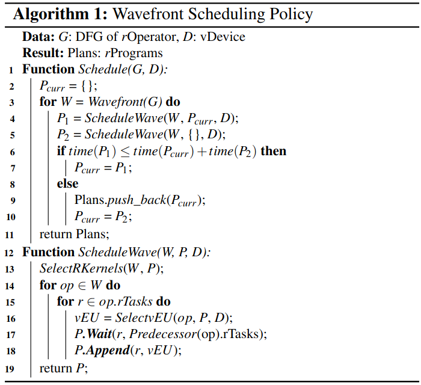

### Evaluation

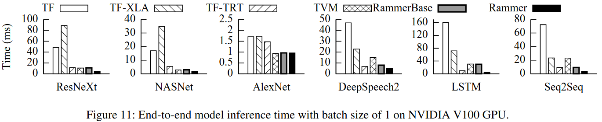

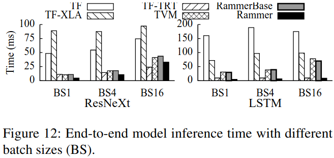

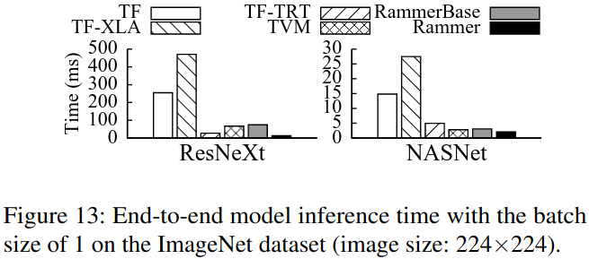

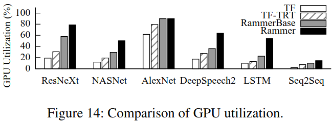

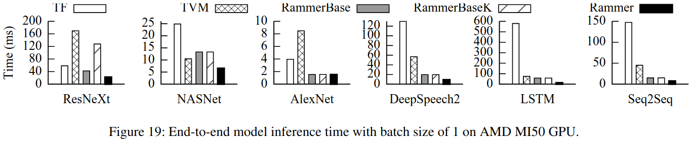