### Design of SmartMem

#### Operator Classification and Analysis
- the performance of the computation depends upon the input layout or is independent
- the output layout is customizable

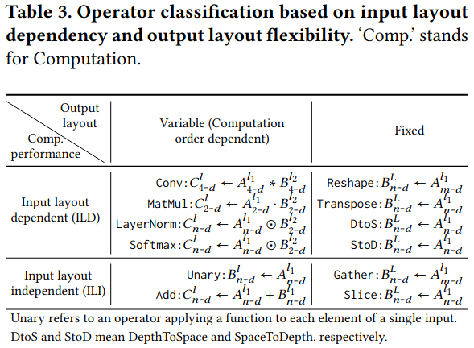

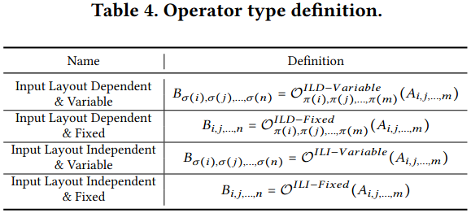

#### Layout Transformation Elimination Analysis

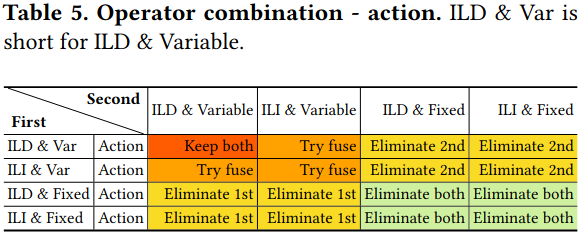

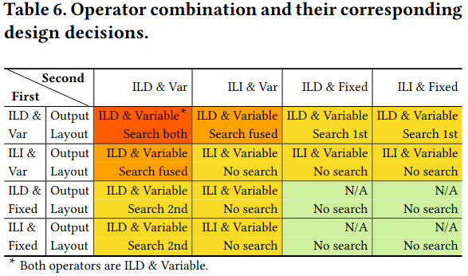

***Operator Elimination based on Index Comprehension***

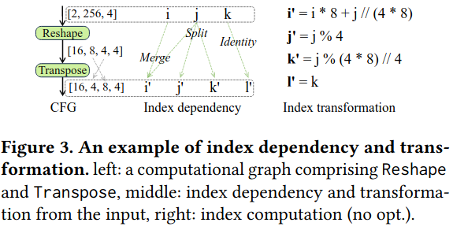

***A Reduction Dimension Based Layout Selection***
- a local layout selection for tensors associated with individual edges in the computational graphm

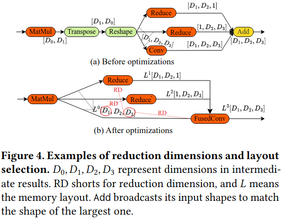

#### Mapping Tensor to Texture Memory and Other Optimizations

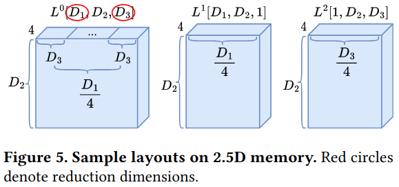

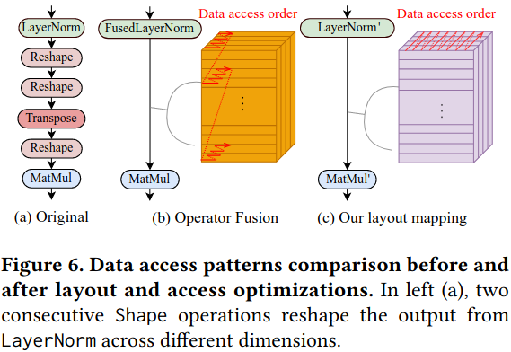

### Evaluation

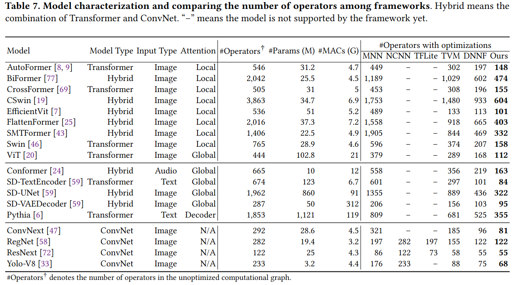

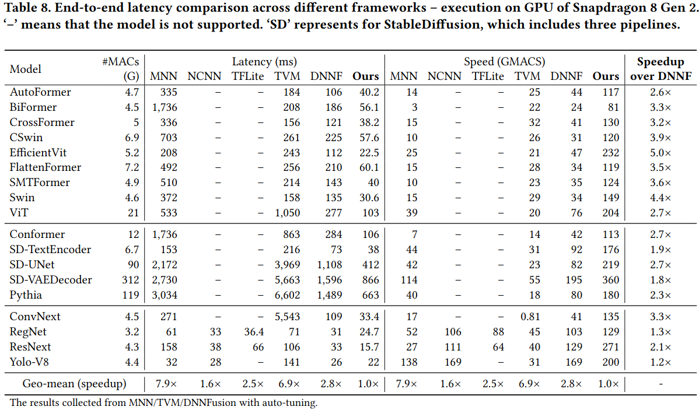

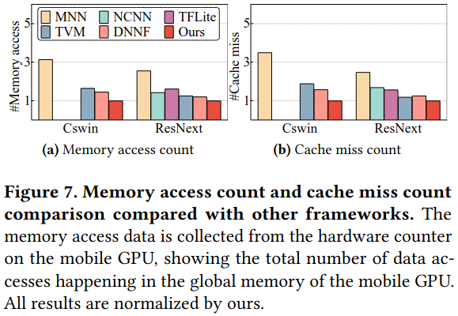

#### Optimization Breakdown and Analysis

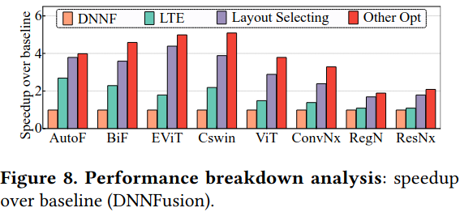

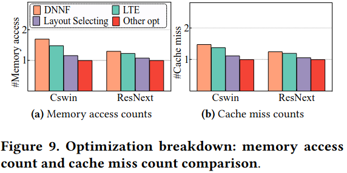

### Reference
[Accelerated Auto-Tuning of GPU Kernels for Tensor Computations](https://dl.acm.org/doi/pdf/10.1145/3650200.3656626)