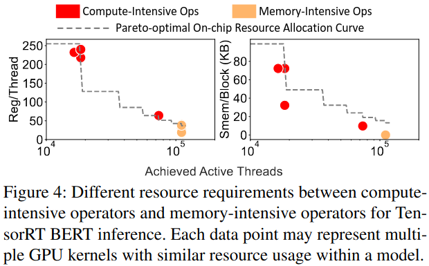
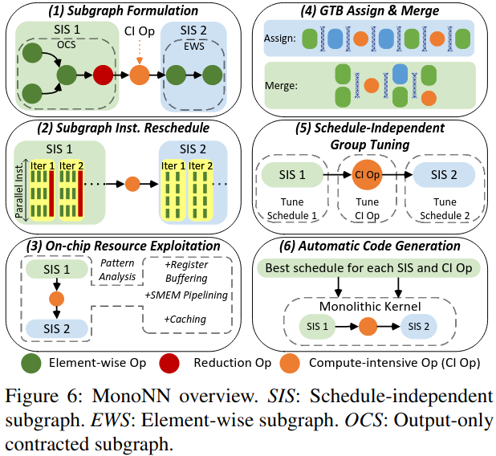
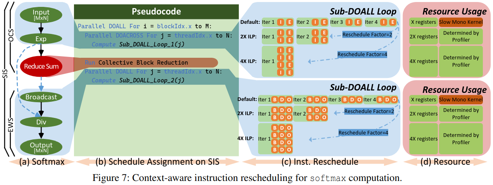
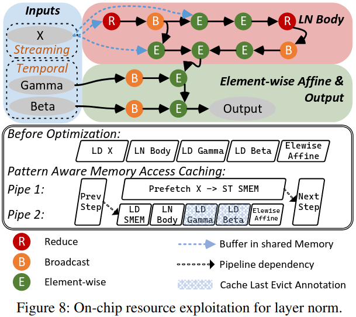
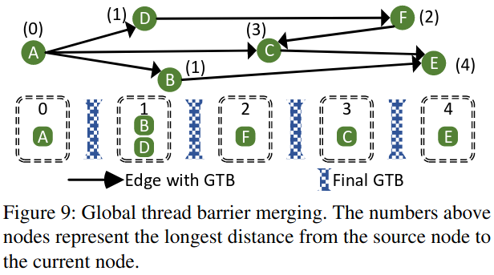
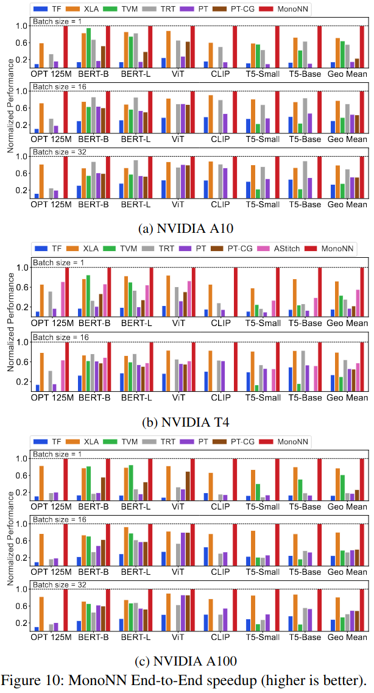
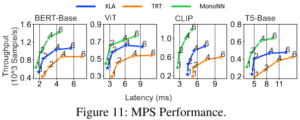
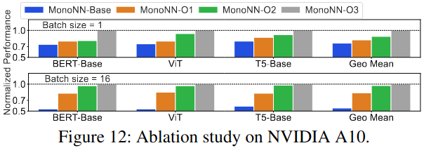
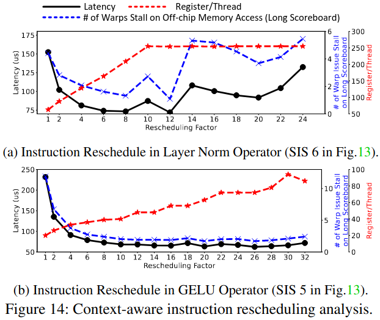

### Motivation
***Existing Method's Problem***:<br>
(1) Continuous advances in computation throughtput leads to an increasing portion of non-computation overhead<br>
(2) Ever-present, non-negligible CPU workloads exacerbate non-computation overhead


### Monolithic Optimization Space
- Main Challenges of Enabling A Monolithic Kernel Optimization Space<br>

***Challenge 1: Resource incompatibility between compute-intensive and memory-intensive operators***<br>

***Challenge 2: Extremely high implementation cost and huge tuning space***




### System Design



#### Exploiting Hidden Parallelism for Memory-intensive Subgraphs

***Memory-intensive Subgraph Formulation***



***Context-Aware Instruction Rescheduling***

DOALL循环: 循环的每次迭代之间完全没有数据依赖关系
```
for(i = 0; i < n; i++)
    C[i] = A[i] + B[i]  // 每次迭代都是独立的
```
DOACROSS循环: 循环的迭代之间存在数据依赖关系
```
for(i = 1; i < n; i++)
    A[i] = A[i - 1] + B[i]  // 当前迭代依赖前一次迭代的结果
```

#### On-Chip Resource Exploitation
- Streaming Access Optimization：输入的张量的每个元素只被访问一次，利用共享内存进行流水线访问
- Temporal Access Optimization：输入张量的元素被多次访问，使用缓存提示来延长数据在缓存中的保留时间



#### Global Thread Barrier Merging




### The MonoNN Compiler

#### Optimization Space Abstraction
***Code generation schedule of each operator in a neural network***

***Context-aware instruction rescheduling factor***

***TLP and on-chip resource of the overall monolithic kernel***


### Evaluation

#### End-to-End Performance Comparison







#### MonoNN Optimization Breakdown

