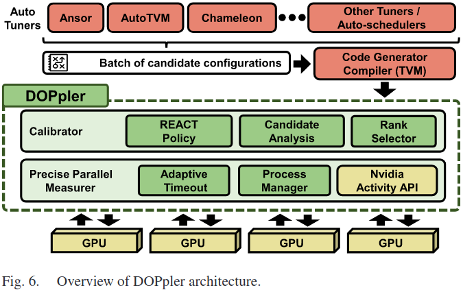
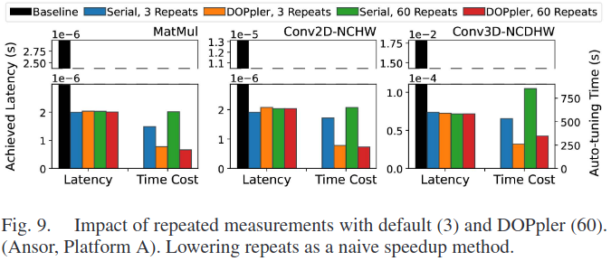

### DOPpler Design & Implementation

***Overview***

$\arg \min_{i,j,p} \delta_{mean}, \Upsilon = E(c_i, h_j, d_p)$

- Precise Parallel Measurer

$t_{out} = \left[\max\left\{\eta, \min\left\{t, 2t \times \tanh\left(\phi d_p\frac{G}{2}\right)\right\}\right\}\right]$

- Calibrator

### Evaluation

