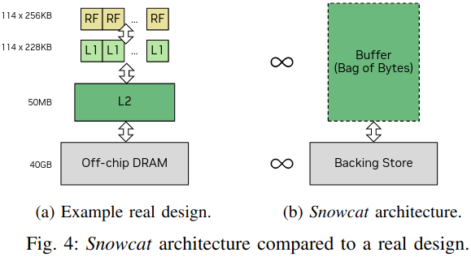
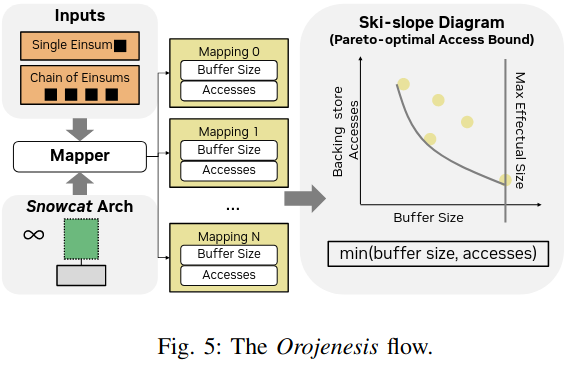
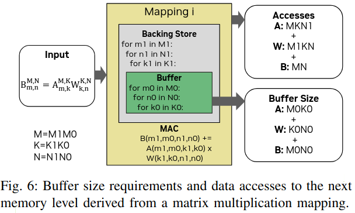

### Motivation
- data movement is sensitive to the reuse that can be exploited by an architecture's memory hierarchy
- data movement is sensitive to the specific implementation of an algorithm

### Orojenesis
***Orojenesis Methodology***
- Snowcat architecture

- Tool Flow

- Extrapolating Orojenesis bounds
(1) Multi-level Memory Hierarchy
(2) Parallel Architecture
(3) Constrained Mapspaces

***Derivation Models***
- Attainable Operational Intensity Model
- Attainable Performance Model

### Single-einsum Bounds Analysis
- Matrix Multiplication
- Convolution
- Batched Matrix Multiplication

### Orojenesis Fusion
