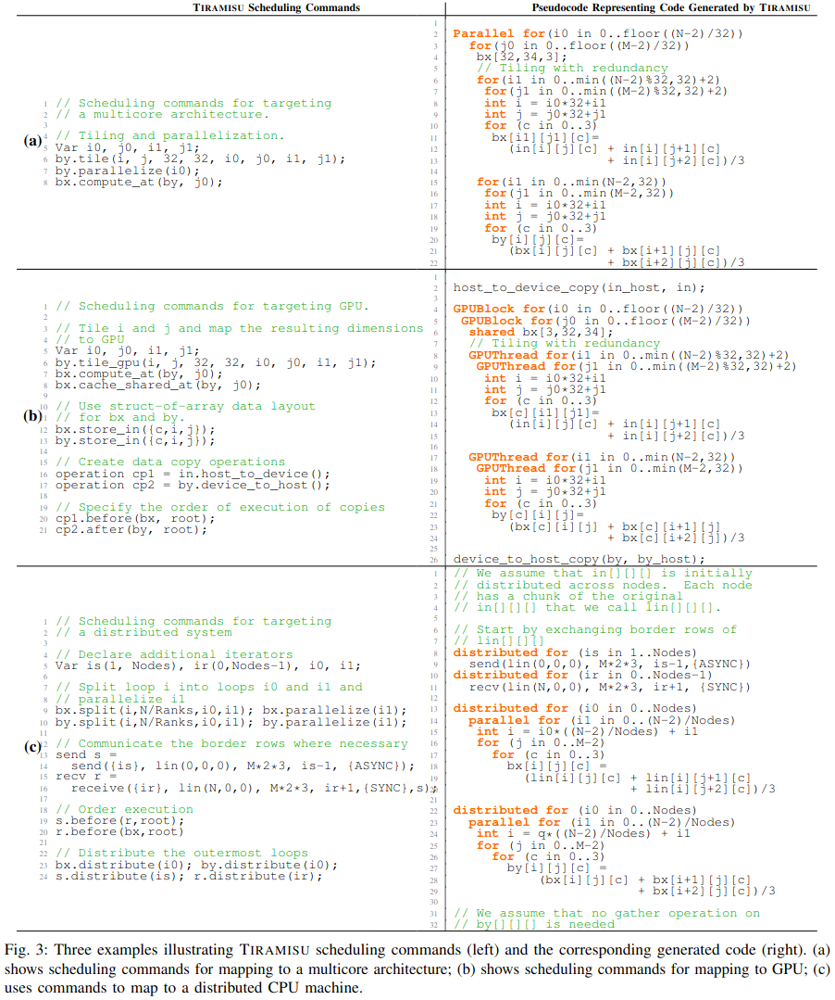
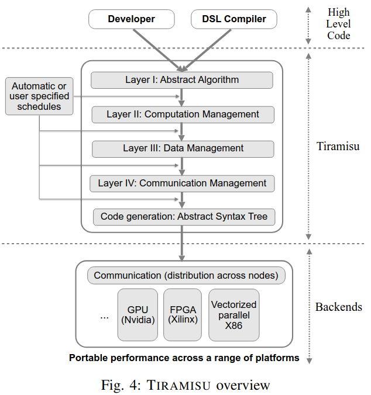

### The Tiramisu embedded DSL

### The Tiramisu IR

***The Muliti-Layer IR***
- Layer I (Abstract Algorithm)
- Layer II (Computation Management)
- Layer III (Data Management)
- Layer IV (Communication Management)