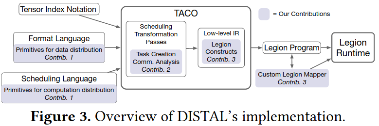
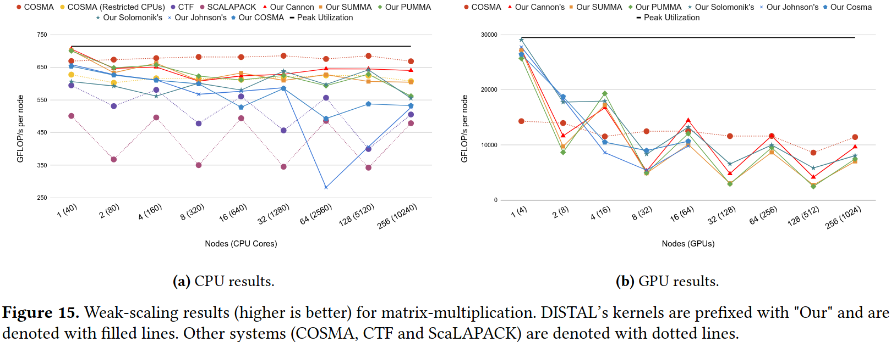
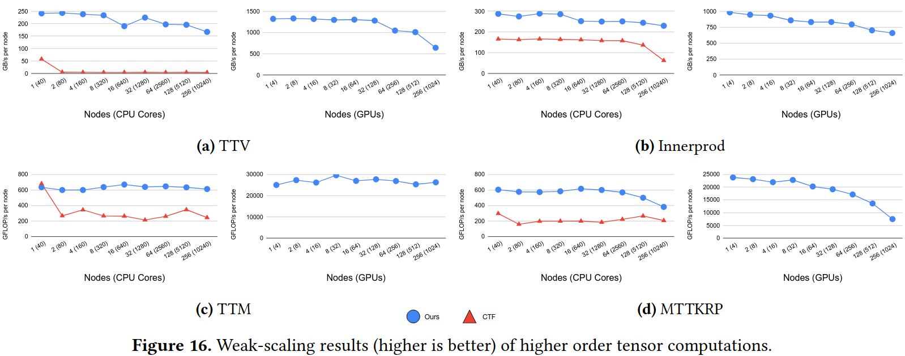

### Motivation
分布式张量算法的实现是正确同时对于程序员来说实现高性能是一个十分挑战的任务，原因：
1. 需要考虑各种各样的计算节点
2. 处理多GPU和CPU之间的非一致性内存访问

### DISTAL

***core abstractions***
- modeling modern machines
- data distribution
- computation distribution

***matrix-multilication case studies***
- distributed matrix-multiplication background
- summa
- cannon's algorithm
- johnson's algorithm
- pumma, solomonik's algorithm and cosma

***compilation***
- concrete index notation
- distributed scheduling 
- lowering tensor distribution notation

***implementation***
- Legion programming model
- lowering to Legion

### Evaluation
benchmark: ScaLAPACK、Cyclops Tensor Framework(CTF)、COSMA

### Reference
[DISTAL: The Distributed Tensor Algebra Compiler](https://dl.acm.org/doi/pdf/10.1145/3519939.3523437)