### Motivation
Existing Method
- The inefficiency of existing exploration-based approaches stems from low-quality search spaces, which are large but nearly all the program candidates are invalid to meet the architectural constraints of DLAs.
- it is quite difficult to accurately constrain the search space because of the diverse and complicated architectural constraints of DLAs.
The challenges of defining and exploring the search spaces for DLAs
**Observation #1**: There exists a large number of diverse and complicated architectural constraints in DLAs
**Observation #2**: High-quality search spaces are hard to be accurately described with a small number of intuitive hand-written constraints
**Observation #3**: Existing search algorithms fail to explore such high-quality while irregualr search space efficiently

### Overview
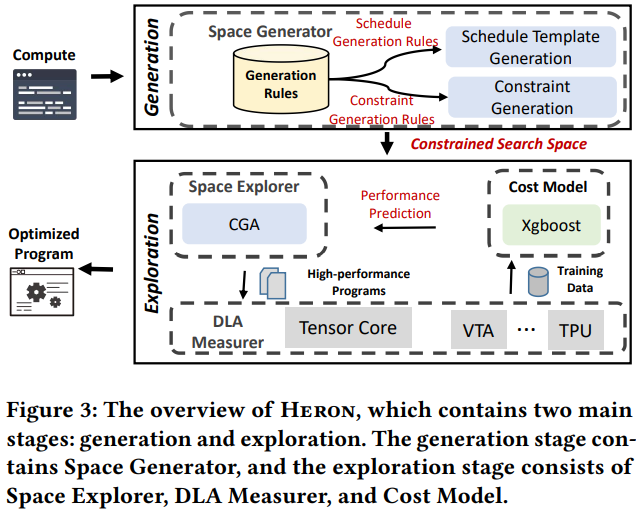

### Constrained Space Generation

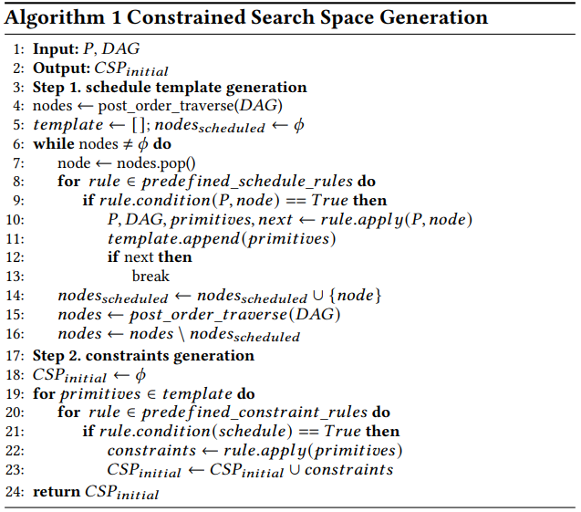

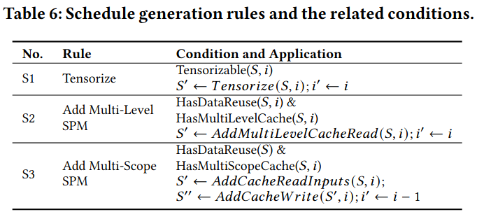

- Tensorize: 检查当前节点是否可以使用硬件张量使用，将计算替换为硬件内置的张量计算指令
- Add Multi-Level SPM: 为数据移动生成多个节点，在不同级别的片上存储之间移动数据
- Add Multi-Scope SPM: 为不同类型数据的移动生成节点
S2关注同一类型数据在不同层级间的移动，S3关注不同类型数据使用独立的存储路径

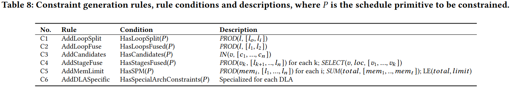

- AddLoopSplit: 检查循环是否被分割，确保分割后的子循环长度乘积等于原循环长度
- AddLoopFuse: 检查循环是否被融合，确保融合后循环长度等于原循环长度
- AddCandidates: 检查是否有候选值限制，限制变量只能取特定值
- AddStageFuse: 检查计算阶段是否被融合，处理融合后的阶段计算位置和循环长度关系
- AddMemLimit: 检查是否使用片上存储
- AddDLASpecific: 为特定DLA生成专门的约束

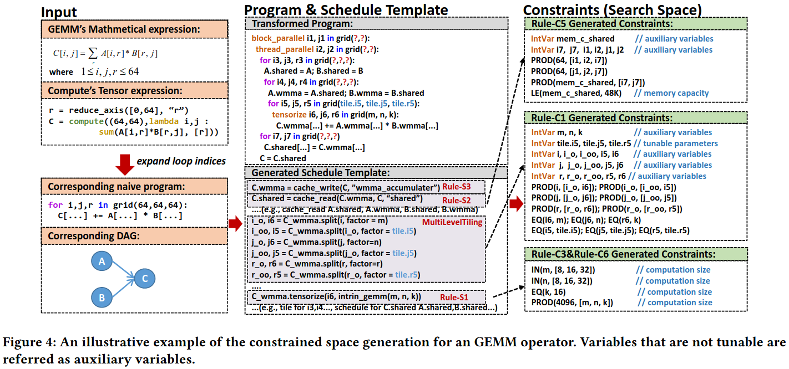

### Constrained Space Exploration

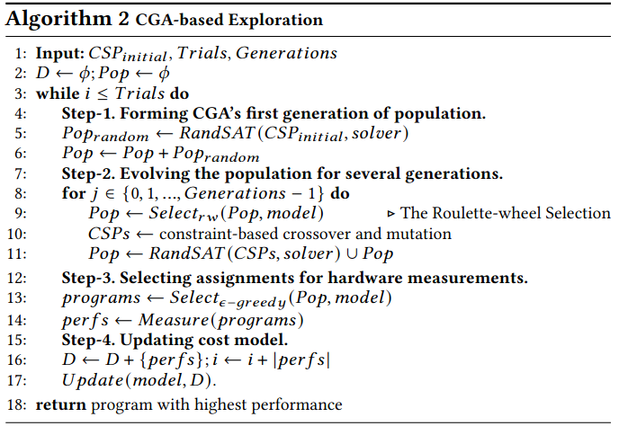

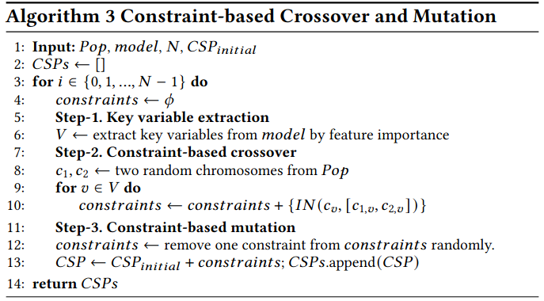

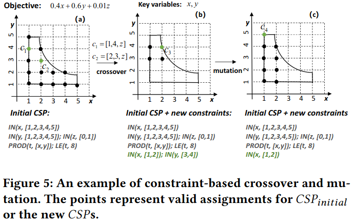

### Evaluation

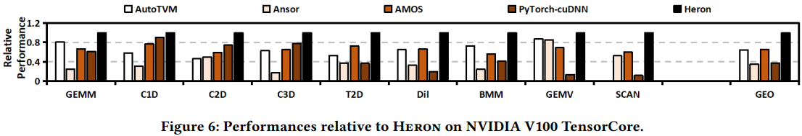

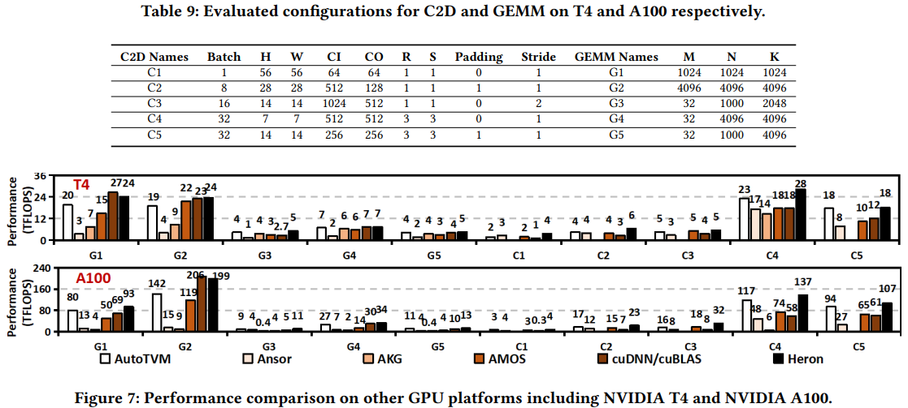

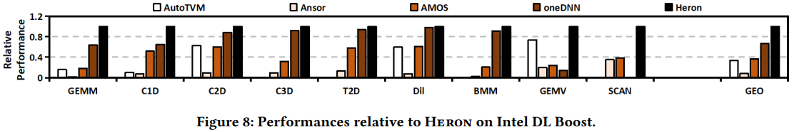

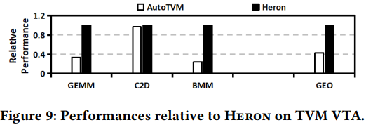

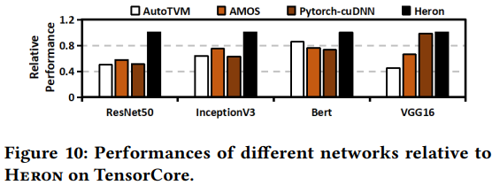

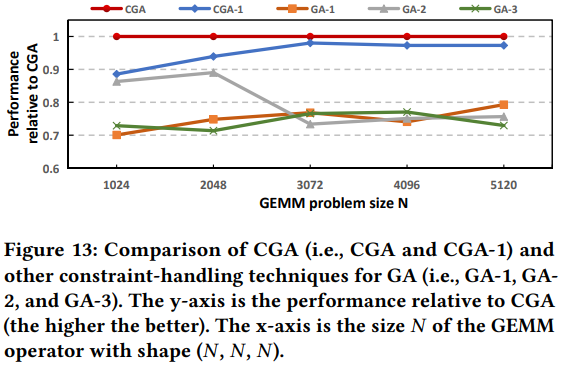

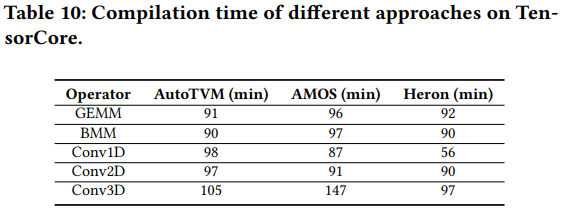

### Reference
[Heron: Automatically Constrained High-Performance Library Generation for Deep Learning Accelerators](https://dl.acm.org/doi/pdf/10.1145/3582016.3582061)