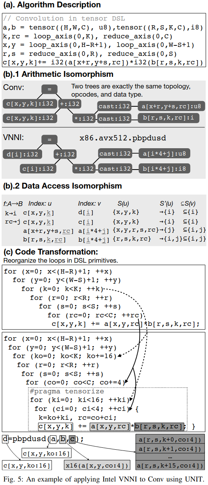
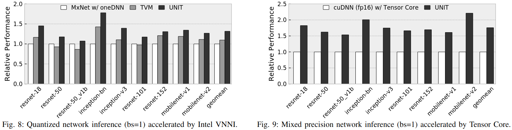
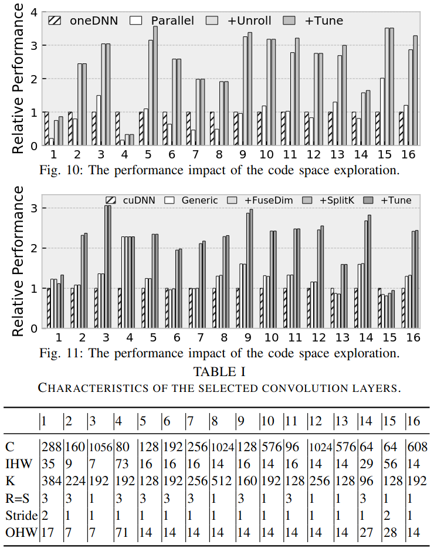
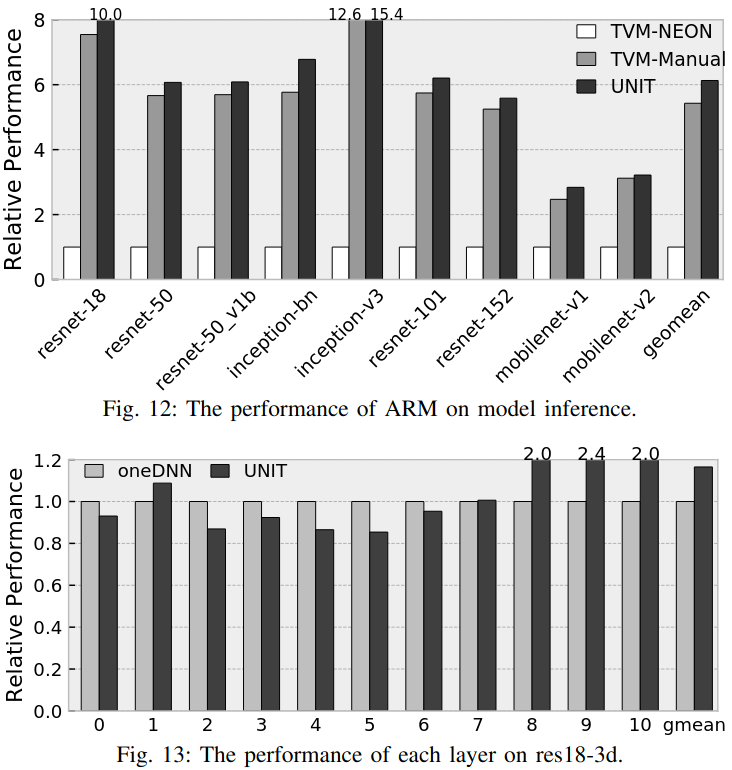

### Motivation
不同处理器可能提供不同的张量化指令，但是在深度学习背景下，这些指令本质上是以一种类似的计算模式。因此，作者提出设计一个统一的方法来编译这些张量化指令在多个硬件平台来优化张量操作
- Instructions Integration
- Detecting the applicability
- Code rewriting

### Unified Tensorization
***Semantics Abstraction - Tensor DSL***

***Applicability Detection - Inspector***
- 计算同构
- 内存访问同构

***Code Transformation - Rewriter***

### Evaluation

### Reference
[UNIT: Unifying Tensorized Instruction Compilation](https://arxiv.org/pdf/2101.08458)