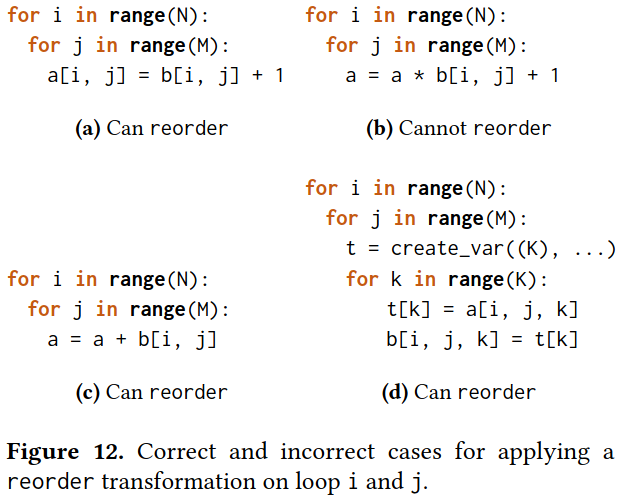

### Motivation
SubdivNet实现遇到的问题
- 需要将数据来回转换和复制
- 引入大量冗余计算和内存拷贝
- 大量操作仅用于重排数据，没有实际计算

FreeTensor遇到的挑战
- Optimization with the presence of dependence: 细粒度控制流使得代码生成更加困难，复杂的控制流和数据依赖关系限制潜在的代码转换优化
- Efficient automatic differentiation on complex control flows: 自动微分在复杂控制流程序上可能引入大量冗余，需设计高性能的自动微分机制

### Free-Form DSL

### Generating High Performance Code
- transform AST without breaking an allocation-freeing pair
- by limiting the life scope of a tensor to a sub-tree, most of the false dependence in dependence analysis can be eliminated

***Loop transformations***

***Parallelizing transformations***

***Memory transformations***

### Evaluation

