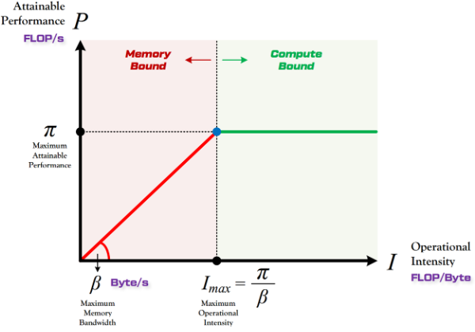

共享内存加载阶段优化顺序(存储对齐→循环融合→向量化→线程绑定)
# 共享内存加载优化顺序示例：矩阵转置加载
假设要从全局内存加载一个1024*32的矩阵到共享内存，并在加载过程中进行转置
### 初始化未优化代码
```
// 未优化的共享内存加载代码
__global__ void load_shared_unoptimized(float *input, float *output) {
    __shared__ float shared_mem[32][1024]; // 注意：行列布局

    // 每个线程逐个元素加载
    for (int i = 0; i < 32; i++) {
        for (int j = 0; j < 1024; j++){
            // 从全局内存加载并转置到共享内存
            shared_mem[i][j] = input[j * 32 + i]; 
        }
    }
}
```

### 应用存储对齐优化
```
// 添加存储对齐优化
__global__ void load_shared_step1(float *input, float *output) {
    // 使用8字节对齐的共享内存内存分配(float = 4字节)
    __shared__ float shared_mem[32][1024 + 1]; // +1 padding以确保行对齐

    // 每个线程逐个元素加载
    for (int i = 0; i < 32; i++) {
        for (int j = 0; j < 1024; j++){
            shared_mem[i][j] = input[j * 32 + i]; 
        }
    }
}
```
存储对齐确保每行开始于新的内存bank,减少bank冲突

### 应用循环融合优化
```
// 添加循环融合优化
__global__ void load_shared_step2(float *input, float *output) {
    __shared__ float shared_mem[32][1024 + 1]; 

    // 融合两层循环为一个一维循环
    for (int idx = 0; idx < 32 * 1024; idx++) {
        int i = idx % 32;
        int j = idx / 32;
        shared_mem[i][j] = input[j * 32 + i];
    }
}
```
循环融合简化了循环结构，为后续分割和并行化做准备

### 应用向量化优化
```
// 添加向量化优化
__global__ void load_shared_step3(float *input, float *output) {
    __shared__ float shared_mem[32][1024 + 1]; 

    // 首先分割融合循环，准备向量化
    for (int idx_outer = 0; idx_outer < 32 * 256; idx_outer++) {
        int i = idx_outer % 32;
        int j_base = (idx_outer / 32) * 4; // 每次处理4个元素

        // 向量化加载 - 一次加载4个float(float4)
        float4 vec_data;
        vec_data = *((float4*)&input[j_base * 32 + i]);

        // 存储向量数据
        shared_mem[i][j_base] = vec_data.x;
        shared_mem[i][j_base+1] = vec_data.y;
        shared_mem[i][j_base+2] = vec_data.z;
        shared_mem[i][j_base+3] = vec_data.w;
    }
}
```

### 应用线程绑定优化
```
// 添加线程绑定优化
__global__ void load_shared_step4(float *input, float *output) {
    __shared__ float shared_mem[32][1024 + 1]; 

    // 线程索引
    int tid = threadIdx.x + threadIdx.y * blockDim.x;

    // 每个线程处理多个向量
    for (int idx = tid; idx < 32 * 256; idx += blockDim.x * blockDim.y) {
        int i = idx % 32;
        int j_base = (idx / 32) * 4;

        // 向量化加载
        float4 vec_data;
        vec_data = *((float4*)&input[j_base * 32 + i]);

        // 存储向量数据
        shared_mem[i][j_base] = vec_data.x;
        shared_mem[i][j_base+1] = vec_data.y;
        shared_mem[i][j_base+2] = vec_data.z;
        shared_mem[i][j_base+3] = vec_data.w;
    }

    __syncthreads(); // 确保所有线程完成加载
}
```

Roofline与深度学习模型的性能分析
Roofline Model提出了使用Operational Intensity（计算强度）进行定量分析的方法，并给出了模型在计算平台上所能达到理论计算性能上限公式

计算平台的两个指标：算力π和带宽β
算力π：称为计算平台的性能上限，指的是一个计算平台倾尽全力每秒钟所能完成的浮点运算数.单位FLOPS或
带宽β：即计算平台的带宽上限，指的是一个计算平台倾尽全力每秒所能完成的内存交换量，单位是Byte/s
计算强度上限Imax：两个指标即可得到计算平台的计算强度上限，描述的是在这个计算平台上，单位内存交换最多用来进行多少次计算，单位是FLOPs/Byte  Imax = π/β

模型的两个指标：计算量与访存量
计算量：指的是输入单个样本，模型进行一次完整的前向传播所发生的浮点运算个数，也即模型的时间复杂度，单位是FLOPs
访存量：指的是输入单个样本，模型完成一次前向传播过程中所发生的的内存交换总量，也即模型的空间复杂度。在理想情况下，模型的访存量就是模型各层权重参数的内存占用与每层所输出的特征图的内存占用之和，单位是Byte
模型的计算强度I：由计算量除以访存量就可以得到模型的计算强度，它表示此模型在计算过程中，每Byte内存交换到底用于进行多少次浮点运算，单位是FLOPs/Byte
模型的理论性能P：模型在计算平台上所能达到的每浮点运算次数，单位是FLOPS

Roof-line Model: **计算量为A且访存量为B的模型在算力为C且带宽为D的计算平台所能达到的理论性能上限E是多少**
Roof-line：指的就是由计算平台的算力和带宽上限这两个参数所决定的屋顶形态；算力决定屋顶的高度，带宽决定屋檐的斜率


性能优化： 并行、访存、通信、计算
# 访存优化
一是减少数据搬运，二是减少访存延时，三是保证负载均衡
### 减少数据搬运
nvidia的GPU内存结构是三级的，global mem->shared mem->register. 通过三级分块可以尽可能地提高数据的复用性，也就是尽可能地将数据放到更近的存储结构上进行多次利用 <br>
**HPC优化的核心思想，怎么样让数据放在更近的存储上来掩盖计算的延迟，从而减少存储墙的影响** <br>
global memory 层面如何进行分块以及数据搬运 <br>
shared memory 层面如何进行分块以及数据搬运 <br>
register 层面如何进行分块以及避免bank冲突 <br>
如何进行prefetch以更好地掩盖访存时延 <br>

### 减少数据访存延迟
减少数据访存延迟指的是当数据搬运的次数已经确定了之后，怎么让每一次数据搬运尽可能地更快 <br>
减少bank冲突 <br>
软流水，有的时候都double buffer,有的时候叫ping pong操作 <br>
切分更多的块，启动更多的warp来掩盖访存延时

### 保证负载均衡

# 计算优化
计算优化的核心及策略：**打满所有的计算单元，用上所有的计算单元**
CPU的单精度算力来自于AVX-512计算单元，GPU的单精度算力来自大量的FP32计算单元，而半精度算力来自于tensorcore
### 选择高效计算单元
X86的AVX512指令集而言，需要使用__mm512指令才能将相应的AVX-512 SIMD单元用上
NVIDIA GPU的tensorcore而言，需要使用WMMA这样的Intrinsics才能使用

### 充分利用寄存器
为了适配特定的计算单元，各类硬件往往有自己特有的寄存器

### 避免流水线阻塞
提高指令的并行度，指令之间存在数据相关、控制相关(分支判断所导致的问题，一旦发生指令跳转，原来正常的流水线就会被影响，而且需要重新从指令cache中取指令，性能会产生一定的影响，一般使用#pragma unroll提示编译器进行循环展开就行但是需要在编译器确定循环次数)