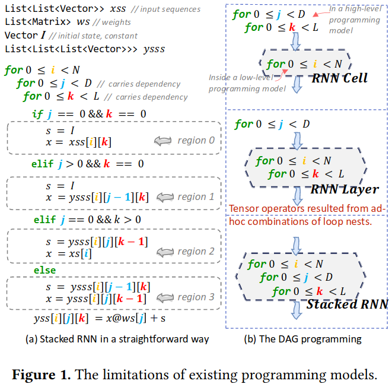
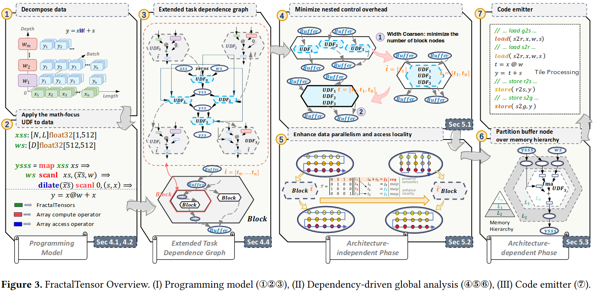
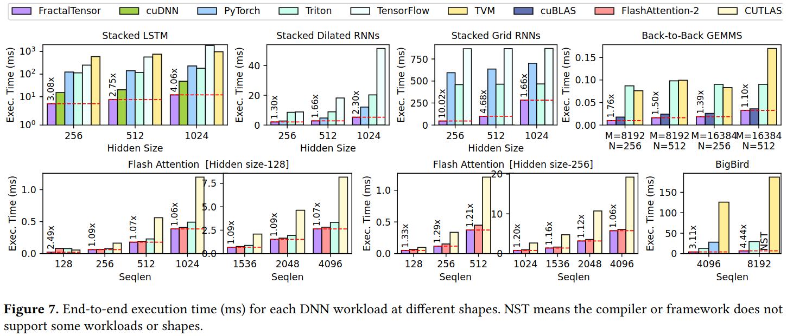
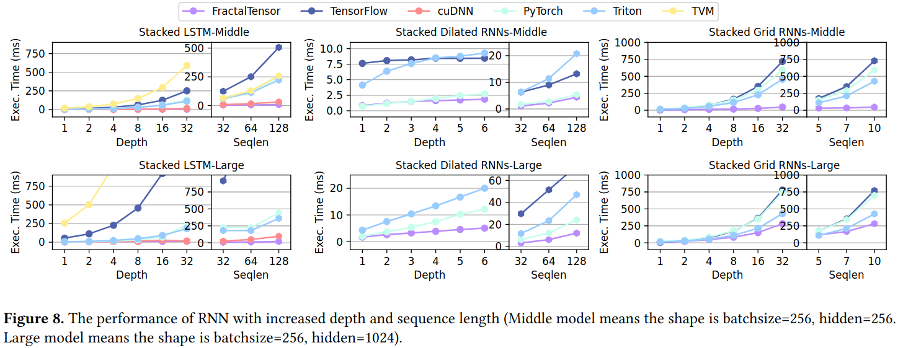

### Existing Method's Problems
- DAG is less expressive and problematic to support many DNN algorithms
- users either use a more flexible, imperative programming interface like pytorch to implement new DNNs while sacrificing efficiency, or keep introducing new tensor operators with optimized performance but ad-hoc semantics based on developer's experience

***Challenges***
- to identify and exploit the obscure data parallelism, especially in the presence of complex, fine-grained data dependencies across operator boundaries or across nested loops
- to identify and exploit the subtle data reuse opportunities across operators or nested loops

***Opportunities***
- the diverse DNN computation patterns can be expressed by a combination of second-order array compute operators
- the high-level data access patterns during DNN computation are highly stylized and can be expressed by a few first-order array access operators

### Programming FractalTensor

#### Extended task dependence graph
- Operation node
- Buffer node
- Block node
- Access map

### System Implementation

### Evaluation

