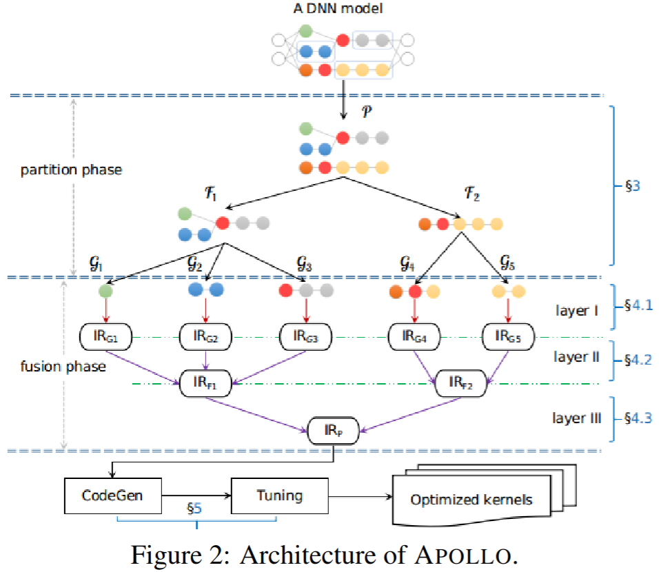

### Motivation
- Tensor compilers perform fusion together with tiling, but their fusion heuristics are subject to the constraints imposed by upstream graph compilers and thus suffer from the scalability issue
- existing compilers inability to effectively use the available hardware parallelism when given smaller batch sizes

### Apollo

#### Partition phase
- extracting sub-graph cluster:从计算图提取合法算子，用户自定义或具有复杂计算逻辑的超乎寻常的算子、控制流算子不被考虑
- opening compound operators
- aggregating primitive operators

#### Fusion phase
- layer I: Polyhedral loop fusion
- layer II: Memory stitching
- layer III: Parallelism

### Putting it all together
- auto-tuning
- piecewise compilation
- code generation

### Evaluation

