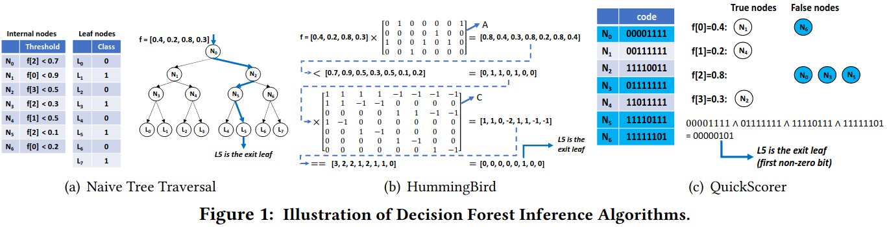

### Motivation
- 数据管理差距
- 数据库推理性能差距：1.缓存不命中 2.查询解析、优化和编译开销 3.其他开销
- 端到端的性能理解差距

现有决策树平台
- Scikit-learn: 对于RandomForest预测，采用模型并行(每个线程负责对输入数据运行一部分树的推理，结果会更新到一个由锁保护的共享结果向量)，predict函数支持向量化，可以批量处理输入样本
- ONNX: 并行化策略(根据输入样本数量和森林中树的数量来选择:数据并行、模型并行)、不使用向量化处理(树遍历函数每次只处理单个样本)
- HummingBird: 
- TreeLite: 将森林中的树分割成多个编译单元，将编译单元转换为C源代码函数，每个编译单元对应一个共享库文件
- Nvidia FIL: 每个GPU线程负责在一棵树上推理一批样本，采用批处理方式提高并行效率
- lleaves: 将树编译为嵌套的if-else块，不是直接生成C源代码
- Apache SparkSQL: 调用MLlib APIs来实现，在数据帧上运行决策森林推理
- TensorFlow Decision Forest(TFDF)
- PostgresML

### The DICT Performance Model
D: 数据集大小
I: 推理吞吐量
C: 数据集的基数
T: 数据传输吞吐量