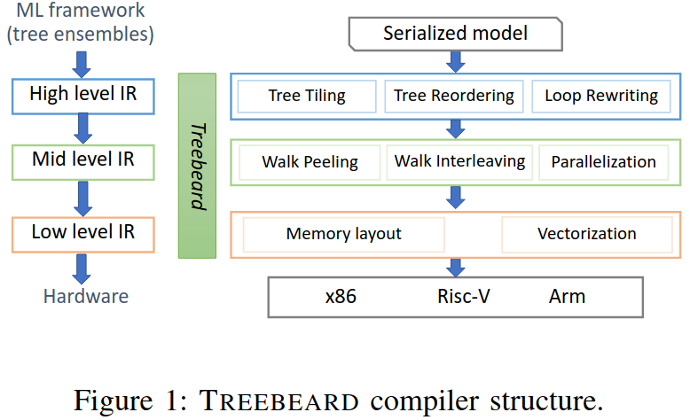
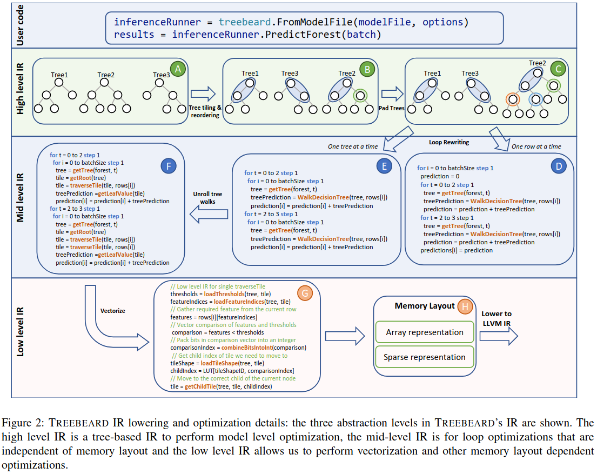
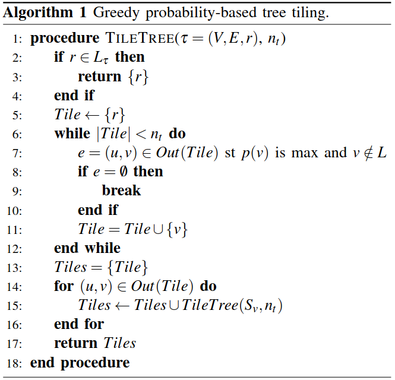
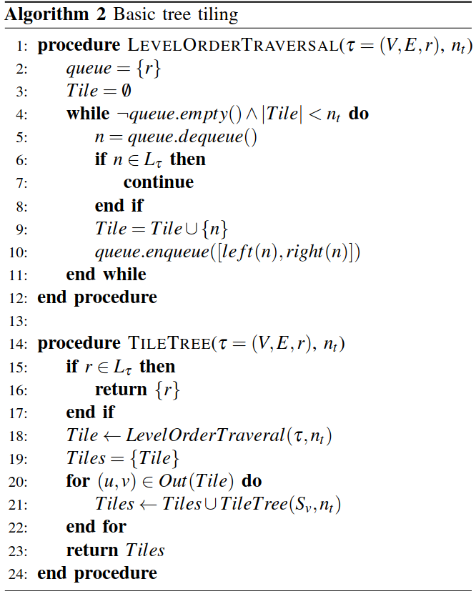
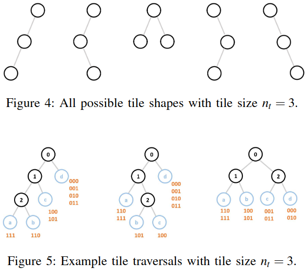
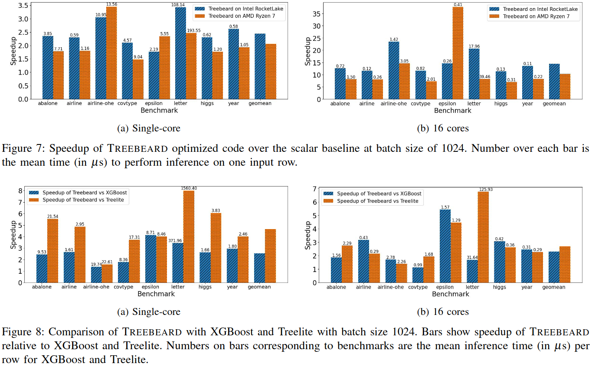

### Motivation
基本的树遍历具有差的空间和时间局部性从而导致高速缓存性能差，频繁的分支和真依赖导致流水线停滞从而导致利用SIMD的向量化进行低级优化十分具有挑战

Optimization Schedule
- pertaining to the nature of the algorithm
- pertaining to the properties of the tree being traversed
- targeting the characteristics of the CPU

### Treebeard Overview

### Optimizations on High-Level IR

- Tree Tiling
传统做法的问题：1.对内存层次结构的利用率低 2.由于真依赖关系导致指令级并行性差 3.无法使用向量指令

* 基于概率的切片: 最小化平均推理延迟
$\min_{\mathcal{F} \in \mathcal{C}(\tau)} \sum_{l \in L_{\tau}} p_l \cdot \text{depth}\mathcal{F}(l)$
基于概率的切片方法适合叶子偏向树，即某些路径被频繁访问的情况，通过将高概率路径上的节点组织在一起，可以提高访问效率

* Basic Tiling
没有明显的叶子偏向时，一个合理的目标是最小化推测执行的节点数

- Tree Reordering
为每棵树生成专门的代码，生成的代码量会很大，导致指令缓存未命中、指令解码延迟；一些跨树优化在树共享相同代码时效果更好

### Optimizations on Mid-Level IR

- Tree Walk Interleaving
指令之间的真依赖关系仍然导致大量处理器停顿，通过以交错方式遍历多个树和输入行对；更好地利用处理器的多个功能单元减少处理器停顿

- Tree Walk Peeling and Tree Walk Unrolling
展开的代码减少了条件分支、提高分支预测的准确性，提高指令级并行性；可以为不同概率的路径生成专门的代码，提高常见路径的执行效率

- Parallelization
数据分块、任务分配、负载均衡

### Optimizations on Low-Level IR
- Vectorization
多个比较操作被合并成一个向量操作，使用SIMD指令一次性完成，没有条件分支，使用查找表直接映射结果，连续的内存访问代替条件跳转

- In-Memory Representation of Tiled Trees

### Evaluation

