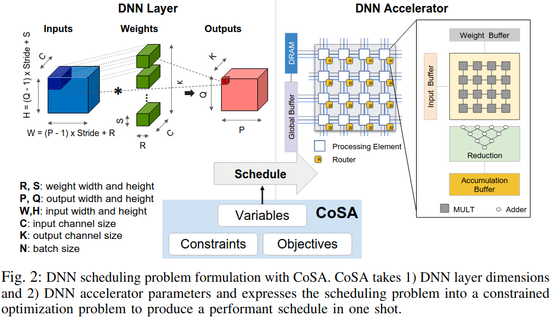
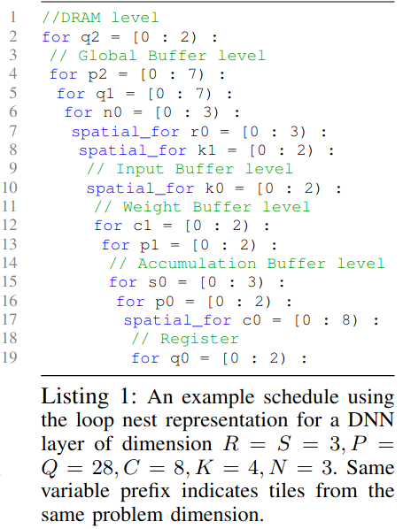
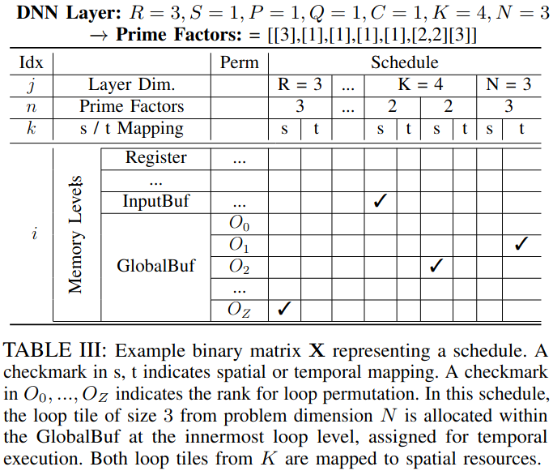
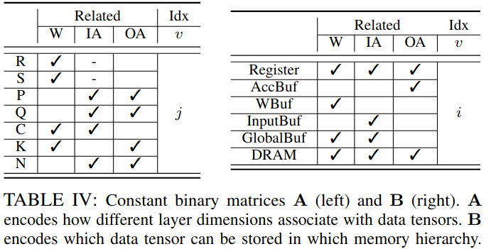
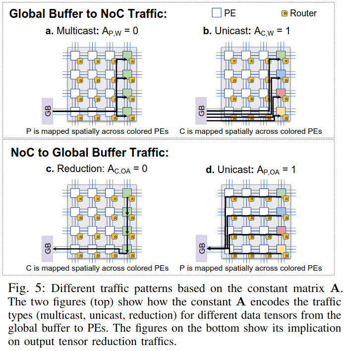

### Motivation
***State-of-the-art Schedulers***
- Brute-force Approaches: a brute-force search tends to be exceedingly expensive for complex hardware architectures, making it infeasible to find a good schedule quickly; the generated schedules often do not perform optimally since analytical models may fail to consider the communication latency across the spatial hardware
- Feedback_based Approaches: 对于现有的硬件架构可以适用，但是对于正在开发的硬件架构不适用
- Constrained-optimization Approaches: 多面体转换利用约束优化方法用于自动向量化和循环分块，缺少分块大小优化

### CoSA Framework

***CoSA Constraints***
- Buffer Capacity Constraint

$$\prod_{i=0}^{I-1} \prod_{j=0,n=0}^{6,N_j} \prod_{k=0}^1 \begin{cases} prime\_factor_{j,n}, & X_{(j,n),i,k}A_{j,v}B_{i,v} = 1 \\ 1, & \text{otherwise} \end{cases}$$

$$U_{I,v} = \sum_{i=0}^{I-1} \sum_{j=0,n=0}^{6,N_j} \sum_{k=0}^1 \log(prime\_factor_{j,n})A_{j,v}B_{I,v}X_{(j,n),i,k} \leq \log(M_{I,v}), \forall I$$

- Spatial Resource Constraint

$$\sum_{k=0}^1 X_{(j,n),i,k} == 1, \forall(j,n),i$$

$$\sum_{j=0,n=0}^{6,N_j} \log(prime\_factor_{j,n})X_{(j,n),I,0} \leq \log(S_I), \forall I$$

***Objective Functions***
- Utilization-Driven Objective
$$Util = \sum_{i=0}^{I-1} \sum_{v=0}^2 U_{i,v}$$

- Compute-Driven Objective
$$\widehat{Comp} = \sum_{i=0}^I \sum_{j=0,n=0}^{6,N_j} \log(prime\_factor_{j,n})X_{(j,n),i,1}$$

- Traffic-Driven Objective
$$D_v = \sum_{i=0}^{I-1} \sum_{j=0,n=0}^{6,N_j} \sum_{k=0}^1 \log(prime\_factor_{j,n})A_{j,v}X_{(j,n),i,k}$$

$$L_v = \sum_{j=0,n=0}^{6,N_j} \log(prime\_factor_{j,n})X_{(j,n),I,0}A_{j,v}$$

$$Y_{v,z} \geq \sum_{j=0,n=0}^{6,N_j} X_{(j,n),z,1}A_{j,v}B_{I,v}, \forall z, \forall v$$
$$Y_{v,z} \geq Y_{v,z-1}, \forall z > 0, \forall v$$

$$T_v = \sum_{z=0}^{Z-1} \sum_{j=0,n=0}^{6,N_j} \log(prime\_factor_{j,n})Y_{v,z}X_{(j,n),z,1}$$

$$\widehat{Traf} = \sum_{v=0}^2 (D_v + L_v + T_v)$$

- Overall Objective
$$\widehat{O} = -w_U\widehat{Util} + w_C\widehat{Comp} + w_T\widehat{Traf}$$

