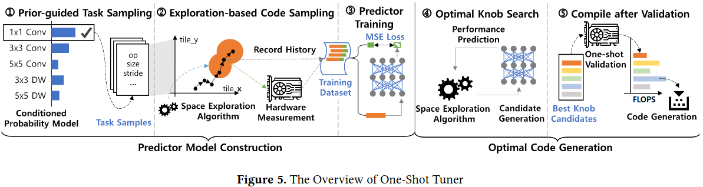
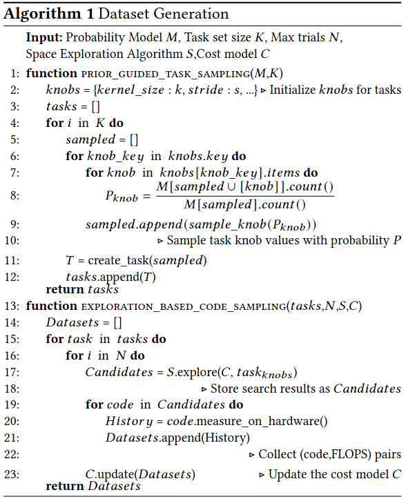
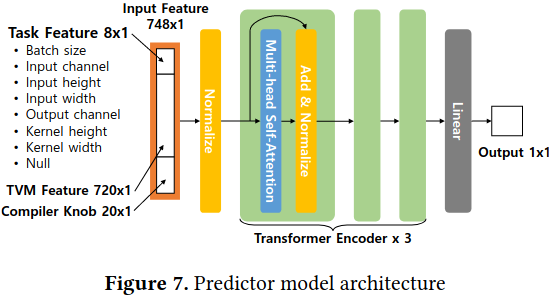
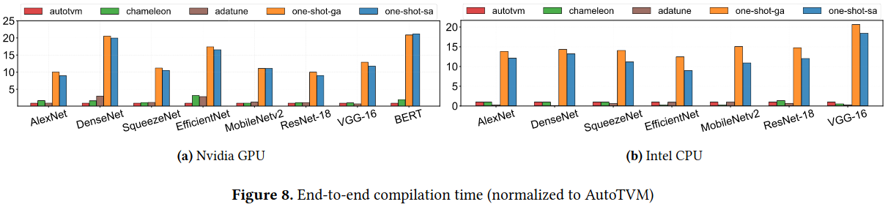
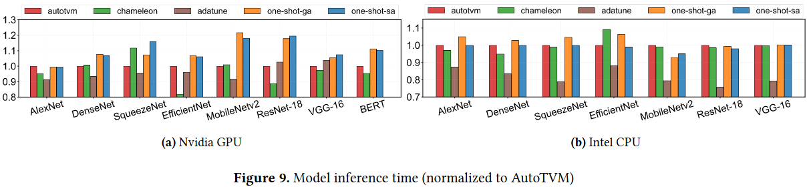

### Motivations and Challenges
- 现有的输入数据和代价模型并不是专门设计用于学习task、knob、performance这些参数
- 任务采样的方法决定了代价模型的通用性
- 硬件测量的随机分布导致性能分布偏斜

### Design and Implementation

#### Predictor Model Construction

***Prior-Guided Task Sampling(PGS)***

***Exploration-Based Code Sampling(EBS)***

***Feature Generation*** 
***Predictor Model Architectured***

#### Optimal Code Generation

### Evaluation

* End-to-End Compilation Time

* Inference Time

* Ablation Analysis

* Comparison with TVM Auto-scheduler

### Reference
[One-Shot Tuner for Deep Learning Compilers](https://dl.acm.org/doi/pdf/10.1145/3497776.3517774)