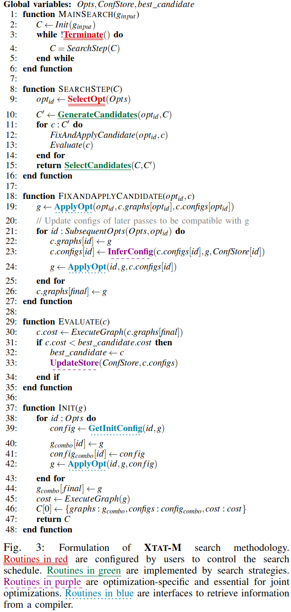
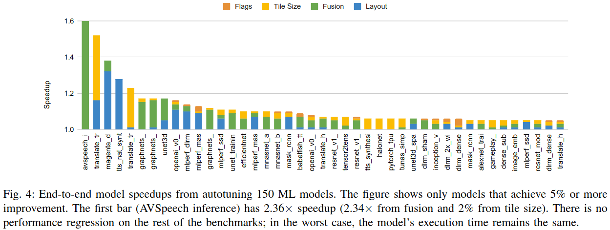
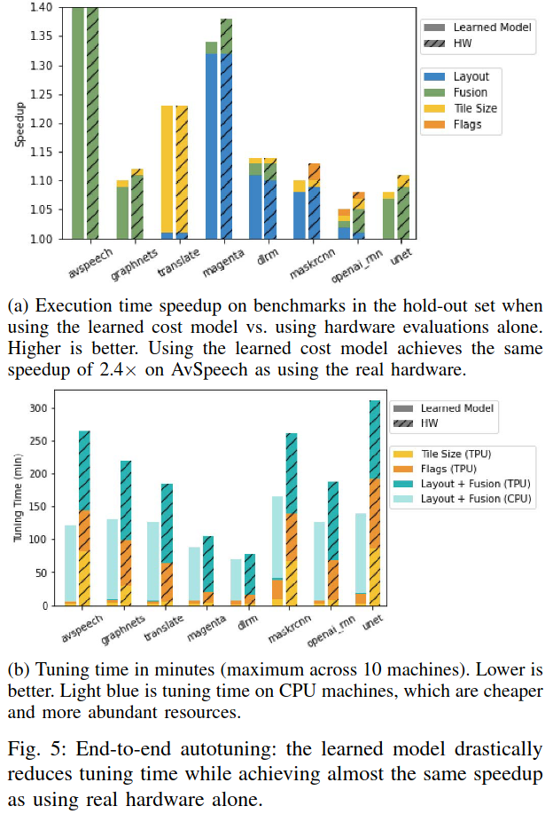
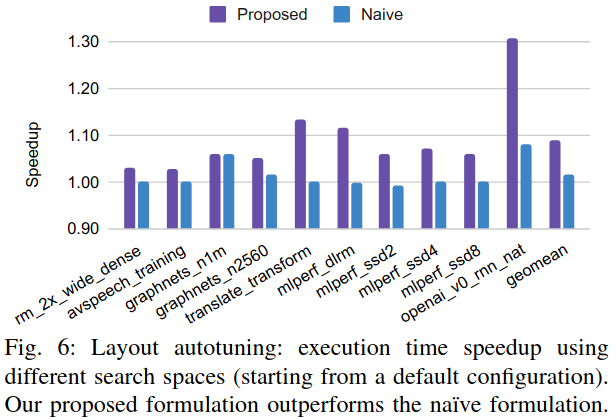
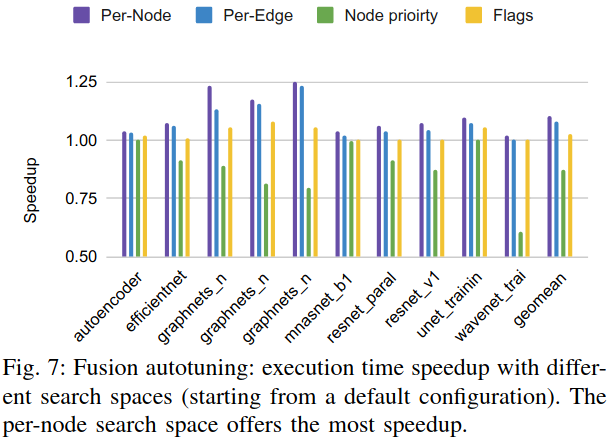
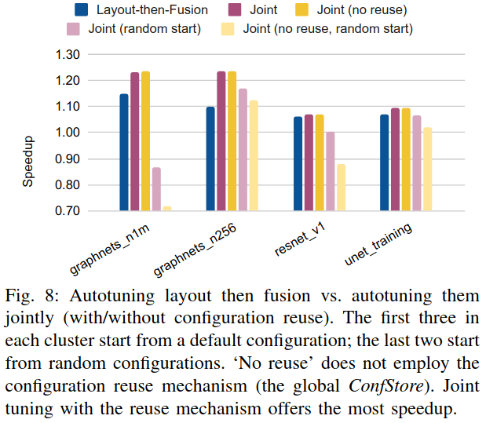

### Motivation
- 子图划分不仅复杂同时会限制优化的范围
- 之前的搜索专注于编译流中的单一阶段，不适合大多数深度学习编译器的多层架构

### XTAT-M

### XTAT
#### XTAT's Optimization-Specific Search Formulations
- Layout Assignment
- Operator Fusion
- Tile-Size Selection
- Lowering Flags

### Evaluation

### Reference
[A Flexible Approach to Autotuning Multi-Pass Machine Learning Compilers](https://mangpo.net/papers/xla-autotuning-pact2021.pdf)