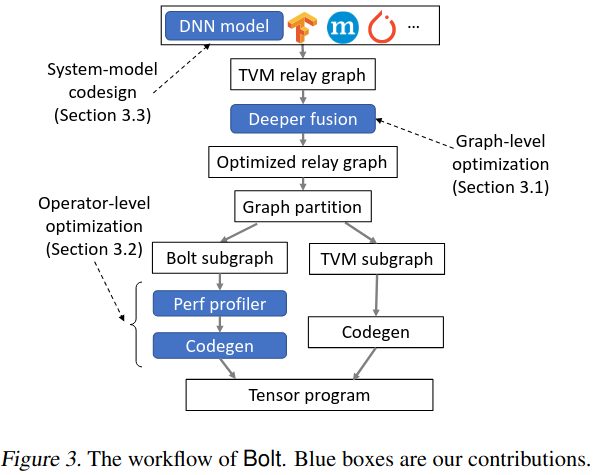
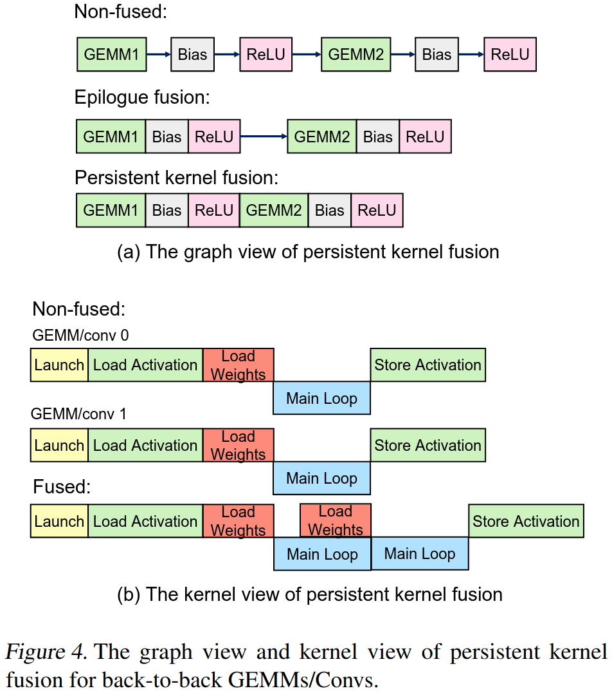
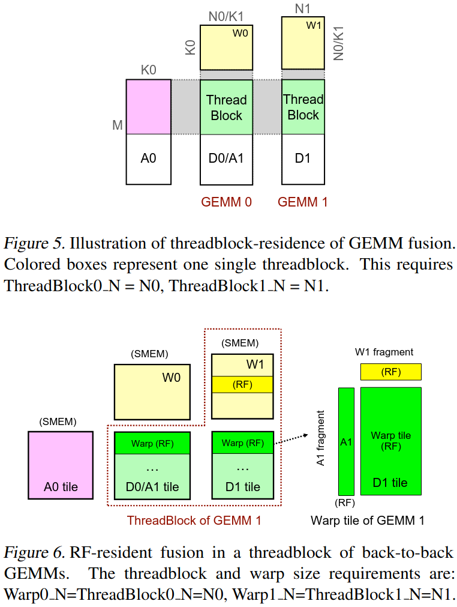
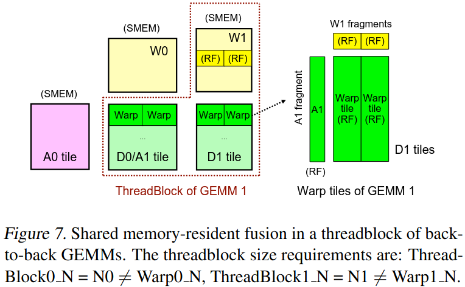
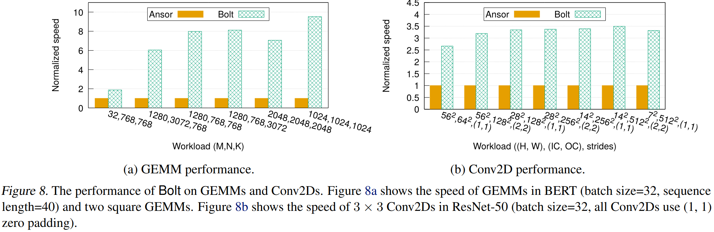
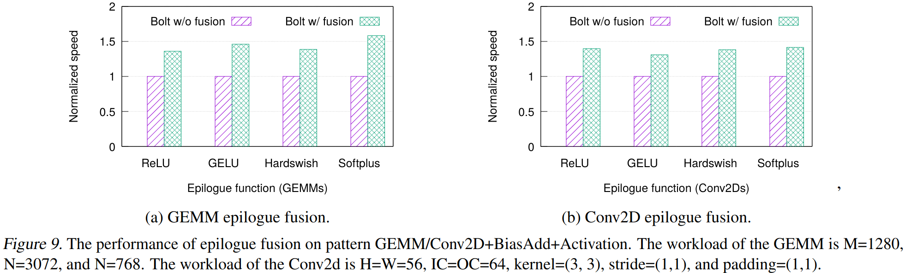
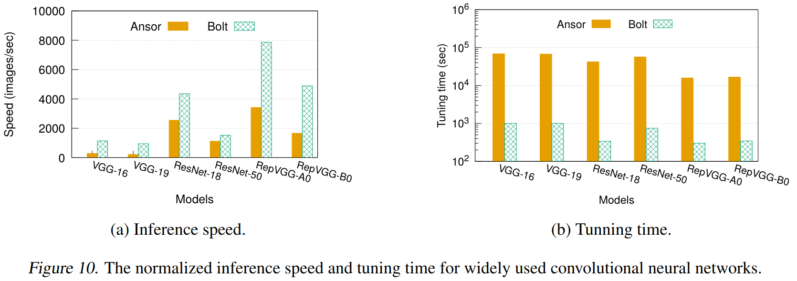

### Motivation
- 自动调优有性能差距：1.缺少硬件本身性能(这里举例说明tvm的float16 GEMM的速度慢于人工调优库cuBLAS，因为tvm支持float32) 2. 低效程序搜索

### Bolt Design

***enabling deeper operator fusion***

将多个连续的GEMM/Conv操作融合到一个内核中执行
好处：1. 减少内存访问，中间结果不需要写回到全局内存 2. 减少内核启动开销，多一个操作合并为一次GPU内核调用 3. 扩大优化空间

- Threadblock residence
保持数据在同一线程块内
对于GEMM融合: ThreadBlock_N = GEMM_N 每个GEMM的N维度要等于线程块的N维度
对于Conv融合: 后续Conv必须是1*1卷积，无padding，stride=1

- RF-resident fusion
权重矩阵W1可以完全装入一个warp tile的N维度

- Shared memory-resident fusion
当RF-resident融合的约束太严格时，需要在warp之间共享数据

核心问题： 性能与灵活性的矛盾
自动调优器(灵活性好、自动化、性能差)
厂商优化库(性能极佳、调优快、功能固定)

利用新兴的模板优化库

***automating templated code generation***
模板库使用的挑战：
1. 模板库功能不完整，只支持部分算法，无法构建完整的DNN模型
2. 参数调优复杂
3. 传统BYOC方法的局限，将库当做黑盒外部函数

传统BYOC
计算图 → 分割子图 → 调用外部库函数 → 运行时执行
Bolt的BYOC
计算图 → 分割子图 → 性能分析 → 模板实例化 → 生成CUDA代码

轻量级性能分析器
1. 提取性能相关参数： threadblock(线程块大小)、warp(warp大小)、instruction(指令形状)、stages(流水线阶段数)
2. 硬件特定的启发规则
寄存器文件容量约束: 优选大的warp瓦片尺寸以提高内存比
warp数量优化: 每个threadblock使用4或8个warp在现代NVIDIA CPU上性能更好
小问题尺寸适配: 小问题需要小threadblock以启动足够多的threadblock保持SM忙碌
3. 生成候选配置
4. 运行时性能测试

模板化代码生成
1. 布局转换
CUTLASS只支持NHWC布局，但pytorch模型都用NCHW布局，直接转换会增加很多开销
Bolt解决方案: 全局布局转换(将所有Conv算子专为NHWC)、只在模型输入和输出处进行布局转换、避免每个算子都转换的开销
2. 内核填充
自动将不对齐的张量填充到8的倍数

***designing system-friendly models***
- Exploring differenct activation functions with epilogue fusion
- Deepening model with 1*1 convs
- Aligning tensor shapes to use GPUs more efficiently

整体工作流程
输入模型 → 计算图优化 → 图分割 → 轻量级性能分析器 → 找到最佳模板参数 → 模板化代码生成 → 与TVM生成的代码一起编译 → 最终可执行文件

### Evaluation

### Reference
[BOLT: BRIDGING THE GAP BETWEEN AUTO-TUNERS AND HARDWARE-NATIVE PERFORMANCE](https://proceedings.mlsys.org/paper_files/paper/2022/file/1f8053a67ec8e0b57455713cefdd8218-Paper.pdf)