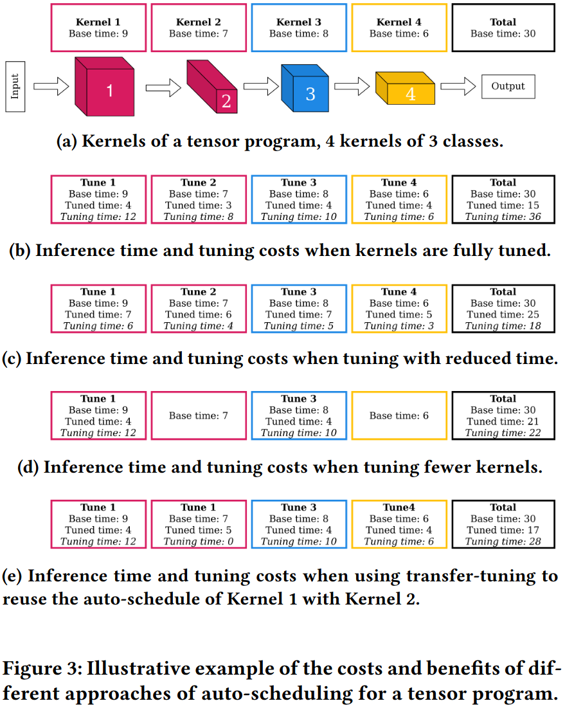
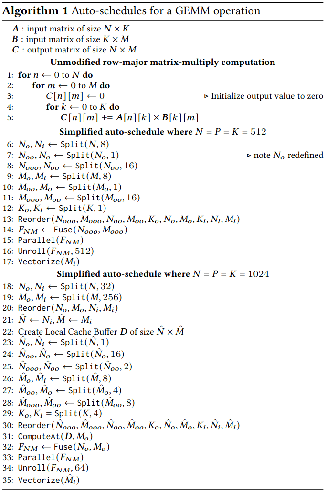
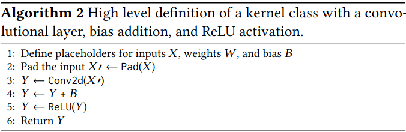
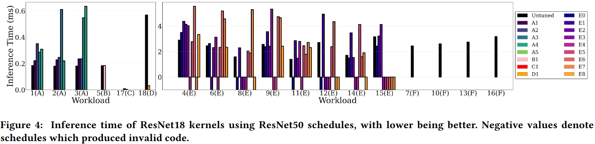
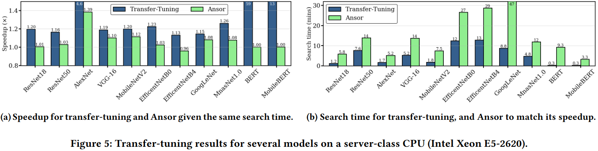
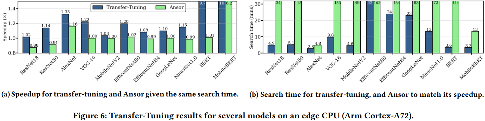
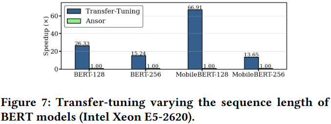
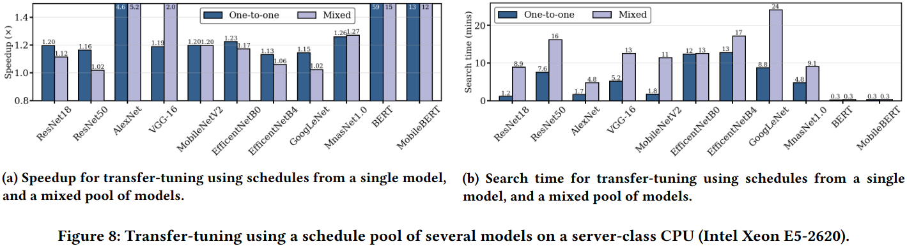

### Motivation

### Transfer-Tuning
#### Principles of Transfer-Tuning

transfer-tuning: when we apply the schedule produced for a given kernel via auto-scheduling and apply it to a kernel other than the one the schedule was tuned for

#### Kernel Classes

### Evaulation

### Reference
[Transfer-Tuning: Reusing Auto-Schedules for Efficient Tensor Program Code Generation](https://arxiv.org/pdf/2201.05587)