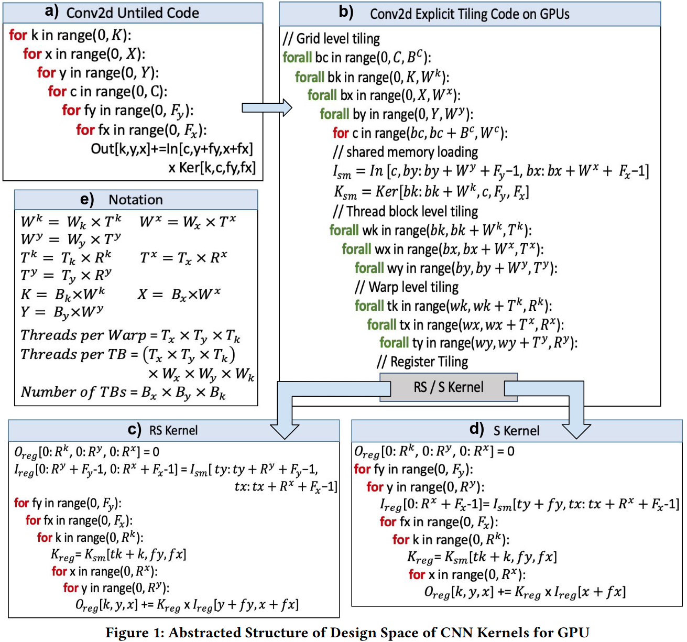
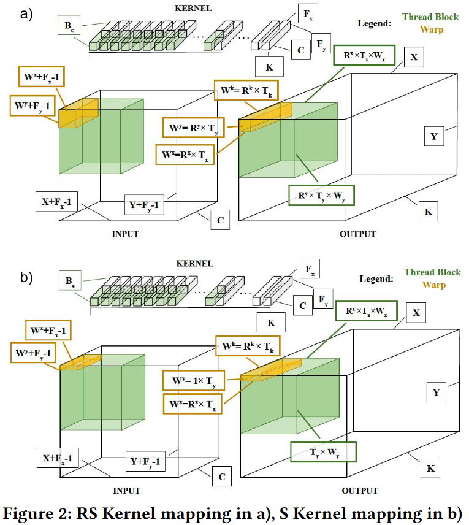
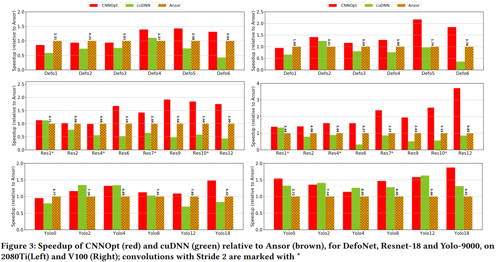
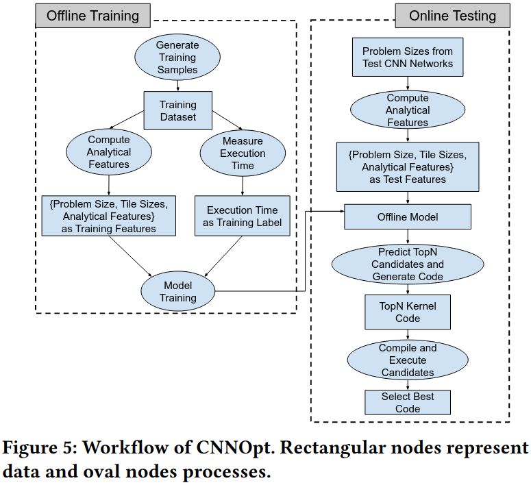

### CNNOpt Overview

***Design Details***
- Pruning Register Tiles for Input Channel
- Design space pruning via capacity constraints
- Impact of Thread Occupancy: S Kernel
- Tail effect and Synchronizations: Reduction Parallelism along Input Channels

### Performance modeling for rapid design space exploration 

### Reference
[Effective Performance Modeling and Domain-Specific Compiler Optimization of CNNs for GPUs](https://dl.acm.org/doi/pdf/10.1145/3559009.3569674)~