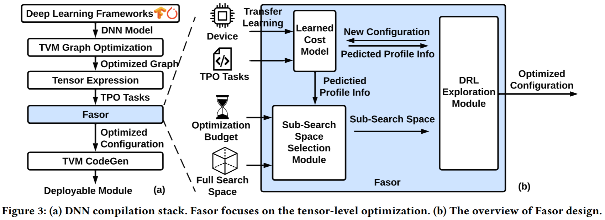
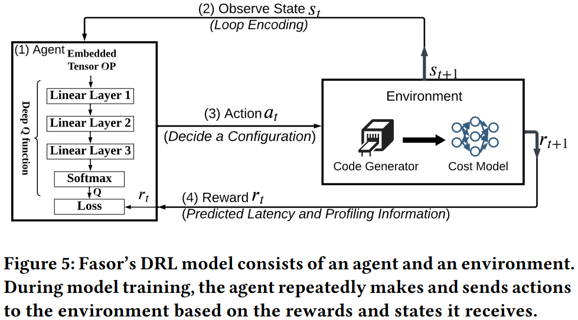
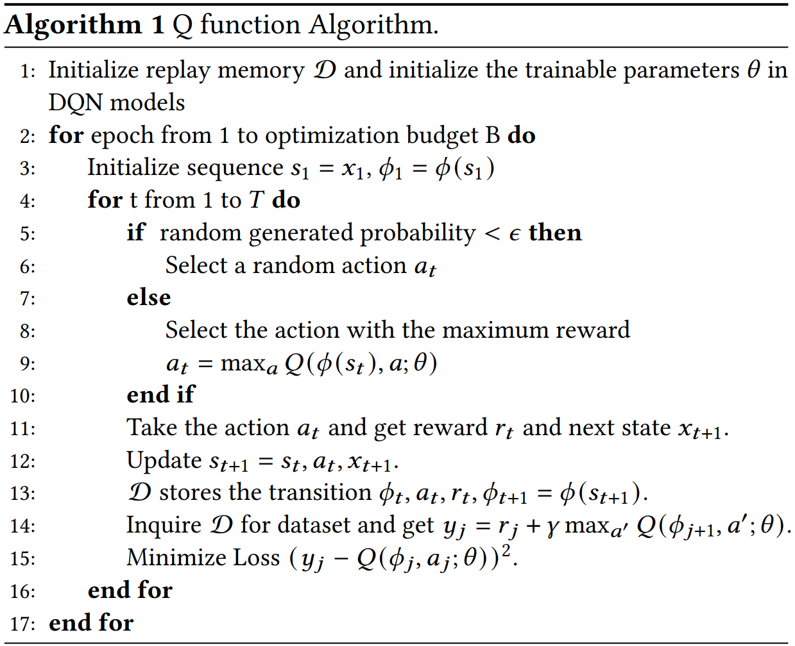
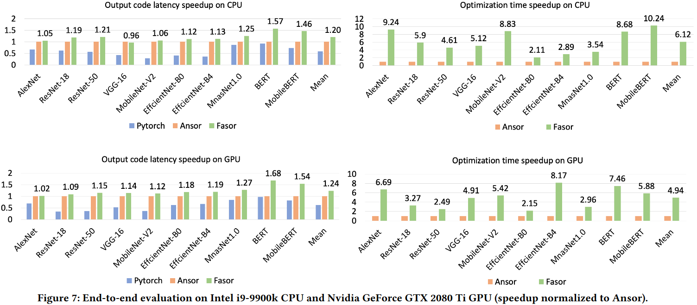

### Motivation
DNN编译的关键瓶颈是代价模型训练，搜索采样低效

Solutions
- Transferring efficiency: 提升代价模型学习评价张量程序的通用知识的能力
- Sampling efficiency: 高效搜索空间，避免采样只能产生较低优化的调度

### Fasor

***A learned cost model***
- model and feature design
代价模型由四个多头注意力层和一个线性层来预测执行时间、内存、处理器核数；特征选择：包括常见特征，从a small signature set of tensor programs来学习硬件特征来确保少样本迁移学习
- few-shot transfer learning

***Sub-search space selection module***
- empirical parameter options pruning
- profile-guided critical primitives selection

***Drl exploration module***
- stage1: exploiting pre-tuned schedule as the search start point
局部最优的问题
- stage2: fast drl search $r_t = \phi_1(T_{t-1} - T_t) + \phi_2\frac{CS}{MS} + \phi_3\#Iter$

### Evaluation
post-fasor-evaluation.png

### Reference
[Fasor A Fast Tensor Program Optimization Framework for Efficient DNN Deployment](https://dl.acm.org/doi/pdf/10.1145/3650200.3656631)