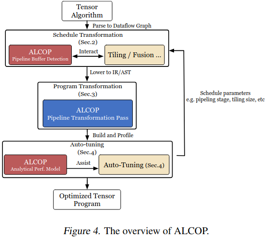
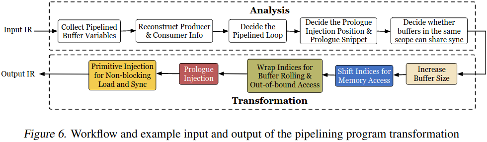
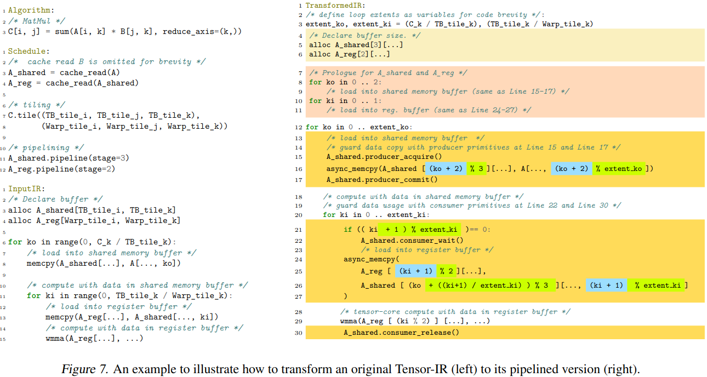
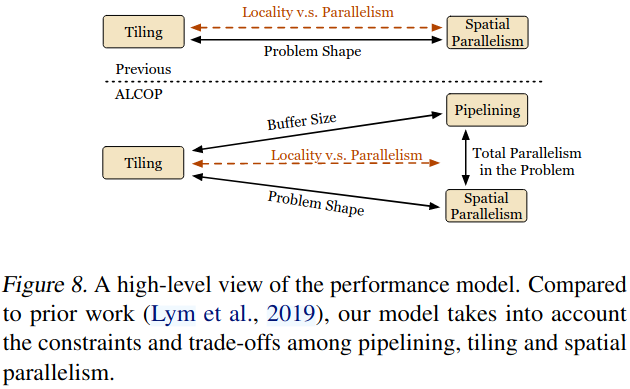
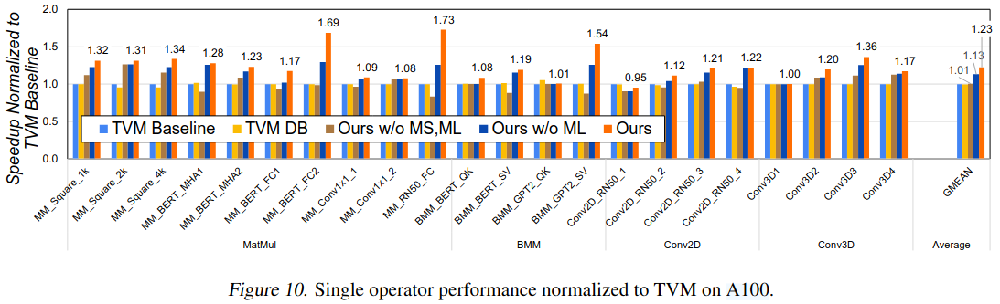
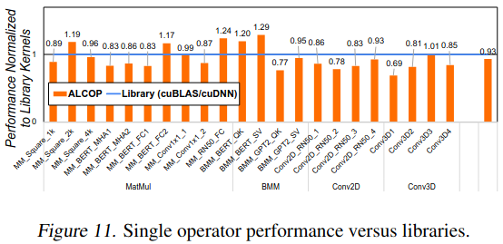
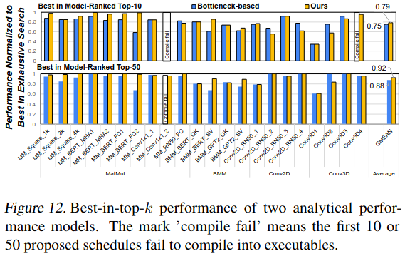
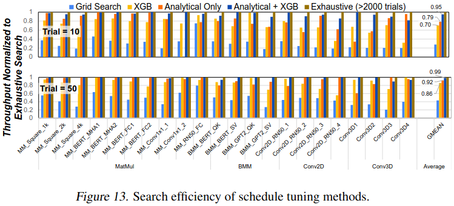

### Motivation
Automatic pipelining: workload complexity(diverse DL operators)、hardware complexity(multi-level memory hierarchy)、design space complexity(coherent performance tuning factors)
Solutions: pipeline buffer detection、pipeline program transformation、analytical-model guided design space search

### Schedule Transformation
***identification of buffers for pipelining***
- 不产生异步内存拷贝的内存不流水
- 流水的缓冲会产生一个序列的load-and-use循环
- 如果硬件平台仅支持基于范围的同步，会检查同一范围内的所有缓冲区，并在其同步位置不匹配时不流水

### Program Transformation

### Static Analysis Guided Tuning

### Evaluation

### Reference
[ALCOP: AUTOMATIC LOAD-COMPUTE PIPELINING IN DEEP LEARNING COMPILER FOR AI-GPUS](https://proceedings.mlsys.org/paper_files/paper/2023/file/d6cde2c1b161daa31be560d062cf2251-Paper-mlsys2023.pdf)