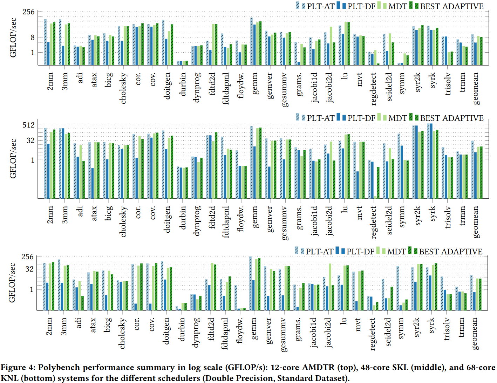

### Motivation
- 之前的方法关注如何生成更大的搜索空间
- 本文的关注： 1. 如何生成小但是有意义调优空间 2. 提供高级、合成和专用的政策来允许用户导航空间 3. 提供机制允许访问构建调优空间的特征和大小

### Adaptive Scheduling

***Leveraging the ILP Performance Lexicon***
生成一个可处理同时丰富的搜索空间

***Building a Database of Nano-Kernels***
- constits of one or two program statements, each with a loop depth greater or equal to one
- each statement accesses at most two multi-dimensional array references
- statements may access the same array, in which case they induce a dependence

***Input SCoP Features and Dependence Keys***

***Architecture Independent Metrics, Architecture Dependent Choices: Assessing the ILP Cost Functions Impact***

***Ranking Dependences***

***Statement Partitioning***

***Selecting ILP Objectives***

***Avoiding Conflicting Objectives***

### Evaluation

### Reference
[Automatic Generation of Multi-Objective Polyhedral Compiler Transformations](http://aegjcef.unixer.de/publications/img/chelini-autopoly.pdf)