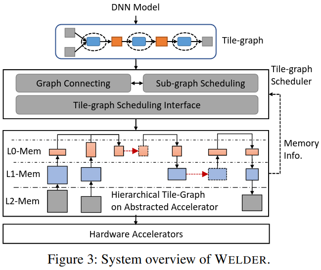
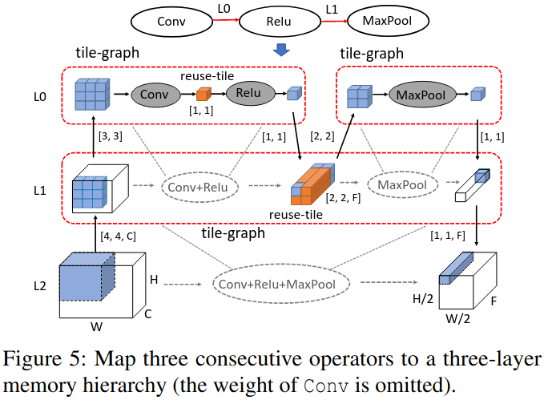
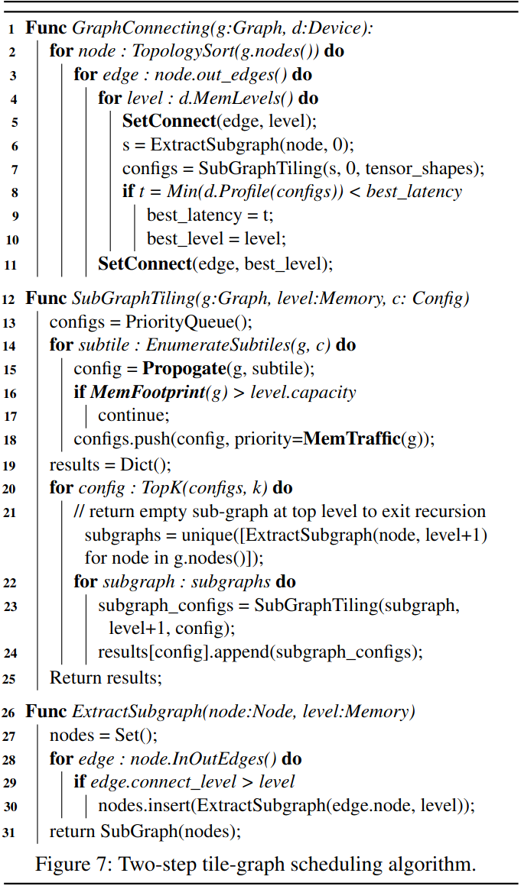
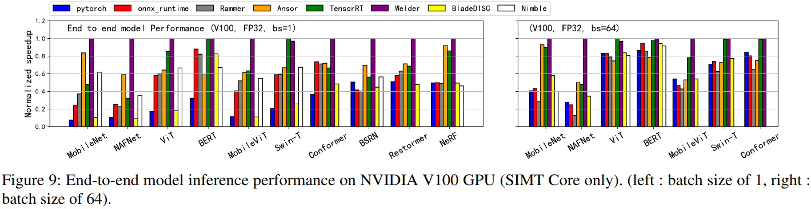
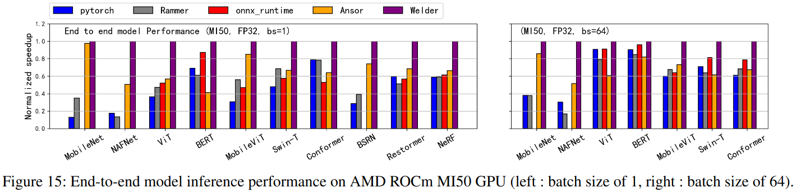
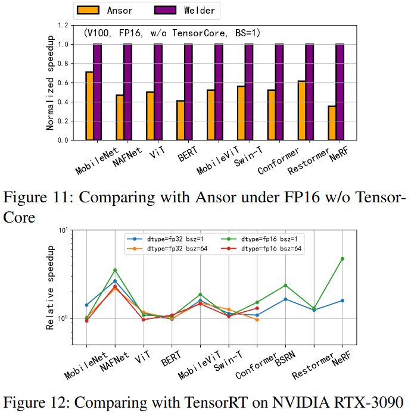
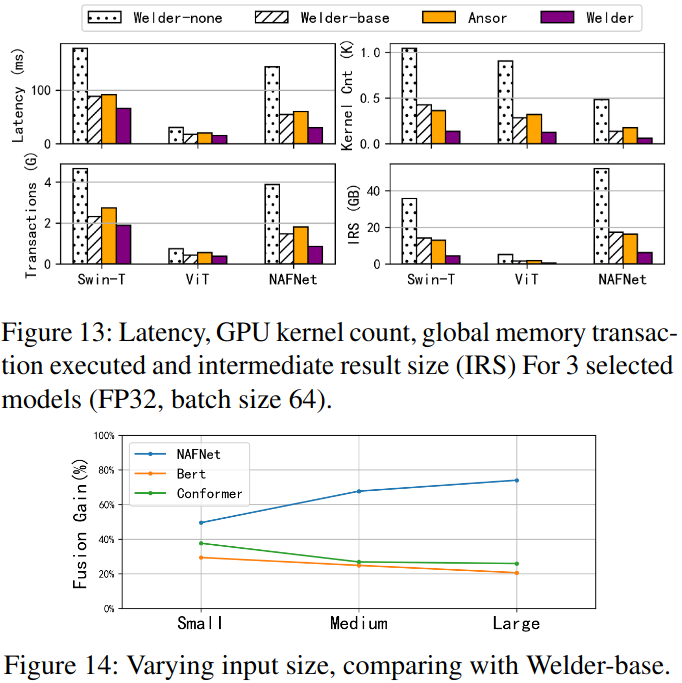

### Motivation
- 解决相邻两个算子之间潜在的分块形状冲突
- 确定最优的分块形状
- 内存流量的优化独立与内存层

### Welder Design 

***operator-tile and tile-graph***
- tile propagation
- memory traffic and footprint

***tile-graph scheduling***
- decoupling optimization space 

- scheduling interface 

- scheduling policy

***mapping to hardware accelerator***

### Evaluation

### Reference
[Welder: Scheduling Deep Learning Memory Access via Tile-graph](https://www.usenix.org/system/files/osdi23-shi.pdf)