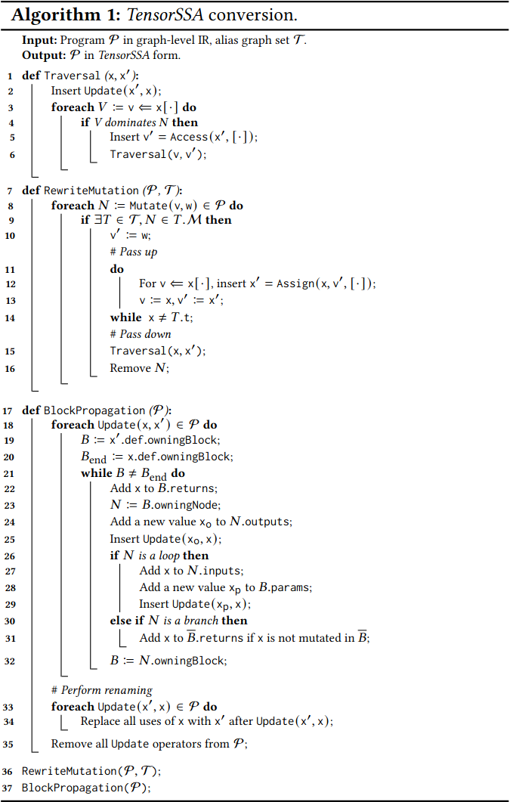
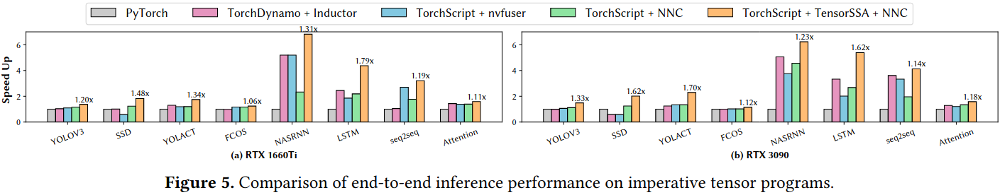
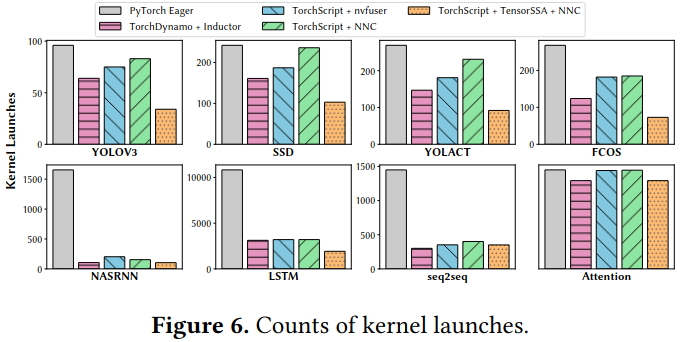
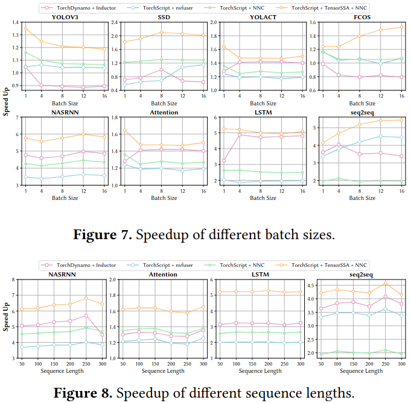

### Functionalization and Optimization

### Evaluation

### Reference
[A Holistic Functionalization Approach to Optimizing Imperative Tensor Programs in Deep Learning](https://dl.acm.org/doi/pdf/10.1145/3649329.3658483)