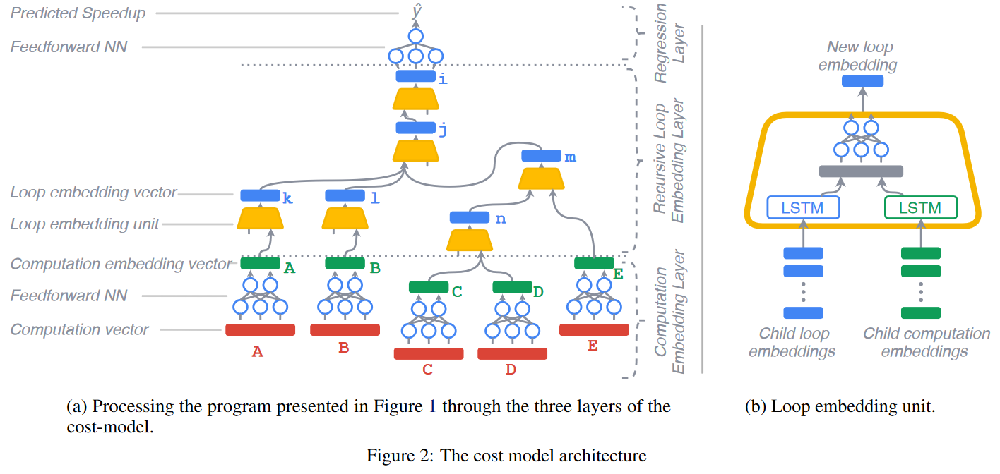

### Motivation
- 选择代码转换的正确顺序的问题可以被建模为一个搜索问题，分为三步：1.定义搜索空间 2.检查每种候选的有效性 3.评价每种有效候选并选择一个能最少执行时间，引出问题检查有效性都直接在硬件上测量需要大量时间，为了解决这个问题，提出利用代价模型来预测加速
- 设计代价模型的挑战：代码转换的复杂交互会使问题变得很复杂，提出用深度学习，但是只考虑组合基本块的输出没有考虑完整程序，或者需要繁重的特征工程

### Data Generation
- random code generation
- dataset construction

### Program characterization and model architectures

***program charcterization***

***detailed list of features composing the computation vector***

***hardware characterization***
只针对CPU这一种硬件

***model architecture***
post-dlbcm-cost-model.png

***level of feature extraction***

### Search space exploration

### Reference
[A Deep Learning Based Cost Model for Automatic Code Optimization](https://proceedings.mlsys.org/paper_files/paper/2021/file/d9387b6d643efb25132be36f7b908d96-Paper.pdf)