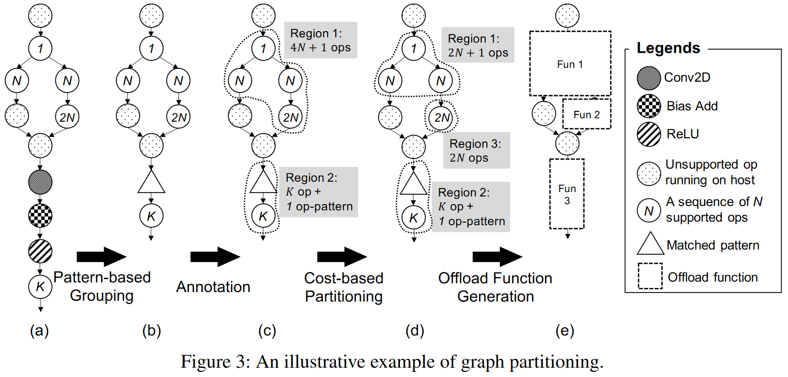

### Motivation
边缘加速器的编译栈开发的挑战
- 加速器的发展速度赶不上模型架构变化速度
- 即使是模型十分简单的架构要实现高性能也十分困难
- 缺乏统一的框架去开发、优化、编译模型导致需要大量人力

### Framework Design and Implementation

***Graph Partitioning***
partition and offload the graph at the high-level IR that includes the operator information, such as operator name and its attributes
- pattern-based grouping
- annotation
- cost-based partitioning

***Accelerator-Specific Processing***

***Code Generation***

***Runtime***

### Reference
[Bring Your Own Codegen to Deep Learning Compiler](https://arxiv.org/pdf/2105.03215)

