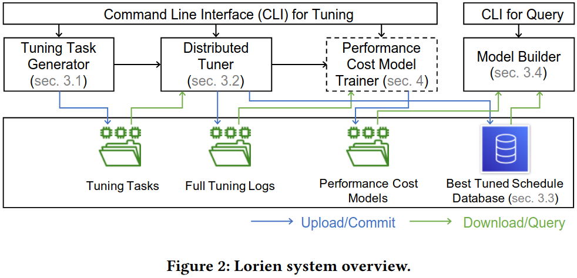
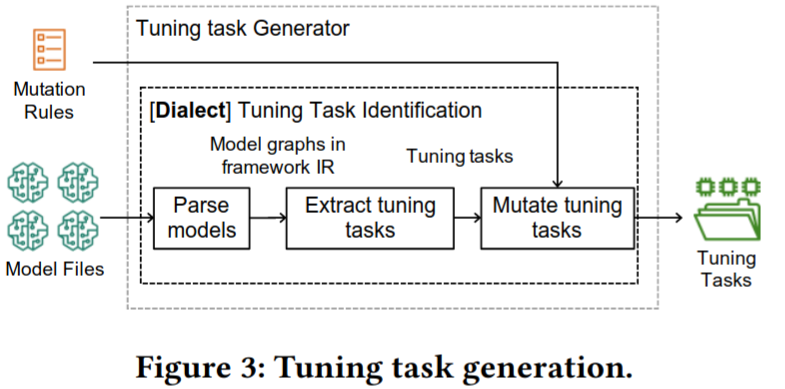
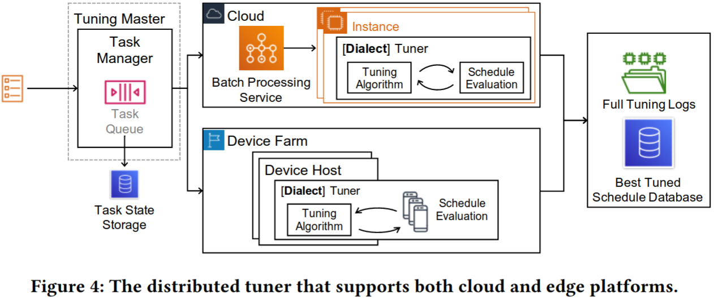
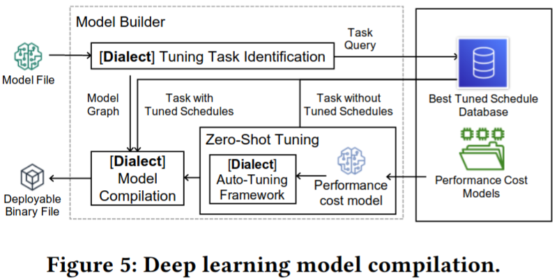
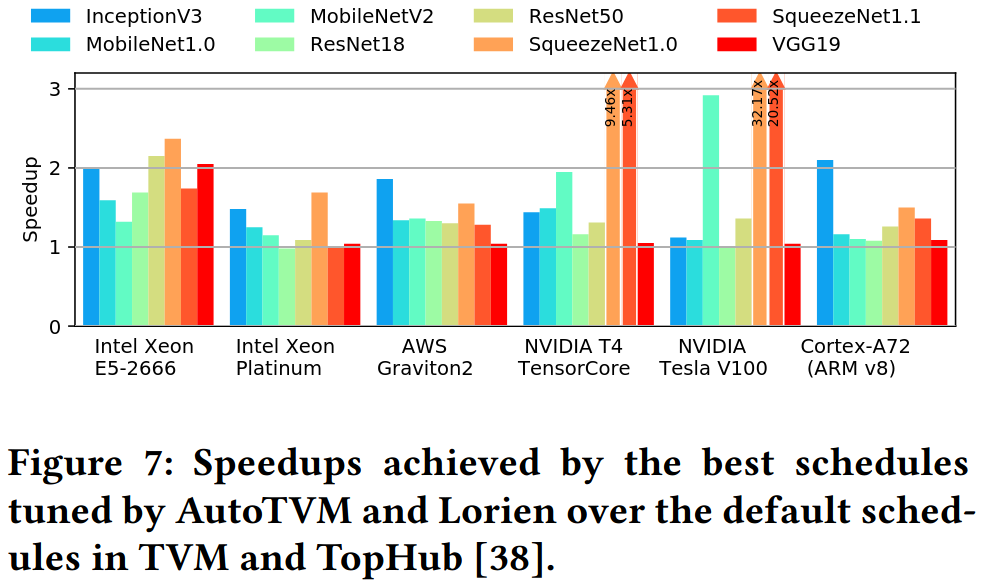
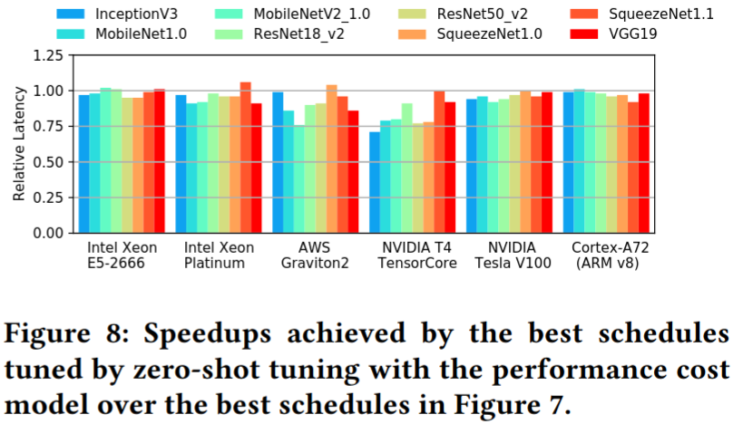

### Motivation
减少调优时间同时维持相对高性能，实现这一目标需解决的挑战
- 调优过程的扩展性和稳定性
- 调优结果管理
- 查询高效调度的时间

### Lorien Infrastructure

***tuning task generator***
- 常见的深度学习模型
- 深度学习模型的变体(batch_size, input_shape)

***Distributed Tuner***
***The Data Model***
***Deep Learning Model Builder***

### Evaluation

### Reference
[Lorien: Efficient Deep Learning Workloads Delivery](https://assets.amazon.science/c2/46/2481c9064a8bbaebcf389dd5ad75/lorien-efficient-deep-learning-workloads-delivery.pdf)