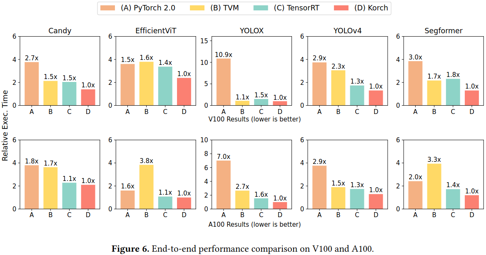

### Motivation
- 在算子级别的内核融合太粗粒度以至于不能发现所有潜在优化
- 现有的算子融合方法都是依靠人工设计的规则来融合算子，需要大量人工和会错过大量人工难以发现的优化

### Overview

***operation fission***
- elementwise primitives
- reduce and broadcast primitives
- layout transformation primitives
- linear transformation primitives

***Kernel orchestraion***

- kernel identifier
- kernel orchestration optimizer

***implementation***
- operation fission
- kernel orchestration optimizer
- executable generator

### Evaluation

***case study***

 

### Reference
[Optimal Kernel Orchestration for Tensor Programs with Korch](https://dl.acm.org/doi/pdf/10.1145/3620666.3651383)

