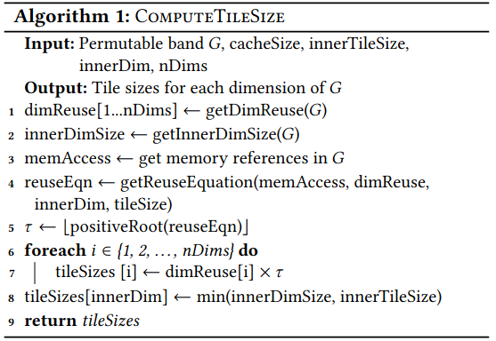
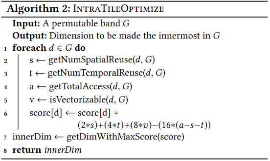
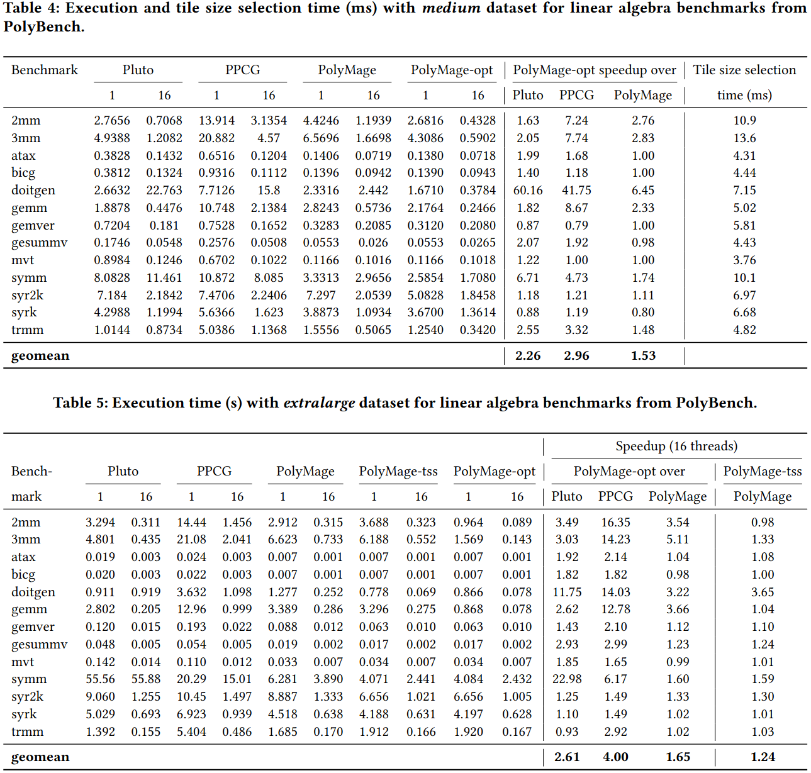
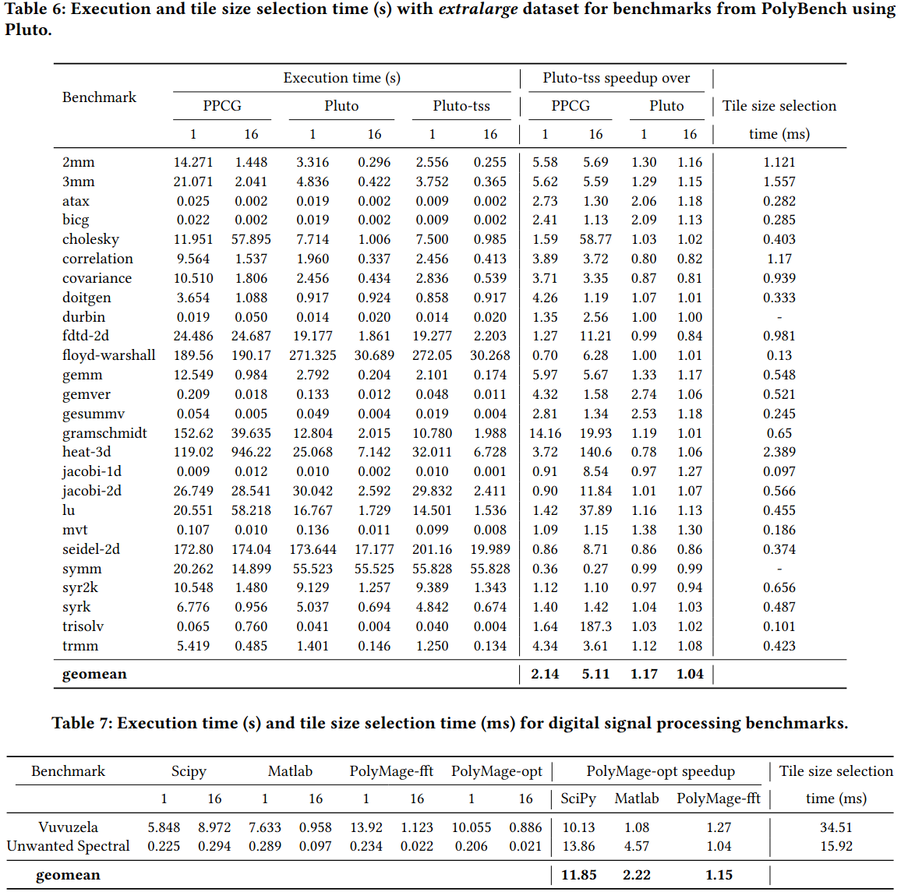

### Motivation
现象：
1. 小的循环分块会导致缓存利用率低
2. 大的循环分块会导致计算的缓存不命中或者在一些情况会导致所有核的不高效工作
现在确定分块大小都是采用自动调优方法而不是一个通用分块大小选择模型

### Tile size selection model
***tile size calculation***

***intra-tile optimization***

***tiling and parallelism***

### Evaluation 

### Reference
[A Practical Tile Size Selection Model for Affine Loop Nests](https://dl.acm.org/doi/pdf/10.1145/3447818.3462213)