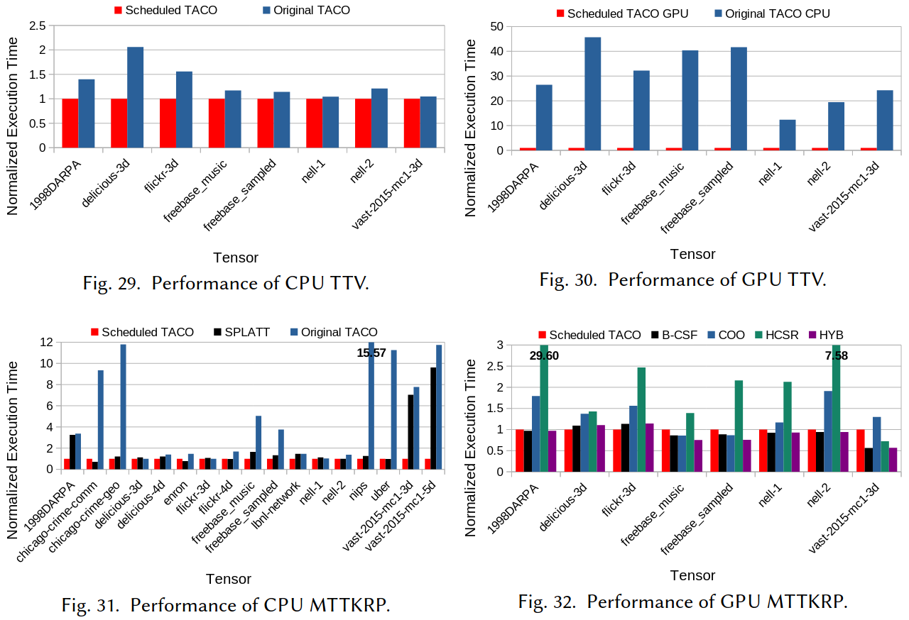

### Motivation
- 在稀疏矩阵里面用于索引数组的访问表达式并不总是循环索引的仿射表达式

### Derived space iteration spaces
- iteration graphs
- provenance graphs
- provenance graph functions: the split transformation may strip-mine(coordinate spaces and position spaces)
split变换的两种不同类型的迭代空间：坐标空间(由索引变量的域给出的稀疏迭代空间，均匀划分稀疏空间)和位置空间(存储在其中一个数据结构中的连续坐标的子集，均分划分其非零坐标)
- tiling

### Transformations
- pos and coord
- collapse
- split
- precompute and reorder
- bound and unroll
- parallelize

### Code generation
- coordinate recovery
- derived bounds porpagation
- iteration guards
- iteration lattice construction
- parallel and GPU code generation

### Heuristics-based autoscheduling
- partition
- reordering and parallelization

### Evaluation

### Reference
[A Sparse Iteration Space Transformation Framework for Sparse Tensor Algebra](https://dl.acm.org/doi/pdf/10.1145/3428226)

