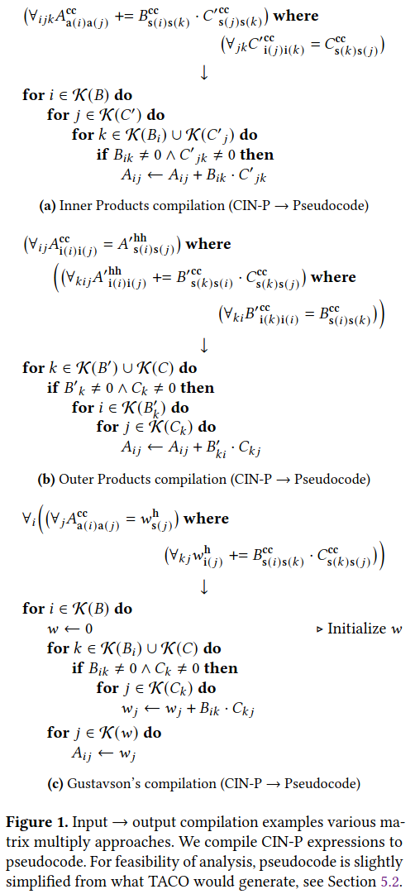
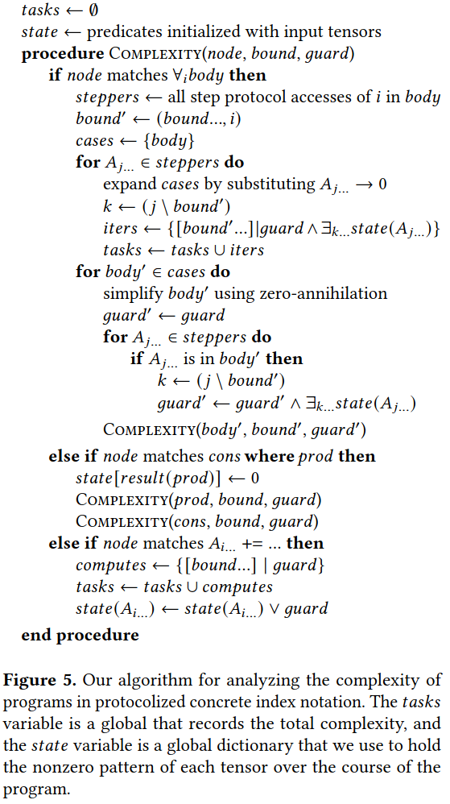
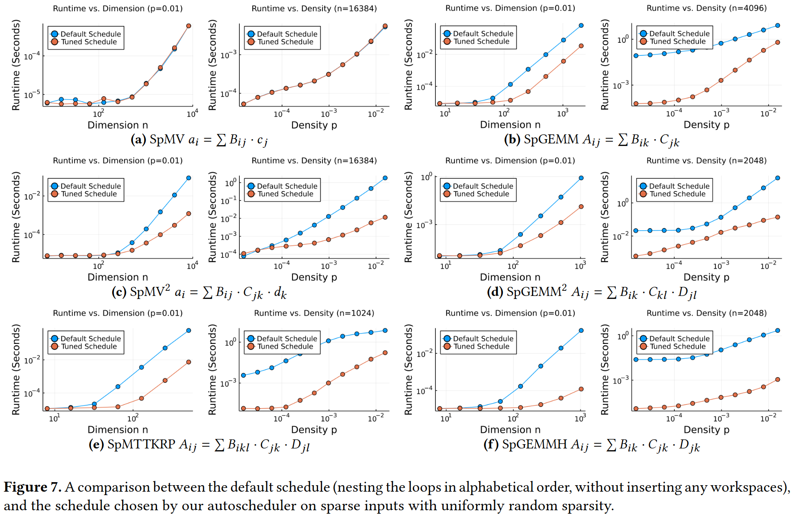

### cost modeling
- the task set model
the complexity of sparse kernels comes from two sources: computation tasks incurred in the numerical body of the loop、coiteration tasks incurred due to iterating over multiple sparse tensor levels
- accuracy of the model

### asymptotic domination
- domination checking algorithm
- sunk costs and assumptions
- building a frontier
- automatic asymptotic analysis

### Autoscheduling
- enumerate expression rewrites
- enumerate where groupings
- enumerate forall nestings
- filter by maximum nesting depth
- name workspace and indices
- enumerate protocols
- filter asymptotic complexity
- add workspaces to transpose and reformat
- extensions and empirical filtering

### Evaluation 

### Reference
[Autoscheduling for Sparse Tensor Algebra with an Asymptotic Cost Model](https://dl.acm.org/doi/pdf/10.1145/3519939.3523442)
