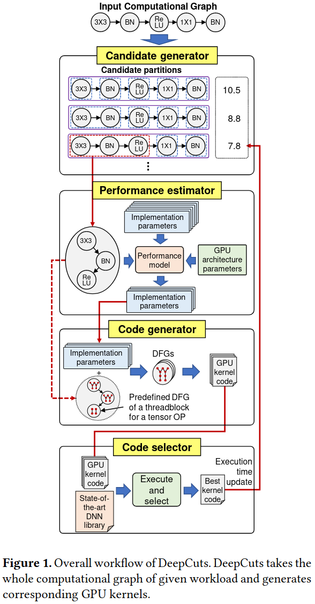
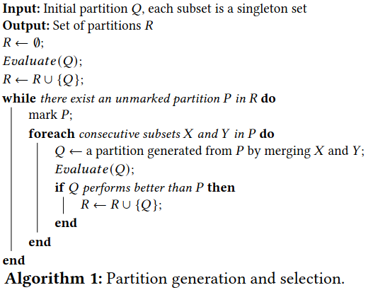
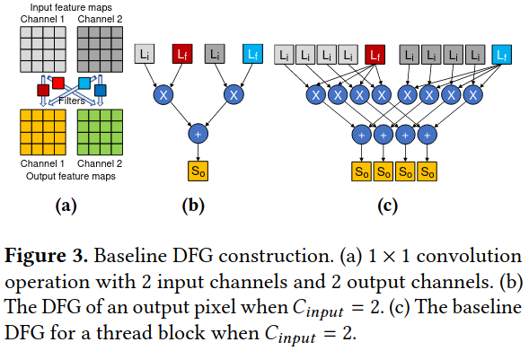
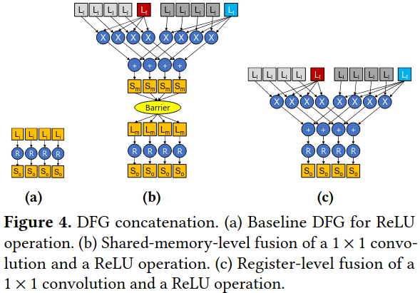
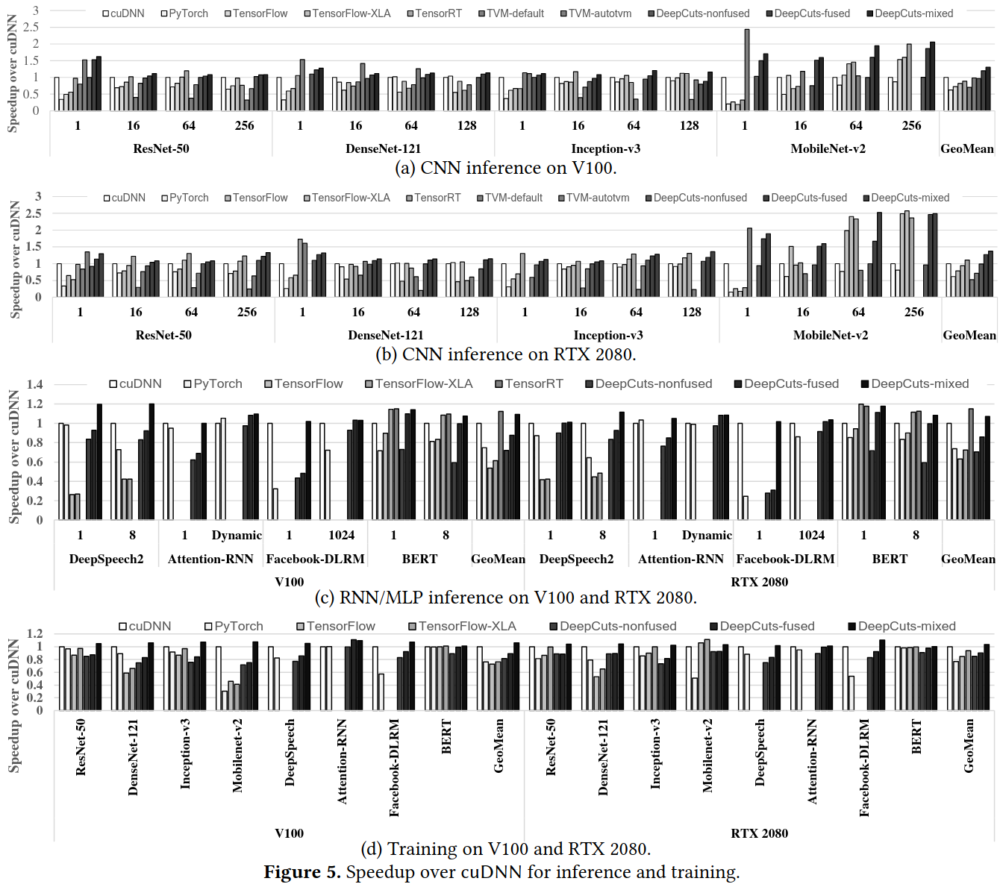
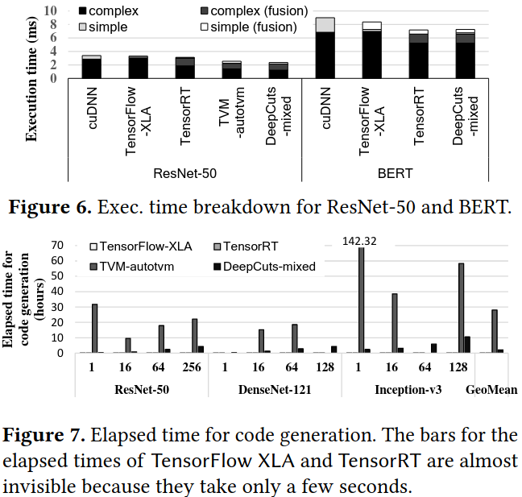

### Motivation
现在的问题：
基于cuDNN的深度框架不能提供最好的性能由于1.深度学习负载的多样性 2.cuDNN具有有限内核融合功能

### Overall Structure of DeepCuts

***performance estimation model***
- kernel implementation parameters
- performance limiting factors: 全局内存带宽、共享内存延迟、多处理器的负载均衡、硬件资源的限制 
全局内存带宽影响：
$$OF_{TB} = COMP_{block}/(SIZE_{element} \cdot TRANS_{global} \cdot NUM_{trans})$$  
$$GMRatio = Min(1, OF_{TB}/(R_{peak}/BW_{global}))$$
共享内存延迟：
$$SMRatio = Min(1, (COMP_{thread}/N_{load})/(LAT_{shared} \cdot COEF_{bc}))$$
多处理器的负载均衡：
$$N_{TB} = (N/N_{block}) \cdot (K/K_{block}) \cdot (H/H_{block}) \cdot (W/W_{block})$$
$$WBRatio = 1 - ((N_{TB} \bmod N_{SM})/N_{SM})/[(N_{TB}/N_{SM})]$$
硬件资源影响：
$$COEF_r = \begin{cases} 
1 & NUM_{thread} < MAX_{thread} \\
& and \\
& SIZE_{shared} < MAX_{shared} \\
0 & otherwise
\end{cases}$$

- estimating the upper bound
$$PUL = GMRatio \cdot SMRatio \cdot WBRatio \cdot COEF_r$$
- shared-memory-level and register-level fusion
寄存器级别融合：一对两个简单操作; 一对一个简单操作+一个复杂操作

***data-flow graph generation***
- baseline DFG generation
- DFG concatenation for fusion
- extracting a subgraph for a thread

***GPU kernel code generation***
- DFG-based code generation
- shared memory optimizations

### Evaluation

### Reference
[DeepCuts: A Deep Learning Optimization Framework for Versatile GPU Workloads](https://dl.acm.org/doi/pdf/10.1145/3453483.3454038)