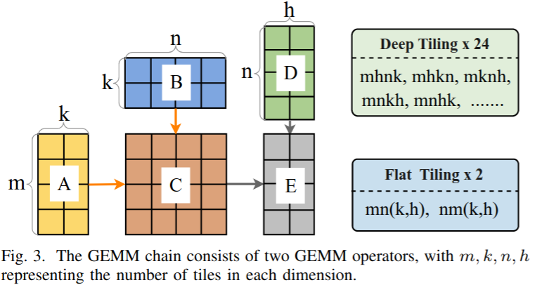
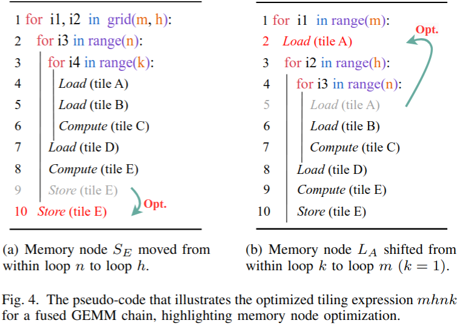
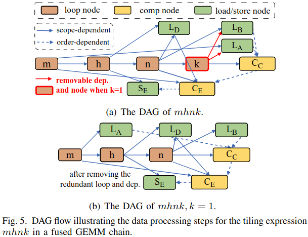
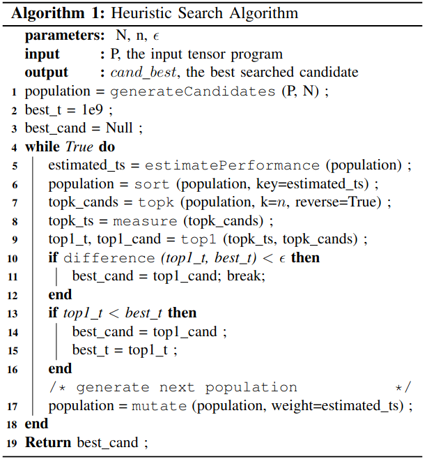
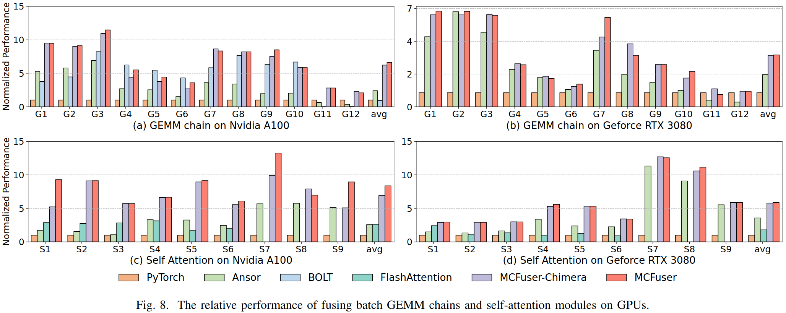
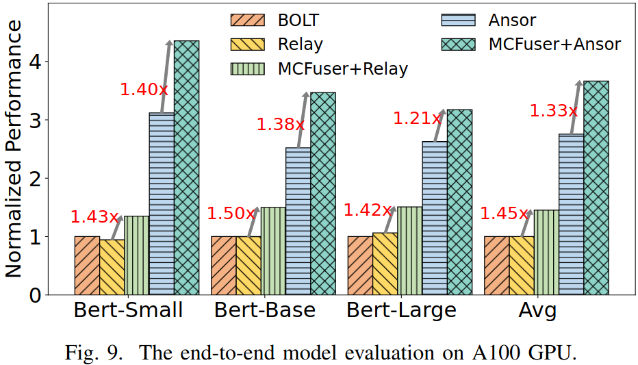
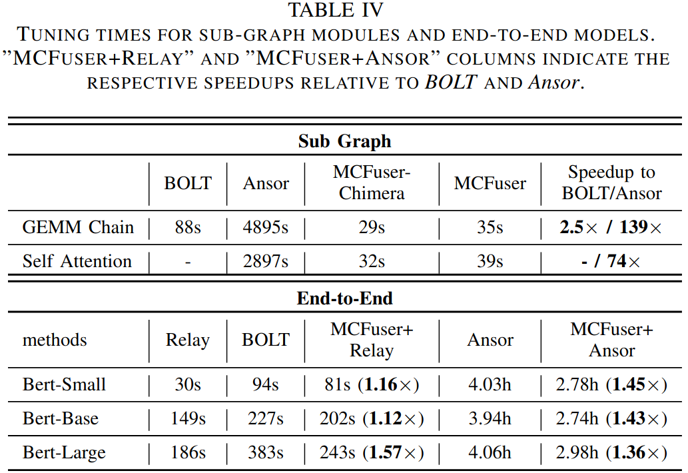

### Motivation
融合MBCI算子(内存受限计算密集算子)的挑战：
1.融合策略的搜索空间通常是不完整的
2.内存访问与计算循环的直接耦合会导致冗余的数据移动
3.融合策略受限于冗长的自动调优阶段和笨拙的搜索空间

### MCFuser

***search space generation and optimization***
- search space generation
- memory access optimization
- pruning:(1.去重 2.防止压倒性的中间张量的共享内存 3.避免过多展开 4.共享内存限制)

***performance model and exploration***
- analytical performance model
$$t_{estm} = (t_{mem} + t_{comp}) \times \alpha$$

$$t_{mem} = \sum_{S_{X_i} \in \{L_{X_i}\}+\{S_{X_i}\}} \frac{TS_{X_i} \times \prod_{l_j \in LP\_set(S)} l_j}{\mathcal{W}}$$

$$t_{comp} = \sum_{S_{X_i} \in \{C_{X_i}\}} \frac{Fp_{X_i} \times \prod_{l_j \in LP\_set(S)} l_j}{\mathcal{P}}$$

$$\alpha = (N_{block} + N_{SM})/N_{block}$$

- exploration

***implementation***
- intra-block optimization and code generation
- framework and front-end

### Evaluation

### Reference
[MCFuser: High-Performance and Rapid Fusion of  Memory-Bound Compute-Intensive Operators](https://ieeexplore.ieee.org/stamp/stamp.jsp?tp=&arnumber=10793220)