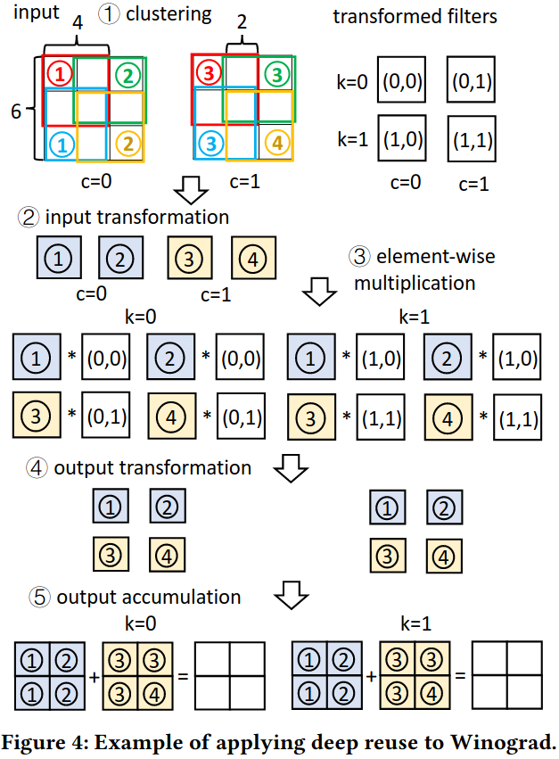
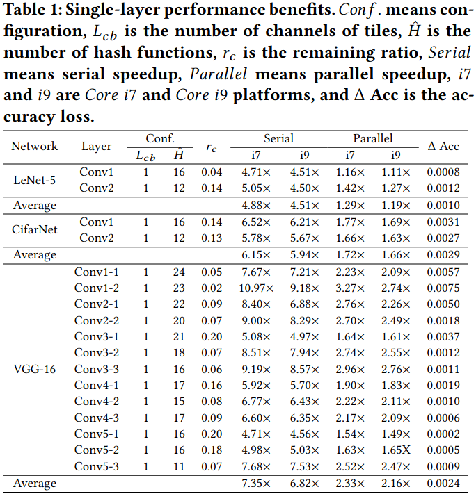
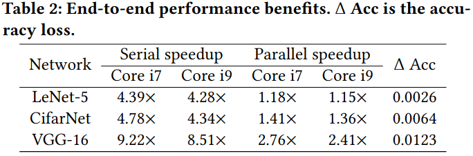
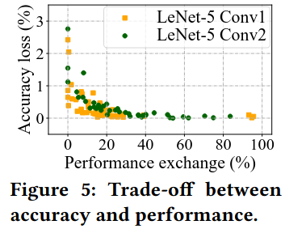
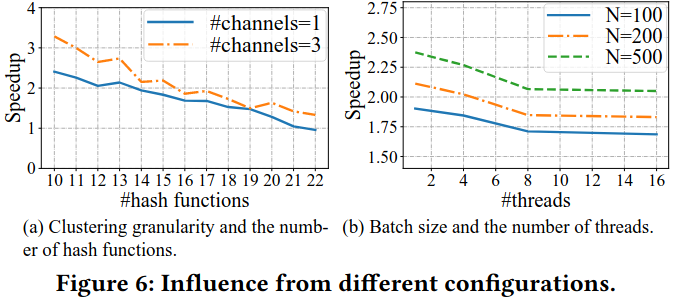

### Motivation
- algorithm design: 利用CNN神经网络中的相似性来节省计算
- Introduced overhead
- cost-benefit tradeoff

### Solution overview

***Drew algorithm and optimizations***
- Deep-reuse Winograd
- Clustering design
- Clustering Granularity

***Parallelism***

### Evaluation

### Reference
[DREW: Efficient Winograd CNN Inference with Deep Reuse](https://research.csc.ncsu.edu/picture/publications/papers/www2022.pdf)