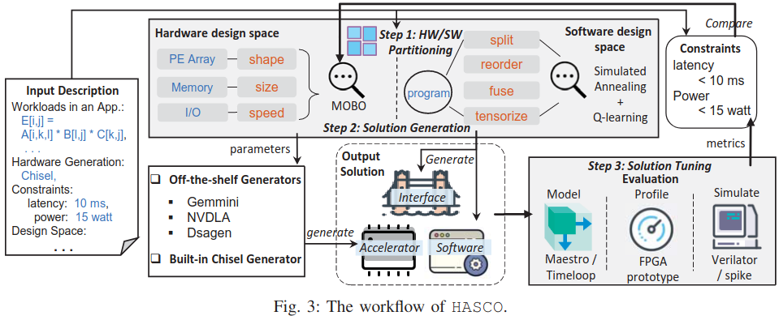
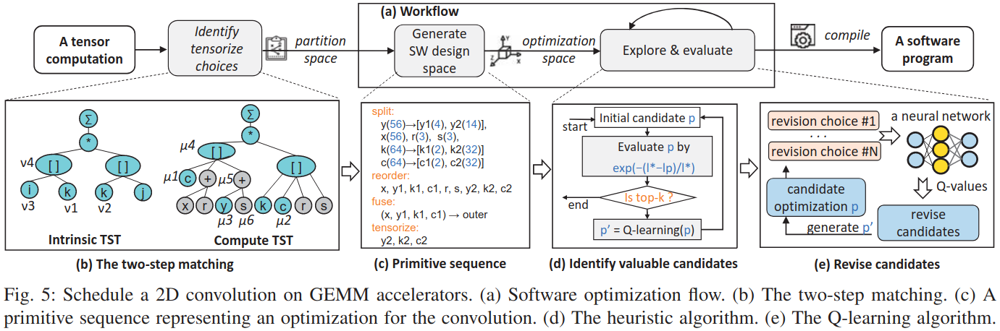
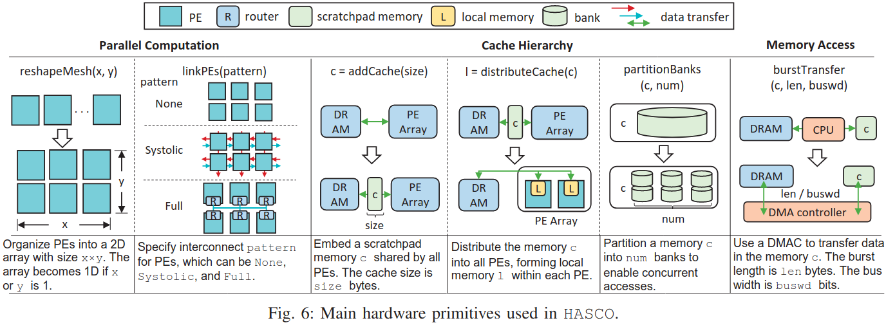
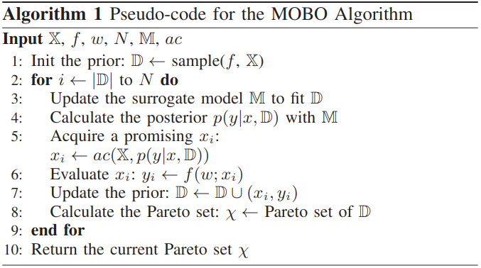
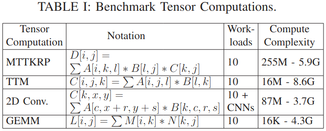
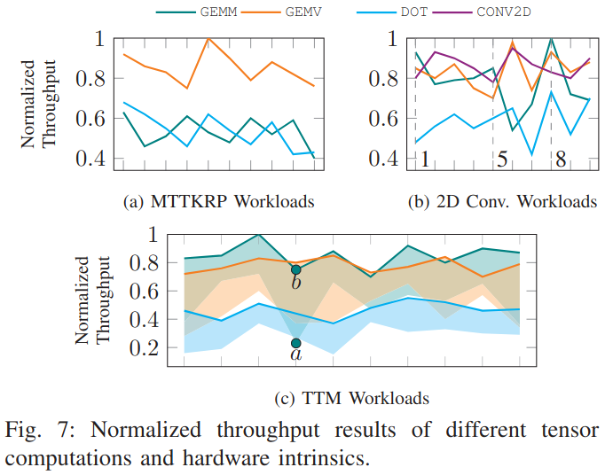
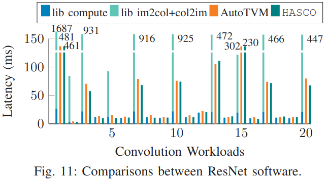

### Motivation
之前对张量计算的优化从硬件、软件方面考虑，但都是仅局限单一方面，没有从硬件、软件结合方向考虑，作者提出软硬件协同设计，针对这一想法遇到的挑战
1. 硬件加速器和软件之间如何定义接口  软件优化有巨大但是不可预计的性能影响
2. 在形成的设计空间如何搜索 设计空间展示复杂的权衡

### HASCO

***HW/SW Partitioning***
- tensorize choices
- partition space generation: index matching、structure matching

***Hardware Generation***
- hardware primitives and design space
- accelerator parameter exploration

***Software and Interface generation***
- software primitives and design space
- software optimization and generation
- interface generation

### Evaluation

***benchmark***

**metrics**: Maestro(一个开源加速器微架构模型)

### Reference
[HASCO: Towards Agile HArdware and Software CO-design for Tensor Computation](https://ieeexplore.ieee.org/stamp/stamp.jsp?tp=&arnumber=9499796)